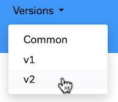

The K8ssandra documentation covers everything from install details, deployed components, configuration references, and guided outcome-based tasks. Be sure to leave us a <a class="github-button" href="https://github.com/k8ssandra/k8ssandra" data-icon="octicon-star" aria-label="Star k8ssandra/k8ssandra on GitHub">star</a> on Github!

**Important! K8ssandra Operator** is our newest implementation that supports single- or multi-cluster Kubernetes deployments of Apache Cassandra&reg; databases. Along with the ability to deploy Cassandra into multiple clusters comes the ability to configure multiple regions for the deployed Datacenters (DCs). K8ssandra Operator offers **unified** deployment and management operations in Kubernetes for related pods that service your Cassandra data via:

* API services (Stargate)
* Management services (cass-operator)
* Data backup and restore services (Medusa)
* Data repair services (Reaper)
* ServiceMonitor custom resources complete with metric labeling
* Metrics Collector for Apache Cassandra
* Management API for Apache Cassandra

And while the initial K8ssandra project features (currently, v1.4.1) are still available, we encourage you to check out K8ssandra Operator. 

## How is this documentation site organized?

We've organized this docs site into three areas:

* [docs.k8ssandra.io](https://docs-staging.k8ssandra.io) provides topics that are of common interest to users of K8ssandra Operator and K8ssandra, such as FAQs, Release Notes, Components, and a Glossary.
* [docs-v1.k8ssandra.io](https://docs-staging-v1.k8ssandra.io) provides topics that are specific to K8ssandra 1.4.x users (the initial project releases).
* [docs-v2.k8ssandra.io](https://docs-staging-v2.k8ssandra.io) provides topics that are specific to the more recent (and recommended) K8ssandra Operator software, including single- or **multi-cluster** installs.

**Tip**: From each page's top banner, use the **Versions** drop-down menu to navigate back to the Common, v1, or v2 documentation Home.

## What is K8ssandra Operator?

K8ssandra Operator is the most recent implementation that allows you to deploy Cassandra into multi-cluster and multi-region Kubernetes environments.

K8ssandra Operator is a native Kubernetes operator that supports the deployment and management of Cassandra databases. Accompanying Cassandra is a suite of tools to ease and automate operational tasks. This includes metrics, data anti-entropy services, and backup tooling. As part of the `K8ssandraCluster` installation process, which uses the new K8ssandra Operator, all of these components are installed and wired together. This unified operator frees your teams from having to perform the tedious Kubernetes plumbing of components.

Cassandra may be deployed in a number of environments. This includes on bare metal hosts, virtual machines, and within container platforms. Each deployment type has its pros and cons, but in all cases it is **_essential_** that automation be leveraged to ensure that all node are configured homogeneously and without failure.

K8ssandra Operator focuses on deploying Cassandra within Kubernetes. Kubernetes was chosen as it allows for the consumption of a common, versioned, set of APIs and tooling across multiple cloud platforms and environments.

## Why do I want K8ssandra Operator?

Apache Cassandra is _the_ NoSQL database for applications that require resilience and scalability. Unfortunately this comes with the same burdens as other distributed systems. There are multiple nodes replicating data all the time. Understanding the health of these systems requires advanced tooling and knowledge of the constituent parts. Users could spend time investigating and building out solutions to ensure operational stability of their Cassandra clusters. K8ssandra Operator looks to provide those integrations from the start in a simple easy to deploy package.

## What is K8ssandra Operator good for?

K8ssandra Operator is a great fit for developers and Site Reliability Engineers (SREs) looking for easy to install and manage Cassandra clusters. Even if your environment currently does not run Cassandra on Kubernetes, we believe that simple installation and upkeep will win you over. 

## Next steps

* If you want to deploy K8ssandra Operator and explore single- and multi-cluster deployment examples, start in its local dev (kind) install topic on the [docs-v2](https://docs-staging-v2.k8ssandra.io/install/local/) area of our site.
* If you prefer to continue using K8ssandra v1.4.x (the initial project implementation), head over to the [docs-v1](https://docs-staging-v1.k8ssandra.io) area of this site.
* [FAQs](): If you're new to K8ssandra and K8ssandra Operator, these FAQs are for you. 
* [Release Notes](): For each release, this topic details the enhancements, bugs fixes, and other changes.

We also strongly encourage you to actively participate in the [K8ssandra community](https://k8ssandra.io/community/)!
