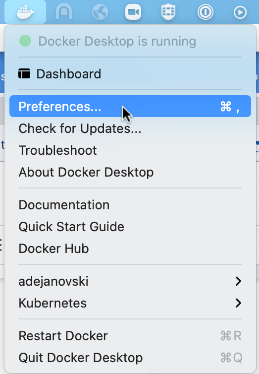
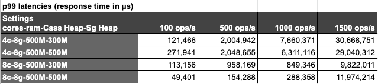
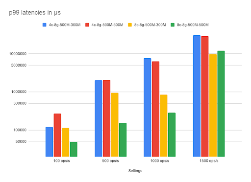

# Managing expectations
The K8ssandra [Quick start]()  is a great guide for doing a full installation of K8ssandra on a dev laptop and trying out the various components of the K8ssandra stack. While this is a great way to get your first hands-on experience with K8ssandra, let’s state the obvious: running K8ssandra on a dev laptop is not aimed at performance.
In this blog post, we’ll explain how we ran benchmarks to help evaluate what level of performance (especially throughput) you can expect from a dev laptop deployment. 

Our goal was to achieve the following:
* Run the whole stack, if possible, with at least three Cassandra nodes and one Stargate node. K8ssandra ships with the following open source components:
    * [Apache Cassandra&reg;](http://cassandra.apache.org/) 
    * [Stargate](https://stargate.io/) : API framework and data gateway (CQL, REST, GraphQL)
    * [Medusa for Apache Cassandra&reg;](https://github.com/thelastpickle/cassandra-medusa) : Backup and restore tool for Cassandra
    * [Reaper for Apache Cassandra&reg;](http://cassandra-reaper.io/) : Repair orchestration tool for Cassandra
    * [Metrics Collector for Apache Cassandra](https://github.com/datastax/metric-collector-for-apache-cassandra) : Metric collection and Dashboards for Apache Cassandra (2.2, 3.0, 3.11, 4.0) clusters.
    * [Management API for Apache Cassandra](https://github.com/datastax/management-api-for-apache-cassandra) : Secure Management Sidecar for Apache Cassandra
    * [Cass Operator](https://github.com/datastax/cass-operator) : Kubernetes Operator for Apache Cassandra
    * [Medusa Operator](https://github.com/k8ssandra/medusa-operator) : Kubernetes Operator for Medusa
    * [Reaper Operator](https://github.com/k8ssandra/reaper-operator) : Kubernetes Operator for Reaper
    * [kube-prometheus-stack](https://github.com/prometheus-community/helm-charts/tree/main/charts/kube-prometheus-stack) chart:
        * [Prometheus](https://prometheus.io/) : Monitoring system & time series database
        * [Grafana](https://grafana.com/) : Fully composable observability stack
* Achieve reasonable startup times
* Specify a dev setup stable enough to sustain moderate workloads (50 to 100 ops/s)
* Come up with some minimum requirements and recommended K8ssandra settings

# Using the right settings
Cassandra can run with fairly limited resources as long as you don’t put too much pressure on it. For example, for the Reaper project, we run our integration tests with [CCM (Cassandra Cluster Manager)](https://github.com/riptano/ccm), configured at [256MB of heap size](https://github.com/thelastpickle/cassandra-reaper/blob/master/.github/scripts/configure-ccm.sh#L22). This allows the JVM to allocate an additional 256MB of off heap memory, allowing Cassandra to use up to 512MB of RAM.

If we want to run K8ssandra with limited resources, we’ll need to set these appropriately in our Helm values files.

## Setting heap sizes in K8ssandra
The K8ssandra Helm charts allow us to set heap sizes for both the Cassandra and Stargate pods separately.

### Cassandra
For Cassandra, the heap and new gen sizes can be set at the cluster level, or at the datacenter level (K8ssandra will support multi DC deployments in a future release):

```
cassandra:
  version: "3.11.10"
  ... 
  ...
  # Cluster level heap settings
  heap: {}
   #size:
   #newGenSize:

  datacenters:
  - name: dc1
    size: 3
    ... 
    ... 
    # Datacenter level heap settings
    heap: {}
      #size:
      #newGenSize:
```

By default, these values aren’t set, which lets Cassandra perform its own computations based on the available RAM, applying the following formula: 

```
max(min(1/2 ram, 1024MB), min(1/4 ram, 8GB))
```

The catch when you run several Cassandra nodes on the same machine is that they will all see the same total available RAM but won’t be aware that other Cassandra nodes could be running as well.
When allocating 8GB RAM to Docker, each Cassandra node will compute a 2GB heap. With a 3 nodes cluster, it’s already 6GB of RAM used, not accounting for the additional off heap memory that can be used by each JVM.
That doesn’t leave much RAM for the other components K8ssandra includes, such as Grafana, Prometheus and Stargate.

The takeaway here: **leaving heap settings blank is not a good idea for a dev environment** in particular, where several Cassandra instances will be collocated on the same host machine. (By default, K8ssandra does not allow multiple Cassandra nodes on the same Kubernetes worker node. For this post, we’re using kind to have multiple worker nodes run on the same OS instance - or virtual machine in the case of Docker Desktop).

The chosen heap size will directly impact the throughput you can expect to achieve (although it’s not the only limiting factor). A small heap will involve more garbage collections, which will generate more stop the world pauses and directly impact throughput and latency. It also increases the odds of running out of memory if the workload is too heavy, as objects cannot end their lifecycle fast enough for the available heap space.

Setting the heap size at 500MB with 200MB of new gen globally for the cluster would be done as follows:


```
cassandra:
  version: "3.11.10"
  ... 
  ...
  # Cluster level heap settings
  heap: 
   size: 500M
   newGenSize: 200M

  datacenters:
  - name: dc1
    size: 3
```

### Stargate 
Because Stargate nodes are special coordinator-only Cassandra nodes and run in the JVM, it is also necessary to set their max heap size:

```
stargate:
  enabled: true
  version: "1.0.9"
  replicas: 1
  ...
  ...
  heapMB: 256
```

Stargate nodes will follow the same rule when it comes to off heap memory: the JVM will be allowed to use as much RAM for off heap memory as the configured heap size. 

As Stargate serves as coordinator, it is likely to hold objects for longer on heap waiting for all nodes to respond to queries before it can acknowledge them and potentially return the result sets to clients. It needs enough heap to do so without excessive garbage collection.
Unlike Cassandra, Stargate doesn’t compute a heap size based on the available RAM, and the value must be set explicitly.

During our tests, we observed that 256MB was a good initial value to have stable Stargate pods. In production you might want to tune this value for optimal performance.

# Benchmark Environment
Our setup for running benchmarks was the following:
* Apple MacBook Pro 2019 - i7 (6 cores) - 32GB RAM - 512GB SSD
* Docker desktop 3.1.0
* [Kind](https://kind.sigs.k8s.io/) 0.7.0
* Kubernetes 1.17.11
* kubectl v1.20.2

Note that we’ve used a fairly powerful environment as our tests ran on a 2019 Apple MacBook Pro with a 6 cores i7 CPU and 32GB RAM.

We used the [Kind deployment guidelines]() found in the [K8ssandra documentation]() to start a k8s cluster with 3 worker nodes.

Docker Desktop allows to tune its allocated resources by clicking on its icon in the status bar, then going to “Preferences…”:



Then click on “Resources” in the left menu, which will allow you to set the number of cores and the amount of RAM Docker can use overall:


# Running the benchmarks
We used [NoSQLBench](https://github.com/nosqlbench/nosqlbench) to perform moderate load benchmarks. It comes with a convenient Docker image that we could use straight away to run stress jobs in our k8s cluster.

Here’s the Helm values file we used as a base for spinning up our cluster, which we’ll name `three_nodes_cluster_with_stargate.yaml`:

```
cassandra:
  datacenters:
  - name: dc1
    size: 3
  ingress:
    enabled: false

stargate:
  enabled: true
  replicas: 1
  ingress:
    host: 
    enabled: true

    cassandra:
      enabled: true

medusa:
  multiTenant: true
  storage: s3

  storage_properties:
      region: us-east-1

  bucketName: k8ssandra-medusa
  storageSecret: medusa-bucket-key
```


We want Stargate to be our Cassandra gateway and enabling Medusa requires us to set up a secret (remember, we want to run the whole stack).

You’ll have to adjust the Medusa storage settings to match your requirements (bucket and region) or disable it if you don’t have access to an AWS bucket at all by disabling Medusa:

```
medusa:
  enabled: false
```

Adjust the Medusa storage settings to match your requirements (bucket and region).  You will need to disable Medusa if AWS usages when an S3 bucket is not available. In addition to AWS, future versions of Medusa will provide support for S3/MinIO and local storage configurations.

We can create a secret for Medusa by applying the following yaml:

```
apiVersion: v1
kind: Secret
metadata:
 name: medusa-bucket-key
type: Opaque
stringData:
 # Note that this currently has to be set to medusa_s3_credentials!
 medusa_s3_credentials: |-
   [default]
   aws_access_key_id = <aws key>
   aws_secret_access_key = <aws secret>
```


You’ll notice in our Helm values that they lack heap settings. We intentionally did this to set them when invoking `helm install` with various heap values for our different tests.

To fully set up our environment, we executed the following steps:

1. Create the kind cluster: 
    ```
    kind create cluster --config ./kind.config.yaml
    ```
1. [Configure and install Traefik]()
1. Create a namespace: 
    ```
    kubectl create namespace k8ssandra
    ```
1. (If Medusa is enabled) Create the secret: 
    ```
    kubectl apply -f medusa_secret.yaml -n k8ssandra
    ```
1. Deploy K8ssandra with the desired heap settings: 
    ```
    helm repo add k8ssandra https://helm.k8ssandra.io/stable
    helm repo update
    helm install k8ssandra k8ssandra/k8ssandra -n k8ssandra \
        -f /path/to/three_nodes_cluster_with_stargate.yaml \
        --set cassandra.heap.size=500M,cassandra.heap.newGenSize=250M,stargate.heapMB=300
    ```


You’ll have to wait for the `cassandradatacenter` resource and then the Stargate pod to be ready before you can start interacting with Cassandra. This usually takes around 7 to 10 minutes.

You can wait for the `cassandradatacenter` to be ready with the following `kubectl` command:

```
kubectl wait --for=condition=Ready cassandradatacenter/dc1 --timeout=900s -n k8ssandra
```

Then wait for Stargate to be ready:

```
kubectl rollout status deployment k8ssandra-dc1-stargate -n k8ssandra
```

Once Stargate is ready, the above command should output something like this: 

```
deployment "k8ssandra-dc1-stargate" successfully rolled out.
```
You can execute a NoSQLBench stress run by creating a k8s [job](https://kubernetes.io/docs/concepts/workloads/controllers/job/). You’ll need the superuser credentials so that NoSQLBench can connect to the Cassandra cluster.
You can get those credentials with the following commands ( requires [`jq`](https://stedolan.github.io/jq/) to be installed):

```
SECRET=$(kubectl get secret "k8ssandra-superuser" -n k8ssandra -o=jsonpath='{.data}')
echo "Username: $(jq -r '.username' <<< "$SECRET" | base64 -d)"
echo "Password: $(jq -r '.password' <<< "$SECRET" | base64 -d)"
```

Then create the NoSQLBench job which will start automatically:

```
kubectl create job --image=nosqlbench/nosqlbench nosqlbench -n k8ssandra \
    -- java -jar nb.jar cql-iot rampup-cycles=1k cyclerate=100 \
    username=<superuser username> password=<superuser pass>    \
    main-cycles=10k write_ratio=7 read_ratio=3 async=100       \
    hosts=k8ssandra-dc1-stargate-service --progress console:1s -v 
```

This will run a 10k cycle stress run with 100 ops/s with 70% writes and 30% reads, allowing 100 in-flight async queries.
Note that we’re providing the Stargate service as the contact host for NoSQLBench (the exact name will differ depending on your Helm release name).

While the job is running, you can tail its logs using the following command:

```
kubectl logs job/nosqlbench -n k8ssandra --follow
```

Latency metrics can be found at the end of the run, and since we’re running at a fixed rate we’ll be interested in the response time which takes coordinated omission ([video](https://www.youtube.com/watch?v=lJ8ydIuPFeU&ab_channel=StrangeLoopConference), [paper](http://btw2017.informatik.uni-stuttgart.de/slidesandpapers/E4-11-107/paper_web.pdf))  into account:

```
kubectl logs job/nosqlbench -n k8ssandra 
  |grep cqliot_default_main.cycles.responsetime
```

Which should output something like this:

```
12:41:18.924 [cqliot_default_main:008] INFO  i.n.e.c.m.PolyglotMetricRegistryBindings - 
  timer added: cqliot_default_main.cycles.responsetime
12:42:58.788 [main] INFO  i.n.engine.core.ScenarioResult - type=TIMER, 
  name=cqliot_default_main.cycles.responsetime, count=10000, min=1560.064, max=424771.583, 
  mean=21894.6342016, stddev=45876.836258003656, median=5842.175, p75=17157.119, 
  p95=100499.455, p98=187908.095, p99=263397.375, p999=384827.391, mean_rate=100.03389528501059, 
  m1=101.58021531751795, m5=105.18698132587139, m15=106.3340149754869, rate_unit=events/second, 
  duration_unit=microseconds
```

As Cassandra operators, we usually focus on p99 latencies: `p99=263397.375`. That’s 263ms at p99, which is fine considering our environment (a laptop) and our performance requirements (very low).

# Benchmark results
We ran our benchmarks with the following matrix of settings:
* Cores: 4 and 8
* RAM: 4GB and 8GB
* Ops rate: 100, 500, 1000 and 1500 ops/s
* Cassandra Heap: 500MB
* Stargate Heap: 300MB and 500MB


Running the full stack with three Cassandra nodes, one Stargate node and 4GB allocated to Docker fails on any attempt of running stress tests, even moderate ones. However, running with a single Cassandra node allowed the stress test to run with the full stack loaded using 4GB RAM.



Latencies are very reasonable for all settings when using a 100 ops/s rate. Trying to achieve higher throughput requires using at least 8 cores, allowing to reach 1000 ops/s with 290ms p99 latencies.
None of our tests allowed us to reach a sustained throughput of 1500 ops/s as shown by the response times that go over 9 seconds per operation.



# Conclusion
Getting the full K8ssandra experience on a laptop will require at least 4 cores and 8GB of RAM available to Docker and appropriate heap sizes for Cassandra and Stargate. If you don’t have those resources available for Docker on your development machine, you can avoid deploying features such as monitoring, Reaper and Medusa, and also reduce the number of Cassandra nodes.
Using heap sizes of 500MB for Cassandra and 300MB for Stargate proved to be enough to sustain workloads between 100 and 500 operations per second, which should be sufficient for development purposes.

Note that starting the whole stack takes around 7 to 10 minutes at the time of this writing on a fairly recent high end MacBook Pro, so expect your mileage to vary a bit depending on your hardware. Part of this time is spent pulling images from Docker Hub, meaning that your internet connection will play a big role in startup duration.

Now you know how to configure K8ssandra for your development machine, and you’re ready to start building cloud-native apps! Visit the [Tasks]() section of our documentation site for detailed instructions on developing against your deployed cluster.

