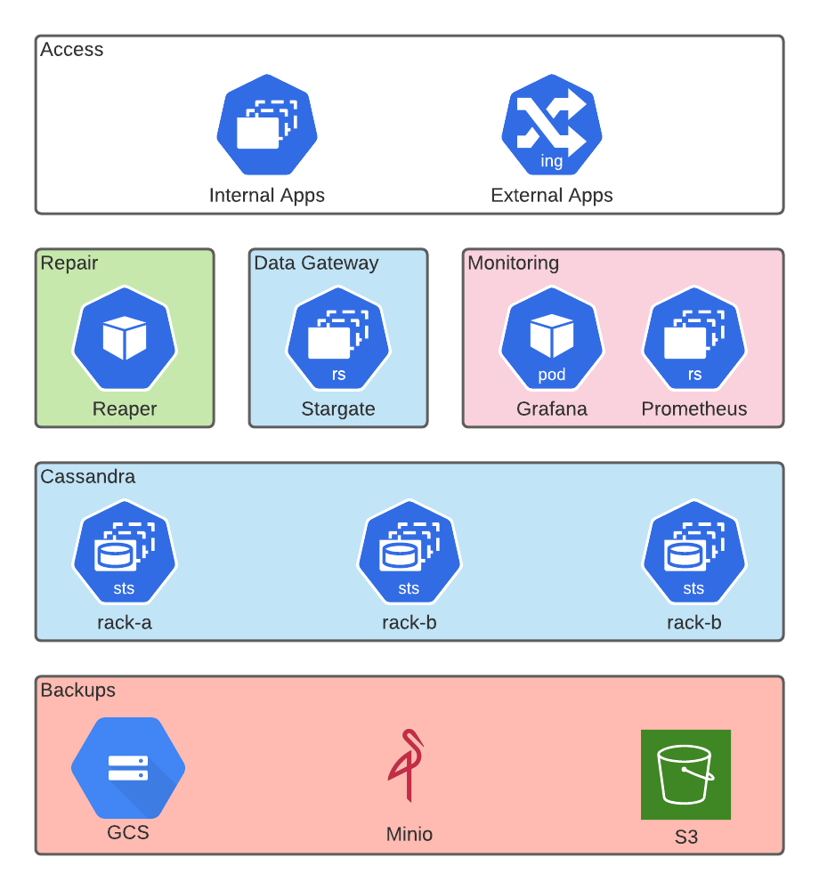

K8ssandra provides a collection of open-source components that handle the automated management of Apache Cassandra® clusters deployed on Kubernetes.

Cassandra is a distributed NoSQL database with a focus on availability and partition tolerance. Historically provisioning and managing the day to day upkeep of this distributed systems has been daunting for operations teams and developers. With the common control-plane of Kubernetes and advanced automation K8ssandra provides a trivial way to install and manage Cassandra. Furthermore K8ssandra automates the deployment of the Stargate data API gateway to open Cassandra to a new group of developers looking to leverage REST, Document, and GraphQL APIs over the standard CQL protocol.

Here's a high-level diagram for the entire K8ssandra stack. Multiple installation of K8ssandra are possible within a single Kubernetes cluster with Kubernetes namespaces as a logical boundary. Through intuitive and customizable Helm charts, installation and upgrades are simple. 

For further details on K8ssandra’s individual components, explore the links below.
