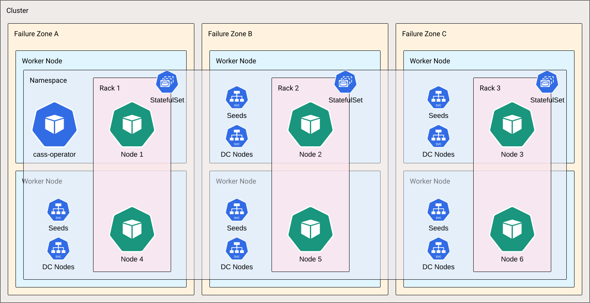
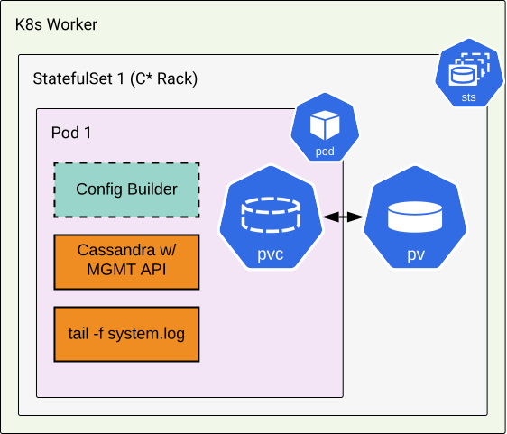
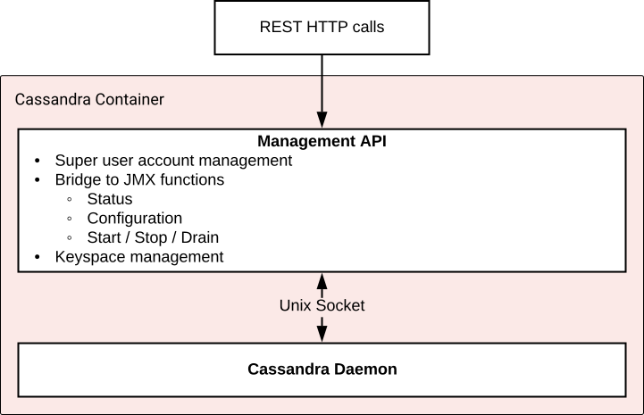

Kubernetes Operator for Apache Cassandra&reg;, also known as Cass Operator or cass-operator, is deployed by K8ssandra as part of its Helm chart. 

If you haven't already installed K8ssandra, see the [install]() topics.

## Introduction

Cass Operator spins up a Cassandra cluster on your Kubernetes cluster. Cass Operator then automates the Kubernetes Cassandra management procedure. Cass Operator manages the lifecycle of individual Kubernetes resources by distilling user-supplied information down to the number of nodes and cluster name. Additional settings are available, but for now, that's pretty much all you'll need to know. Now, operating a distributed Cassandra or DSE data platform is straightforward, allowing your team to concentrate on the application layer and its functionality.

Let's start with containers and Kubernetes' emergence as the leading technology for application orchestration. Then we'll take a look at K8ssandra's Cass Operator's Cassandra architecture.

## Optimizing data management in containers with Kubernetes

Containers are a popular tool for speeding up application development nowadays. When compared to virtual computers, you can bundle apps more effectively using popular container technologies like Docker. Apps and all of their dependencies are packed together in a basic deployable image with containers. As a developer, you can use containers to move applications between environments and ensure that your applications work as expected. These goals led to the creation of container coordination platforms. The leader in this field is Kubernetes.

Highlighting just a few of the Kubernetes advantages:

* Kubernetes accepts definitions for services and handles the assignment of containers to servers and connecting them.
* Kubernetes dynamically tracks the health of the running containers. If a container goes down, Kubernetes handles restarting it and can schedule its container replacement on other hardware.
* By using Kubernetes to orchestrate containers, you can rapidly build microservice-powered applications and ensure they run as designed across any Kubernetes platform.

## Cassandra managed by Cass Operator

Cassandra extensively simplifies improvement. All nodes are equal, and each node is able to handle study and write requests and not using an unmarried factor of failure. data is automatically replicated among failure zones to save you the lack of a single box taking down your software. With simple configuration options in Cass Operator, Cassandra databases can rapidly take advantage of Kubernetes orchestration and are well applicable for the box-first approach in your enterprise.

## Cassandra architecture

Apache Cassandra is an open-source, NoSQL database built from the foundation of geographically distributed and fault-tolerant data replication. Given the ephemeral nature of containers, Cassandra is a logical fit as _the_ cloud-native data plane for Kubernetes. 

### Operations with Cass Operator

K8ssandra delegates core Cassandra management to Cass Operator. It handles the provisioning of datacenters, scaling operations, rolling restarts, upgrades, and container failure remediation.

### Anatomy of a Cassandra Cluster

Cassandra clusters are separated into a topology of logical data centers, racks, and nodes. We will cover each level of the topology along with its associated Kubernetes.

### Logical Datacenters (Namespaces)

Apache Cassandra clusters are composed of one or more logical datacenters. Datacenters are usually aligned to cloud regions or geographical areas but may reside within the same geography as other data centers for workload isolation purposes.

_1x Datacenter, 3x Rack, 6x node Cassandra Cluster_

Here we have a single Cassandra datacenter occupying a cloud region. In this deployment there are three failure domains, or logical racks where six nodes are deployed.

### Logical Racks (StatefulSets)

Each logical datacenter is composed of multiple logical racks (named this way because they previously represented physical racks in datacenters). Cassandra ensures that data is replicated across rack boundaries such that the loss of a single rack does not effect data availability. With K8ssandra, logical Cassandra racks are mapped to Kubernetes Stateful Sets. Thus a datacenter with three logical racks will be composed or three Stateful Sets. Stateful Sets allow for reliable and consistent identity and storage between instances of containers running.

If the replication factor in use matches the number of racks being deployed across then each rack contains a single copy of the data. It is important to note that while an entire rack may be taken down and still support operations at local quorum sizing _must_ take into account the additional query load on each of the remaining racks should one become unavailable.

### Nodes (Pods)

The smallest unit within the topology of a Cassandra cluster is a single node. A Cassandra node is represented by a JVM process. It _is_ possible to run multiple instances or nodes of Cassandra per physical host, but care should be that there are enough fault domains to keep multiple record copies off the same host.

In Kubernetes, each Cassandra pod is composed of a number of containers. The first container run in any Cassandra pod is the `server-config-init` initContainer. It handles rendering out configurations on a per pod basis with input from the `CassandraDatacenter` custom resource. Then the main, application containers are started. 

The Cassandra pod always includes two application containers - `cassandra` and `server-system-logger`. The `cassandra` container does not immediately launch Cassandra. Instead, the [Management API for Apache Cassandra](https://github.com/datastax/management-api-for-apache-cassandra) is started first. This boots a REST API for lifecycle and operations tasks to be requested by `cass-operator`. 

For instance, all nodes in the cluster may be scheduled and start their management APIs before the operator starts triggering the bootstrap for nodes. The `server-system-logger` container's sole purpose is to `tail` Cassandra's logs at `/var/log/cassandra/system.log`.

## Next steps

* For information about using a superuser and secrets with Cassandra authentication, see [Cassandra security]().
* For reference details, see the [K8ssandra]() Helm chart.
* Also see the topics covering other [components]() deployed by K8ssandra. 
* For information on using other deployed components, see the [Tasks]() topics.
