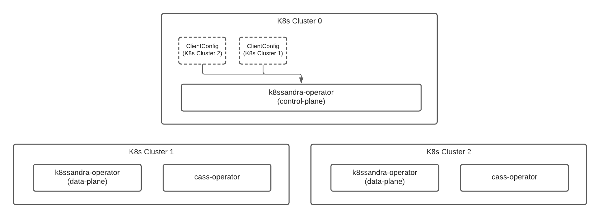
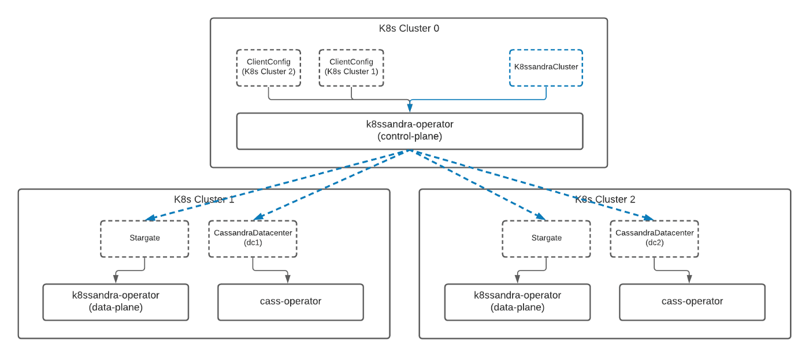
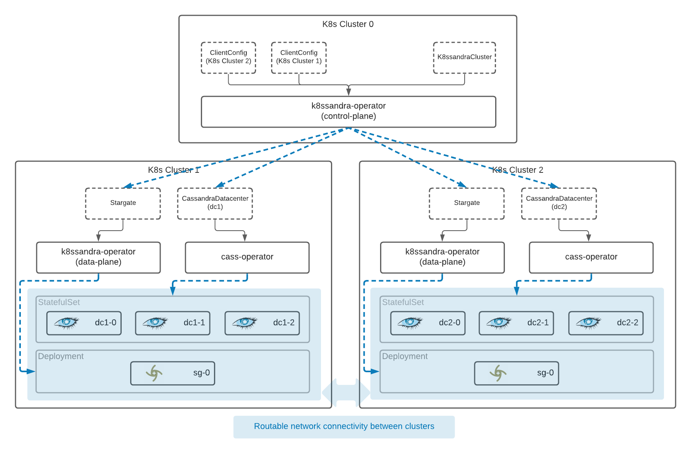

K8ssandra Operator provides multi-cluster and multi-region support for Apache Cassandra&reg; databases deployed in Kubernetes environments. K8ssandra operator also works in single-cluster and single-region Kubernetes deployments.

You can [install](https://docs-v2.k8ssandra.io/install/local/) K8ssandra Operator in:

* A local Kubernetes 1.19+ environment, such as kind, K3D, or minikube
* A supported cloud provider's Kubernetes environment

## Architecture

K8ssandra Operator consists of two primary components:

* A control plane
* A data plane

The control plane creates and manages objects that exist only in the API server. The control plane can be installed in only one cluster; that is, in the control-plane cluster. While it is possible to deploy a Cassandra datacenter in the control-plane cluster, we recommend that you avoid doing so. 

The data plane deploys and manages pods, and the data plane can be installed on any number of clusters. Moreover, the data plane may interact directly with the managed applications. For example, the operator may call the `management-api` to create keyspaces in Cassandra.

In each cluster, the deployed and managed pods can include [Stargate]() and [cass-operator]().   

**Tip:** In addition to this topic, be sure to read this [K8ssandra Operator architecture]() deep dive! 

Here's how the K8ssandra Operator components fit together:


## Introducing the K8ssandraCluster

In this initial K8ssandra Operator release, we're introducing a new custom resource: the `K8ssandraCluster`. This new resource will encompass all of the aspects necessary to install a production-ready, multi-cluster K8ssandra deployment.

To deploy a K8ssandraCluster, we use a custom YAML file. The following shows what a configuration looks like. This example would create a cluster with two data centers deployed across two different Kubernetes clusters. Notice there are two Cassandra 4.0.1 datacenters, dc1 and dc2, that are associated with the two data plane clusters.

```yaml
apiVersion: k8ssandra.io/v1alpha1
kind: K8ssandraCluster
metadata:
  name: demo
spec:
  cassandra:
    serverVersion: "4.0.1"
    storageConfig:
      cassandraDataVolumeClaimSpec:
        storageClassName: standard
        accessModes:
          - ReadWriteOnce
        resources:
          requests:
            storage: 5Gi
    config:
      jvmOptions:
        heapSize: 512M
    networking:
      hostNetwork: true
    datacenters:
      - metadata:
          name: dc1
        k8sContext: kind-k8ssandra-1
        size: 3
        stargate:
          size: 1
          heapSize: 256M
      - metadata:
          name: dc2
        k8sContext: kind-k8ssandra-2
        size: 3
        stargate:
          size: 1
          heapSize: 256M
```

In this example, you can see that the Cassandra configuration is exposed very similarly to how it was previously within K8ssandra 1.4.x, allowing you to specify data centers, racks, and easy access to the selected version — to name a few. 

This should feel very familiar for good reason. Under the hood, the K8ssandra Operator still leverages and delegates control to Cass Operator.

So, what's different? How does this add anything to the current K8ssandra experience? 

One key element of this new configuration is the `k8sContext`, which is the connection between the CassandraDatacenter and the Kubernetes cluster that is to be its home. With this small yet powerful setting, you can simply define a remote Kubernetes cluster to which a particular data center should be deployed.

## Specifying remote clusters

You know you can tell the `K8ssandraCluster` what remote cluster to install a data center within — but how? 

The association of a remote cluster is made possible through the addition of another new custom resource: the **ClientConfig**. 

A ClientConfig is essentially the definition of a remote cluster a kubeconfig that the K8ssandra Operator can use to remotely access it. Deploying a data center onto the local Kubernetes cluster, where the “control plane” operator is deployed, doesn't require any additional settings.

Next, we'll take a look at the overall architecture of a K8ssandra Operator deployed system. This will show you how the K8ssandra Operator works within each cluster, and also help you understand the difference between a “control plane” and “data plane” deployment.

## Deployment architecture

What happens when you deploy a `K8ssandraCluster`?

Before deploying a `K8ssandraCluster`, there are a few other requirements, including the installation of the necessary operators as well as establishing network connectivity between the clusters. It's important to note that there must be routable network connectivity among the pods in each cluster. The good news is that the virtual networking configurations available within cloud services, such as Google Kubernetes Engine (GKE), make this easy to do.

There are a few different ways to accomplish the prerequisite steps, using Helm or Kustomize. You can learn more about the installation process in our K8ssandra Operator [local install](https://docs-v2.k8ssandra.io/install/local/) topic and its related topics.

This next diagram gives you a quick glimpse at a simple deployment, **before** the installation of the `K8ssandraCluster`:



In the configuration above, we have:

* Deployed across three distinct Kubernetes clusters.
* Declared that “K8s Cluster 0” is our control plane.
* Declared that “K8s Cluster 1” and “K8s Cluster 2” are data plane clusters.
* Provided access from K8s Cluster 0 to K8s Cluster 1 and K8s Cluster 2 by providing a ClientConfig for each remote data plane cluster.

While any k8ssandra-operator is capable of operating in the control plane or data plane mode, the control plane is the one responsible for distributing resources to remote clusters. So, the `K8ssandraCluster` resource should be deployed to the **control plane** cluster.

When a `K8ssandraCluster` resource is installed to the control plane cluster, other resources will be distributed to the remote clusters for local reconciliation within those clusters.

Here's an illustration of our distribution of resources between clusters, **after** a `K8ssandraCluster` has been installed :



The control plane in Kubernetes has now distributed new resources to each of the other clusters. From here, the operators installed in each remote cluster will begin to deploy the necessary services within that cluster.

Eventually, a coordinated deployment will take shape that will look like the following:



Once resources have been distributed by the control plane to each data plane cluster, the local operator services within each cluster will manage the deployment of the data services.

The control plane has also taken care of the configuration necessary within the remote clusters to connect each of the distributed data centers, forming a **highly available (HA) multi-datacenter cluster**.

In addition to coordinating the distribution of resources to remote clusters and configuration, the control plane is also responsible for the collection and rollup of status across the complete cluster. This is another benefit of the K8ssandra Operator that wasn't possible in prior K8ssandra releases.

## Next steps

* Learn how to [install](https://docs-v2.k8ssandra.io/install/local/) a `K8ssandraCluster` custom resource, using K8ssandra Operator, in a local single- or multi-cluster Kubernetes.
* Also see the topics covering other [components](https://docs-v2.k8ssandra.io/components/) deployed by K8ssandra Operator. 
* For information on using the deployed K8ssandra components, see the [Tasks](https://docs-v2.k8ssandra.io/tasks/) topics.
