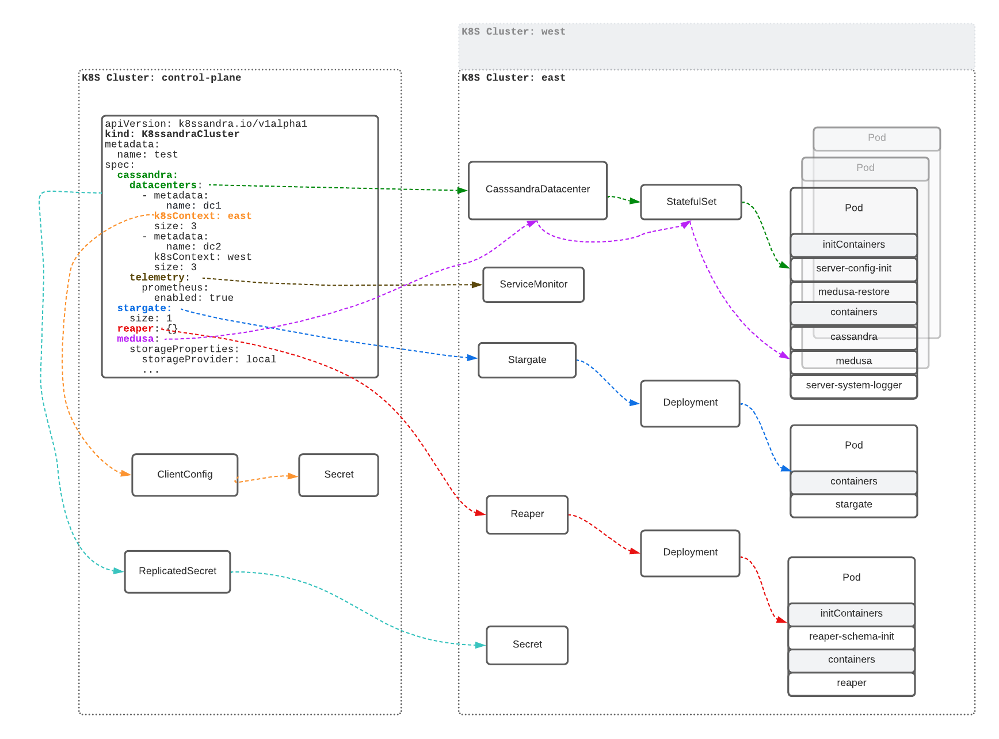

K8ssandra Operator provides several Custom Resource Definitions (CRDs), notably `K8ssandraCluster`. It is the primary custom resource (CR) with which you will with interact when using K8ssandra Operator. `K8ssandraCluster` is inherently complex given the number of software components than can be configured and deployed. 
This topic provides information about the `K8ssandraCluster` CR.

The following diagram provides an overview of the various objects that make up a `K8ssandraCluster`. Key parts are highlighted with arrows pointing to the relevant objects. The following sections of this document will explain the various parts of the diagram.



## Kubernetes Clusters
The components that make up a `K8ssandraCluster` can be spread across multiple Kubernetes clusters. One of those clusters must be designated as the control plane cluster. The other clusters are data plane clusters. In the diagram we have three Kubernetes clusters - `control-plane`, `east`, and `west`. The latter two make up the data plane.

The `K8ssandraCluster` object must be created in the control plane cluster.

K8ssandra Operator is deployed in each cluster. The operator consists of several controllers. Some controllers, notably the `K8ssandraCluster` controller, only run in the control plane cluster. This is the main reason that the `K8ssandraCluster` object needs be created in the control plane cluster. 

Other controllers run in both the control plane and in the data plane. This includes controllers for the following types:

* CassandraDataCenter
* Stargate
* Reaper
* CassandraBackup
* CassandraRestore

## Cassandra Datacenters
The `cassandra.datacenters` property is an array. K8ssandra Operator creates a `CassandraDatacenter` for each element. Here is the relevant portion of the manifest from the diagram:

```yaml
cassandra:
  datacenters:
    - metadata:
        name: dc1
      k8sContext: east
      size: 3
    - metadata:
        name: dc2
      k8sContext: west
      size: 3  
``` 

There are two elements in the array. K8ssnandra Operator will create `CassandraDatacenters` named `dc1` and `dc2`. Each one will have a size of 3.

(Add link to configuration doc when it's available.)

The `k8sContext` property specifies in which Kubernetes cluster the CassandraDatacenter should be created.  K8sandra Operator creates `dc1` in the `east` cluster and `dc2` in the `west` cluster.  If `k8sContext` is not specified, the operator creates the CassandraDatacenter in the control plane cluster. To understand what values can be specified for `k8sContext` we have to talk about ClientConfigs, which are covered in the next section.

[Cass Operator](https://github.com/k8ssandra/cass-operator) provides the CassandraDatacenter CRD and manages CassandraDatacenter objects. After K8ssandra Operator (the `K8ssandraCluster` controller to be precise) creates the `CassandraDatacenter`, Cass Operator creates a `StatefulSet`. 

**Note:** There can be multiple StatefulSets for a CassandraDatacenter. The example in the diagram above only includes one for simplicty.

After Cass Operator creates the StatefulSet, the StatefulSet controller (which is part of Kubernetes itself0 creates the Cassandra pods. The Cassandra pod consists of several containers. The `cassandra` container is the main one where the Cassandra process runs.

## ClientConfig
A ClientConfig is another CRD provided by K8ssandra Operator; however, it is not part of a K8ssandraCluster. It is essentially a reference to secret that contains a [kubeconfig](https://kubernetes.io/docs/concepts/configuration/organize-cluster-access-kubeconfig/). The kubeconfig should contain one or more `context` elements which provide details for connecting to a Kubernetes cluster. The `k8sContext` property is a reference to one of these `contexts`.

The operator uses ClientConfigs to establish connections to remote clusters. It is best to think of a ClientConfig as an operator configuration that is shared across all K8ssandraClusters.

**Note:** See [Remote Cluster Connection Management][https://github.com/k8ssandra/k8ssandra-operator/tree/main/docs/remote-k8s-access#readme] for more information about ClientConfigs. 

## Telemetry
Next we look at the `telemetry` property. Here is the relevant portion of the manifest in the diagram:

```yaml
cassandra:
  datacenters:
    ...
  telemetry:
    prometheus:
      enabled:
        true
```

When telemetry is enabled, K8ssandra Operator creates a `ServiceMonitor` for each `CassandraDatacenter`. The `ServiceMonitor` CRD is provided by [Prometheus Operator](https://github.com/prometheus-operator/prometheus-operator). You must install the CRD in order for K8ssandra Operator to be able to create Service Monitors. This can most easily be done by installing Prometheus Operator.

**Note:** See [Monitoring using Prometheus](https://github.com/k8ssandra/k8ssandra-operator/blob/main/docs/prometheus-grafana/prometheus-installation-configuration.md) for more information about using ServiceMonitors.

## Stargate
K8ssandra Operator provides a Stargate CRD. Stargate objects are managed by the Stargate controller.

Here is the relevant portion of the manifest for the `stargate` property:

```yaml
cassandra:
  ...
stargate:
  size: 1  
```

The presence of the `stargate` property tells the operator to enable and configure Stargate for each CassandraDatacenter. The `size` property configures the number of Stargate nodes per datacenter.

(TODO: Add link to configuration doc when it's available.)

**Note:** See [stargate.io](https://stargate.io/) to learn more abour Stargate.

After the K8ssandraCluster controller creates the Stargate object, the Stargate controller creates a Deployment. After the Deployment is created, the Deployment controller, which is part of Kubernetes itself, creates the Stargate pod. This pod runs the Stargate process.

## Reaper
K8ssandra Operator provides a Reaper CRD. Reaper objects are managed by the Reaper controller. 

Here is the relevant portion of the manifest for the `reaper` property:

```yaml
cassandra:
  ...
stargate:
  ...
reaper: {}    
```

The presence of the `reaper` property tells the operator to enable and configure Repaer for each CassandraDatacenter. The empty object `{}` simply means that Reaper will be configured with default settings.

**Note:** See [cassandra-reaper.io](http://cassandra-reaper.io/) to learn more about Reaper.

(TODO: Add link to configuration doc when it's available.)

After the K8ssadraCluster controller creates the Reaper object, the Reaper controller creates a Deployment. After the Deployment is created, the Deployment controller, which is part of Kubernetes itself, creates the Reaper pod. This pod runs the Reaper process.

# Medusa
K8ssandra Operator provides CassandraBackup and CassandraRestore CRDs for performing backup/restore operations with Medusa. CassandraBackup and CassandraRestore objects are managed by their own, respective controllers.

Here is the relevant portion of the manifest for the `medusa` property:

```yaml
cassandra:
  ...
stargate:
  ...
reaper: {}
medusa:
  storageProperties:
    storageProvider: local
  ...
```

**Note:** See [https://github.com/thelastpickle/cassandra-medusa](https://github.com/thelastpickle/cassandra-medusa) to learn more about Medusa.

The `medusa` property is different from the `telemetry`, `stargate`, and `reaper` properties in that it does not result in the operator 
creating an additional object. Instead K8ssandra Operator configures the CassandraDatacenter to enable and deploy Medusa. 

The Cassandra pod has a `medusa-restore` init container and a `medusa` sidecar container. The former performs restores and the latter performs backups.

**Note:** See [Deploying Medusa](https://github.com/k8ssandra/k8ssandra-operator/blob/main/docs/medusa/usage.md) for more information on 
configuring and performing backups and restores.

## ReplicatedSecret
K8ssandra Operator provides a ReplicatedSecret CRD. ReplicatedSecrets are managed by the SecretSync controller. 
Unlike other properties, there is no property in the K8ssandraCluster spec to enable and configure a ReplicatedSecret.

The operator automatically creates a ReplicatedSecret for each K8ssandraCluster.  This object determines which secrets in the control plane cluster are replicated to the data plane clusters.  The best example of this is the default superuser secret for Cassandra.

There is a superuser secret for each K8ssandraCluster. It can be created and provided by the user; otherwise, the operator generates a default one. 
The SecretSync controller ensures that the secret is replicated to each of the data plane clusters.

(TODO: Add link to secrets management doc when it's available.)
 
