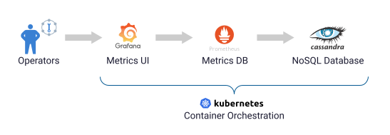
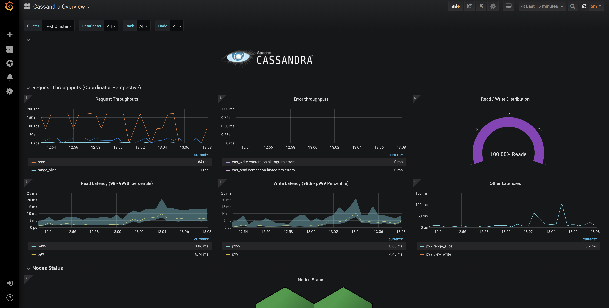
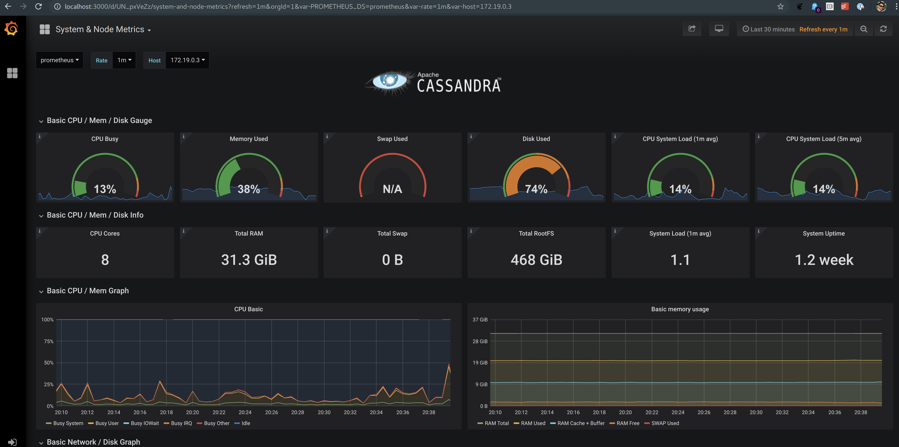
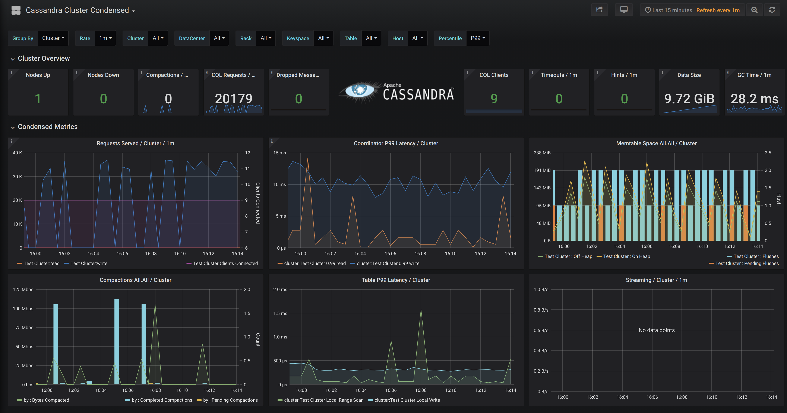
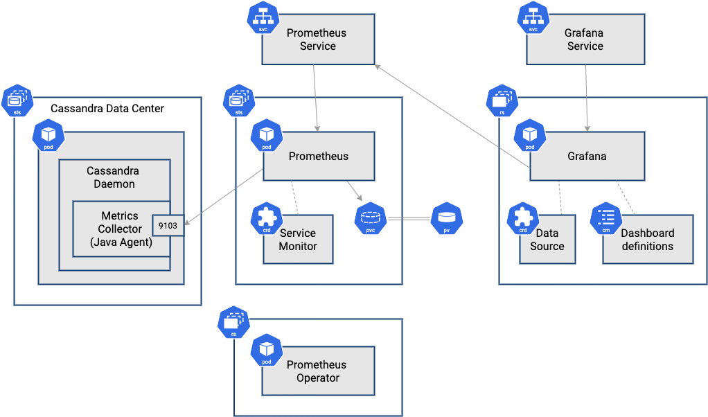

## Introduction

When running applications in Kubernetes, observability is key. K8ssandra includes [Prometheus](http://prometheus.io) and [Grafana](http://grafana.com) for storage and visualization of metrics associated with the Cassandra cluster.

Metrics Collector for Apache Cassandra (MCAC) is the key to providing useful metrics for K8ssandra users. MCAC is deployed to your Kubernetes environment by K8ssandra. If you haven't already installed K8ssandra, see the [install]() topics.

MCAC aggregates OS and Cassandra metrics along with diagnostic events to facilitate problem resolution and remediation. K8ssandra provides preconfigured Grafana dashboards to visualize the collected metrics. 

### About Metric Collector 

* Built on [collectd](https://collectd.org), a popular, well-supported, open source metric collection agent. With over 90 plugins, you can tailor the solution to collect metrics most important to you and ship them to wherever you need.

* Cassandra sends metrics and other structured events to collectd over a local Unix socket.  

* Fast and efficient. MCAC can track over 100k unique metric series per node. That is, metrics for hundreds of Cassandra tables.

* Comes with extensive dashboards out of the box. The Cassandra dashboards let you aggregate latency accurately across all nodes, dc or rack, down to an individual table.  

* Design principles:
  * Little or no performance impact to Cassandra
  * Simple to deploy via the K8ssandra install, and self managed
  * Collect all OS and Cassandra metrics by default
  * Keep historical metrics on node for analysis
  * Provide useful integration with Prometheus and Grafana

* Supported versions of Apache Cassandra: 2.2+ (2.2.X, 3.0.X, 3.11.X, 4.0) 

### Sample overview metrics in Grafana

Cassandra node-level metrics are reported in the Prometheus format, covering everything from operations per second and latency, to compaction throughput and heap usage. Example:

### Sample OS metrics in Grafana

### Sample cluster metrics in Grafana

## Architecture details

K8ssandra uses the [kube-prometheus-stack](https://github.com/prometheus-community/helm-charts/tree/main/charts/kube-prometheus-stack), a Helm chart from the [Prometheus Community](https://prometheus.io/community/) project, to deploy Prometheus and Grafana and connect them to Cassandra, as shown in the figure below.

Let's walk through this architecture from left to right. We'll provide links to the Kubernetes documentation so you can dig into those concepts more if you'd like to.

The Cassandra nodes in a K8ssandra-managed cluster are organized in one or more datacenters, each of which is composed of one or more racks. Each rack represents a failure domain with replicas being placed across multiple racks (if present). In Kubernetes, racks are represented as [StatefulSets](https://kubernetes.io/docs/concepts/workloads/controllers/statefulset/). (We'll focus here on details of the Cassandra node related to monitoring. 

Each Cassandra node is deployed as its own [pod](https://kubernetes.io/docs/concepts/workloads/pods/). The pod runs the Cassandra daemon in a Java VM. Each Apache Cassandra pod is configured with the DataStax [Metrics Collector for Apache Cassandra](https://github.com/datastax/metric-collector-for-apache-cassandra), which is implemented as a Java agent running in that same VM. The Metrics Collector is configured to expose metrics on the standard Prometheus port (9103).

One or more Prometheus instances are deployed in another StatefulSet, with the default configuration starting with a single instance. Using a StatefulSet allows each Prometheus node to connect to a Persistent Volume (PV) for longer term storage. The default K8ssandra chart configuration does not use PVs. By default, metric data collected in the cluster is retained within Prometheus for 24 hours.

An instance of the Prometheus Operator is deployed using a Replica Set. The `kube-prometheus-stack` also defines several useful Kubernetes [custom resources (CRDs)](https://kubernetes.io/docs/concepts/extend-kubernetes/api-extension/custom-resources/) that the Prometheus Operator uses to manage Prometheus. One of these is the `ServiceMonitor`. K8ssandra uses `ServiceMonitor` resources, specifying labels selectors to indicate the Cassandra pods to connect to in each datacenter, and how to relabel each metric as it is stored in Prometheus. K8ssandra provides a `ServiceMonitor` for Stargate when it is enabled. Users may also configure `ServiceMonitors` to pull metrics from the various operators, but pre-configured instances are not provided at this time.

The `AlertManager` is an additional resource provided by `kube-prometheus-stack` that can be configured to specify thresholds for specific metrics that will trigger alerts. Users may enable, and configure, AlertManager through the `values.yaml` file. See the `kube-prometheus-stack` [example](https://github.com/prometheus-community/helm-charts/blob/main/charts/kube-prometheus-stack/values.yaml#L114-L595) for more information.
  
An instance of Grafana is deployed in a Replica Set. The `GrafanaDataSource` is yet another resource defined by `kube-prometheus-stack`, which is used to describe how to connect to the Prometheus service. Kubernetes config maps are used to populate `GrafanaDashboard` resources. These dashboards can be combined or customized.

Ingress or port forwarding can be used to expose access to the Prometheus and Grafana services external to the Kubernetes cluster.

## FAQs

  1. Where is the list of all Cassandra metrics?

     The full list is located on [Apache Cassandra docs](https://cassandra.apache.org/doc/latest/operating/metrics.html) site.
     The names are automatically changed from CamelCase to snake_case.

     In the case of Prometheus the metrics are further renamed based on [relabel config](https://prometheus.io/docs/prometheus/latest/configuration/configuration/#relabel_config) which live in the
     [prometheus.yaml](https://github.com/datastax/metric-collector-for-apache-cassandra/blob/master/dashboards/prometheus/prometheus.yaml) file in the MCAC repo.

  2. How can I filter out metrics I don't care about?

     Please read the [metric-collector.yaml](https://github.com/datastax/metric-collector-for-apache-cassandra/blob/master/config/metric-collector.yaml) section in the MCAC GitHub repo on how to add filtering rules.

  3. What is the datalog? And what is it for?

     The datalog is a space limited JSON based structured log of metrics and events which are optionally kept on each node.  
     It can be useful to diagnose issues that come up with your cluster.  If you wish to use the logs yourself, 
     there's a [script](https://github.com/datastax/metric-collector-for-apache-cassandra/blob/master/scripts/datalog-parser.py) included on the MCAC GitHub repo to parse these logs which can be analyzed or piped into [jq](https://stedolan.github.io/jq/).

     Alternatively, we offer free support for issues, and these logs can help our support engineers help diagnose your problem.

## Next steps

* For details about viewing the metrics in Grafana dashboards provided by K8ssandra, see [Monitor Cassandra]().
* See the topics covering other [components]() deployed by K8ssandra. 
* For information on using other deployed components, see the [Tasks]() topics.
