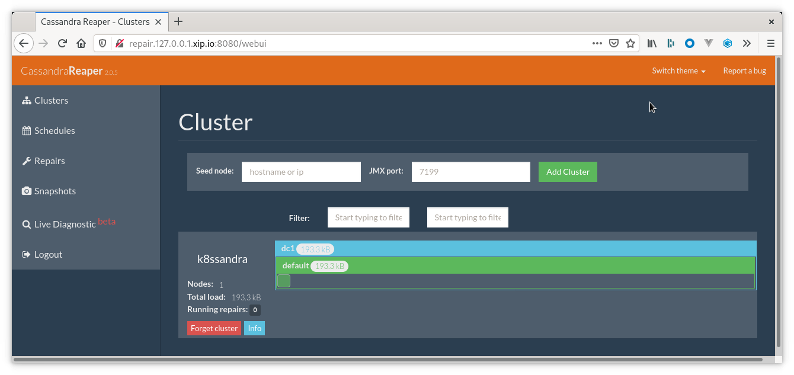

Reaper for Apache Cassandra&reg; is deployed by a K8ssandra Operator install, based on the [Reaper]() Custom Resource Definition (CRD).

If you haven't already installed a K8ssandraCluster using K8ssandra Operator, see the [local install]() topic.

## Introduction

Reaper is an open source tool to schedule and orchestrate repairs of Apache Cassandra® clusters. Reaper was originally designed and open-sourced by [Spotify](https://www.slideshare.net/planetcassandra/spotify-automating-cassandra-repairs) in an attempt to automate repairs while applying best practices from their solid production experience.

Reaper enable you to maintain anti-entropy for your data, which is necessary for partition-tolerant distributed systems like your Kubernetes-managed Cassandra database.

Apache Cassandra works constantly to provide consistent results for queries. There are a number of anti-entropy mechanisms continuously running to keep data in sync across replicas. Repair is one of these mechanisms. We recommended running a complete repair cycle across the entire dataset **once every ten days**. In order to reduce the impact of analyzing the entire dataset at once, many operators choose to spread out the repair process over the ten day period.

To that end, K8ssandra leverages [Reaper for Apache Cassandra](http://cassandra-reaper.io/) from The Last Pickle to handle the scheduling, execution, and monitoring of repair tasks. Optionally, ingress may be configured as part of the K8ssandra installation for external connectivity to the Reaper web interface.

Here's an example from the Reaper Web UI. For more, see [Repair tasks](). 

## Repair challenges before Reaper

Anti-entropy repair has been performed traditionally using the `nodetool repair` command. It can be performed in two ways, full or incremental, and be configured to repair various ranges of tokens: 

* all
* primary range
* sub-range

Add to this task various anti-compaction triggers and the different validation compaction orchestration settings:

* sequential
* parallel
* datacenter aware

All of which often resulted in complexity for a mandatory repair operation that should be simple to run. 

In the 1.x/2.x days of Cassandra (and probably after that), some operators simply gave up on repairing their clusters due to the difficulties in completing the operation successfully, without impacting SLAs.

The main problems that were encountered then during repairs:

* High number of pending compactions and SSTables on disk
* Repairs taking longer than the tombstones GC grace period
* High cluster load due to repair pressure
* Blocked/never-ending repairs
* Inability to resume repair operations if failures occurred
* vnodes made the operation very long and challenging to perform

## Reaper performs safe repairs

Reaper was built to address those issues and make repairs as safe and reliable as possible. It splits the repair operations into evenly sized subranges, and schedules the operations, so that:

* All nodes are kept busy repairing small units of data if possible
* A single segment is running on a node at once
* Segments lasting too long are terminated and re-scheduled
* Failed segments get replayed in case of transient failure
* Pending compactions will be monitored to pause segment scheduling, preventing overload
* Repairs can be paused

Reaper also supports incremental repair - recommended for use starting with Cassandra 4.0. Since Cassandra 3.0, Reaper can create segments with several token ranges to reduce the overhead of vnodes on repairs. Such ranges will be repaired in a single job by Cassandra as segments will only contain ranges that are replicated on the same set of nodes.

## Reaper concepts

### Segments

Reaper splits repair runs in segments. A segment is a subrange of tokens that fits entirely in one of the cluster token ranges. The minimum number of segments for a repair run is the number of token ranges in the cluster. With a 3 nodes cluster using 256 vnodes per node, a repair run will have at least 768 segments. If necessary, each repair can define a higher number of segments than the number of token ranges.

Token ranges that have the same replicas can be consolidated into a single segment. If the total number of requested segments is lower than the number of vnodes, Reaper will try to group token ranges so that each segment has the appropriate number of tokens. For Cassandra 2.2 tables, one repair session will be started for each subrange of the segment, so the gain will be the reduction of overhead in Reaper. Starting with 3.0, Cassandra will generate a single repair session for all the subranges that share the same replicas, which then further reduces the overhead of vnodes in Cassandra.

### Back-pressure

Reaper associates each segment with its replicas, and run repairs sequentially on only one of the replicas. If a repair is already running on one of the replicas or if there are more than 20 pending compactions, Reaper postpones the segment for future processing and tries to repair the next segment.

### Concurrency and multithreading

As a multi-threaded service, Reaper computes how many concurrent repair sessions can run on the cluster and adjust its thread pool accordingly. To that end, it will check the number of nodes in the cluster and the RF (Replication Factor) of the repaired keyspace. On a three node cluster with RF=3, only one segment can be repaired at a time. On a six node cluster with RF=3, two segments can be repaired at the same time.

The maximum number of concurrent repairs is 15 by default and can be modified in the YAML configuration `cassandra-reaper.yaml` file.

Since Cassandra 2.2, repairs are multithreaded in order to process several token ranges concurrently and speed up the process. No more than four threads are authorized by Cassandra. The number of repair threads can be set differently for each repair run/schedule. This setting is ignored for clusters running an older version of Apache Cassandra.

### Timeout

By default, each segment must complete within 30 minutes. Reaper subscribes to the repair service notifications of Cassandra to monitor completion, and if a segment takes more than 30 minutes it gets canceled and postponed. This means that if a repair job is subject to frequent segment cancellation, it is necessary to either split it up into more segments or raise the timeout over its default value.

### Pause and resume

Pausing a repair will force the termination of all running segments. Once the job is resumed, canceled segments will be fully processed once again from the beginning.

### Intensity

Intensity controls the eagerness by which Reaper triggers repair segments. The Reaper will use the duration of the previous repair segment to compute how much time to wait before triggering the next one. The idea behind this concept is that long segments mean a lot of data mismatch, and thus a lot of streaming and compaction. Intensity allows reaper to adequately back off and give the cluster time to handle the load caused by the repair.

### Scheduling interval

Reaper polls for new segments to process at a fixed interval. By default the interval is set to 30 seconds and this value can be modified in the Reaper configuration YAML file.

## Reaper features

K8ssandra deploys the Reaper web UI. You can access it using the following URL format, specifying `$REAPER_HOST` with the configured DNS name (or localhost) of your environment:

http://$REAPER_HOST:8080/webui/index.html

The web interface lets you:

* Add/remove clusters
* Manage repair schedules
* Run manual repairs and manage running repairs

Reaper collects and displays runtime Cassandra metrics, running compactions and ongoing streaming sessions.

Reaper comes with a scheduler for recurring repairs but can also perform on-demand one-off repairs.

Reaper also has the ability to listen and display live Cassandra’s emitted Diagnostic Events.

In Cassandra 4.0, internal system “diagnostic events” have become available, via the work done in CASSANDRA-12944. These allow operators to observe internal Cassandra events, for example in unit tests and with external tools. These diagnostic events provide operational monitoring and troubleshooting beyond logs and metrics.

Reaper can use Postgres and Cassandra itself as a storage backend for its data, and is capable of repairing all Cassandra versions since 1.2 up to the latest 4.0.

In order to make Reaper more efficient, segment orchestration was recently revamped and modernized. It opened for a long awaited feature: fully concurrent repairs for different keyspaces and tables.
These changes also introduced a long awaited feature by allowing fully concurrent repairs for different keyspaces/tables.

## Next steps

* For the steps to set up repair operations using the Reaper Web UI, see [Repair Cassandra with Reaper](). 
* For information about using a superuser and secrets with Reaper authentication, see [Reaper security]().
* For reference details, see the K8ssandra Operator [Custom Resource Definitions (CRDs)]().
* Also see the topics covering other [components]() deployed by K8ssandra Operator. 
* For information on using the deployed components, see the [Tasks]() topics.
