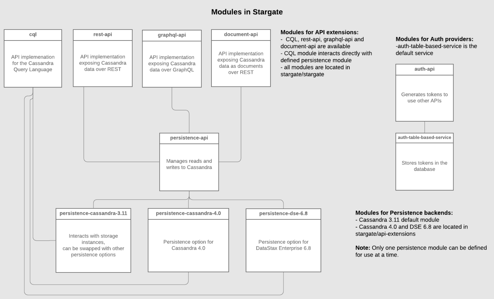

Stargate provides a data gateway with REST, GraphQL, and Document APIs in front of your K8ssandra-managed Cassandra database. Stargate is deployed by K8ssandra as part of its Helm chart install. If you haven't already installed K8ssandra, see the [install]() topics.

## Introduction

[Stargate](https://stargate.io) is an open source data gateway that sits between your app and your databases. It brings together an API platform and data request coordination code into one OSS project.

Stargate is a framework used to customize all aspects of data access. It is deployed between client applications and a database to provide an abstraction layer that can be used to shape your data access to fit your application's needs.

Many companies already build applications against Cassandra databases using the native Cassandra Query Language (CQL) API. With Stargate, Cassandra is available to a whole new class of applications through its many data API gateways. Instead of writing CQL, developers may opt for REST, GraphQL, or even Document endpoints that are all backed by the high performance and availability of Cassandra. K8ssandra has optional charts for the automated deployment and configuration of Stargate alongside Cassandra data nodes.

## Architecture

Stargate is organized into modules comprised of three broad categories:

* API extensions &mdash; responsible for defining the API, handling and converting requests to database queries, dispatching requests to persistence services, and returning and serving response to clients. Currently there are extensions for CQL, and REST and GraphQL APIs for CRUD access to table data. These extensions use the Authentication Extensions and the Persistence Extensions.

* Persistence extensions &mdash; responsible for implementing the coordination layer to execute requests passed by API services to underlying data storage instances. The Persistence extensions are currently Cassandra-centric. The extensions for Cassandra 3.11 and 4.0 use Cassandra’s coordinator to do the majority of the work.

* Authentication extensions &mdash; responsible for access control to Stargate’s APIs. This extension stores generated access tokens in the database.

Here's how the modules fit together:

## Next steps

* For comprehensive information about Stargate, visit the [stargate.io](https://stargate.io/) site.
* For details on the API calls, see the Stargate [API reference](https://stargate.io/docs/latest/api.html).
* For an introduction to using Stargate with K8ssandra, see [Develop with Stargate APIs](). 
* For information about using a superuser and secrets with Stargate authentication, see [Stargate security]().
* Also see the topics covering other [components]() deployed by K8ssandra. 
* For information on using the deployed components, see the [Tasks]() topics.
