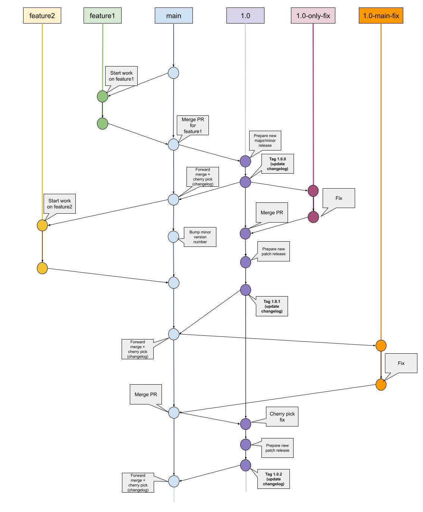
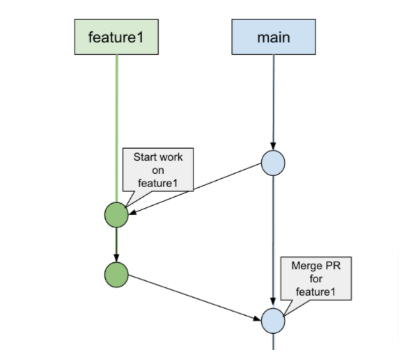
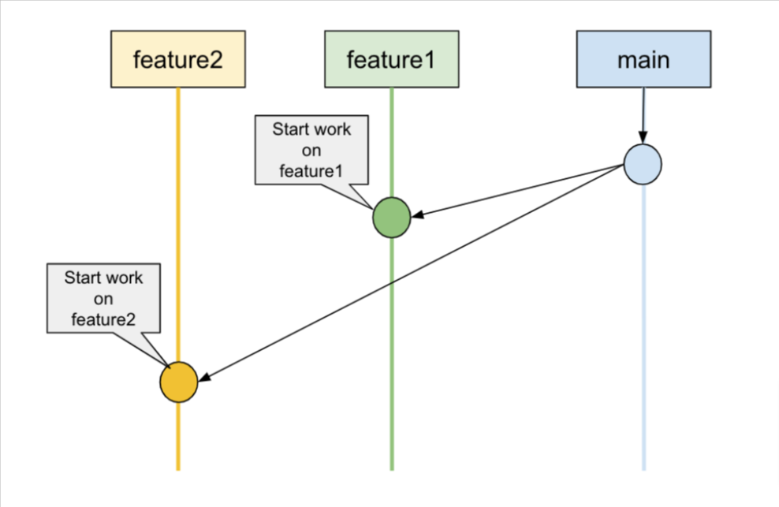
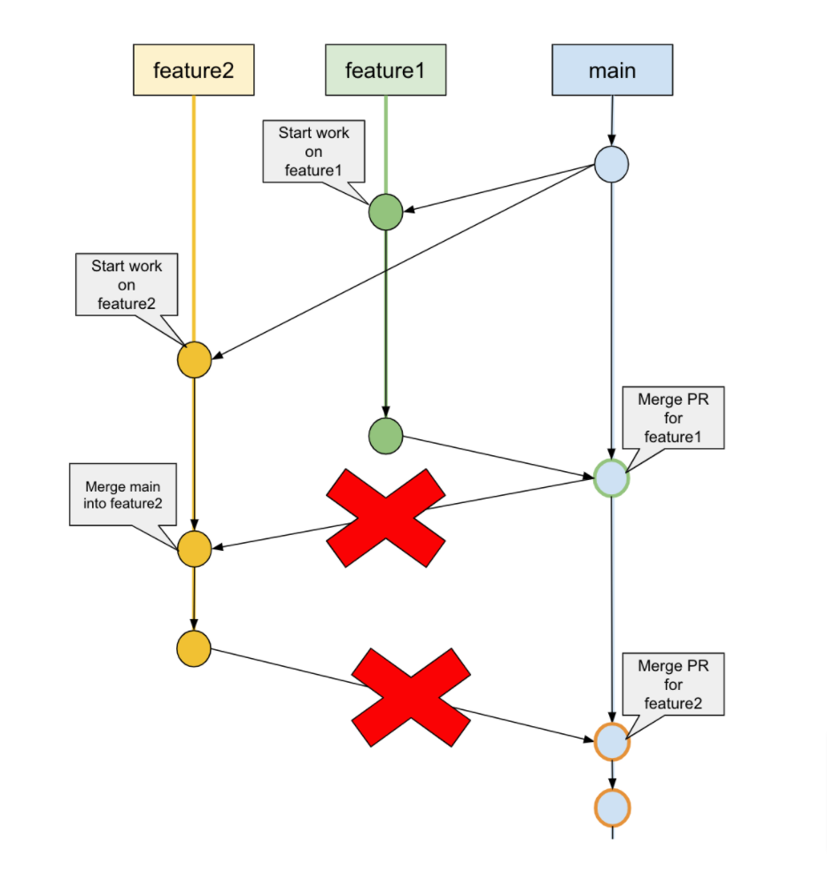
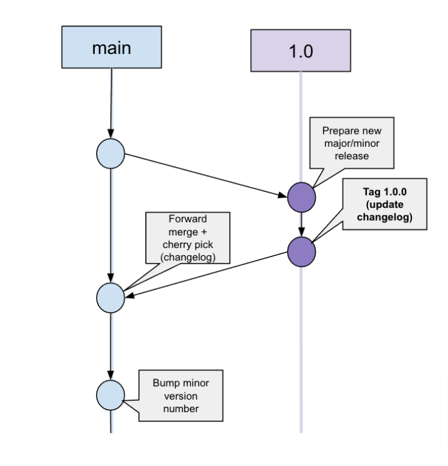
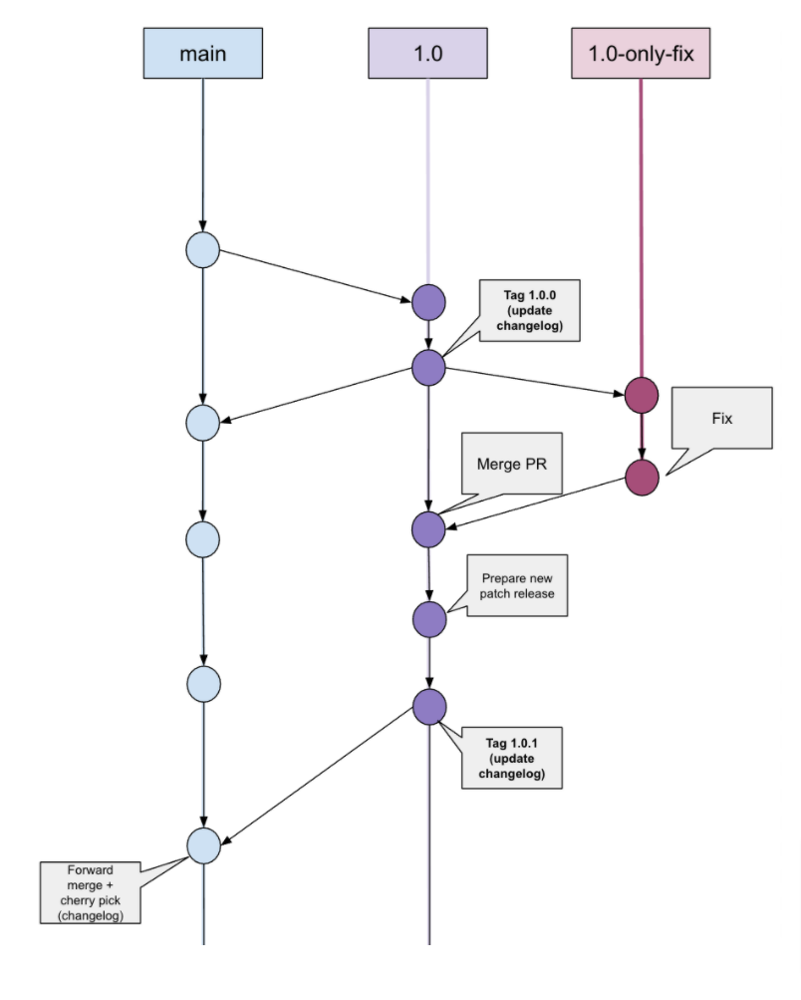

## Purpose

The current document aims at proposing a branching model for the K8ssandra project and at describing the following:

* The types of branches we should/can use
* The lifecycle of feature branches
* The process of merging feature branches into the main branch
* How to cut releases
* How to issue fixes on past releases and merge such patches back to the main branch

The branching model should allow publishing patches for past releases without bringing instability by including refactorings or new features that weren’t part of the initial release.

## Branches



### main

The main branch contains the next release and all PRs adding new features or fixes for the upcoming major/minor release should be merged in it.

**This branch is protected against force push to prevent rewriting its history.**

Direct pushes to main should be avoided as much as possible to allow peer review through the PR process. This also allows unit/integration tests to run before a commit is pushed to **main** as we cannot rewrite history.

### &lt;feature&gt;

Feature branches are branched off the **main** branch. Feature branches should be created **[on our personal forks](https://docs.github.com/en/github/getting-started-with-github/quickstart/fork-a-repo)**. 



Feature branches are meant to be short lived (as much as possible).
As feature branches are owned and actively worked on by a single developer, it should be synced with main using rebase instead of merges.

This brings the following benefits:

* The commit history is kept flat and easily readable without numerous merge commits
* The tests run on the branch as they will once merged into **main**, making the impact of merging the PR as predictable as possible
* There is no risk of duplicating commits when merging the PR into **main**

Let’s consider two feature branches that are created one after the other from the same **main** commit:



The following for example should not be done on feature2, considering feature1 gets merged first:




Instead, before merging feature2 (and preferably on a regular basis during feature2’s lifespan), the branch should be rebased on top of **main** (or **upstream/main** if you don’t want to update your local main just yet):

```
git checkout main
git pull upstream main
git checkout feature2
git rebase main
```

This allows to shift the initial commit of **feature2** to the latest commit of **main** (and could require fixing conflicts during rebase):


This also allows us to use the "Rebase and merge" option from GitHub to retain multiple commits when it makes sense to.

### &lt;release&gt;

Release branches are named in the form **&lt;major&gt;.&lt;minor&gt;** and should always be branched off **main**.  
Release branches can receive fixes and should be "forward merged" to **main** in order to keep them compatible in a safe way.  
Release tags are created on release branches only, never on **main** (see [Stable Releases](#stable-releases)). 

After the release branch was forward merged and the appropriate commits (such as changelog updates) were cherry picked back to main from the release branch, the next minor version should be prepared by bumping up the version numbers where appropriate (including Helm charts - see [Versioning](#versioning) for more information).



After the release tag is cut, **no new features should go into the release branch.** The only changes that should go into the release branch are bug fixes.


### &lt;fix&gt;

Fix branches can be branched off **main** or a release branch. If the fix **only** applies to a released version, then the corresponding release branch should be used as base and the PR should target the release branch:



If the same fix should be applied on **main** then the fix branch should be branched off **main** and the PR should be merged back to **main**. The fix commit should then be cherry picked to the release branch before a new patch version is released:


When a bug fix is cherry picked into the release branch and after necessary testing, we create a patch release, e.g., 1.0.1. [https://docs.microsoft.com/en-us/azure/devops/learn/devops-at-microsoft/release-flow](https://docs.microsoft.com/en-us/azure/devops/learn/devops-at-microsoft/release-flow) explains motivation for cherry-picking bug fixes from main:

* Maintains a consistent workflow for both new features and bug fixes
* Ensures changes land in main as well as in the release branch


## Branching strategies


### For a new feature

First sync up your fork’s **main** branch with upstream:

```
git checkout main
git fetch upstream
git rebase upstream/main
```

Then create the feature branch: 

```
git checkout -b new-feature-branch
```


### For a fix

If the fix targets only main, or both main and a release branch, sync up your fork’s main branch and create the fix branch off it:

```
git checkout main
git fetch upstream
git rebase upstream/main
git checkout -b fix-branch
```

Fix branches should be rebased on top of their origin branch just as feature branches do.
If the fix targets only a specific release and not main, reset your fork’s release branch with the upstream release branch:

```
git checkout -b 1.0 upstream/1.0
git checkout -b fix-for-1.0
```

### For a release

Cutting out releases requires working **on the upstream repo directly**.

#### Prereleases

Prereleases are pushed automatically to the Helm repo for each push to `main`.  
The release workflow will update the Helm charts version number by replacing `-SNAPSHOT` by the date and time at which the release workflow runs. This change will not be committed as `main` will remain on a `-SNAPSHOT` version until the upcoming stable release.

#### Stable releases

To cut out a new major/minor release, follow these steps:

* Make sure testing was fully completed in `main` by asking the whole team to approve the upcoming release.
* Create a release branch off main named using the following pattern: `<major>.<minor>`

```
git checkout main
git pull
git checkout -b <major>.<minor>
```

* Update the changelog and commit (Commit message should be "Update changelog for release x.x.x")
* Update the version numbers and commit (see [Versioning](#versioning)) (Commit message should be "Release x.x.x")
* Tag the commit using the following pattern: `v<major>.<minor>.<patch>`
* Push the tag
* Go to [the GitHub Releases](https://github.com/k8ssandra/k8ssandra/releases) page
* Edit the tag that was just created and paste the changelog in the description. Press the "Publish release" which will trigger the GHA workflow.
* Wait for the action to go through successfully
* Bump the version numbers to prepare the next patch release (to `<major>.<minor>.<next-patch>-SNAPSHOT`) and commit: **This includes charts and sub-charts**
* Forward merge the release branch to main and cherry pick the changelog update
* Checkout main
* Bump the version numbers to prepare the next minor release (to `<major>.<next-minor>.0-SNAPSHOT`), create a new empty `CHANGELOG-<major>.<next-minor>.md` file and commit
* Push to main

To cut out a new patch release, follow these steps:

* Checkout the existing release branch (and make sure you’re in sync by resetting your local copy)

```
git checkout <major>.<minor>
git pull
```

* Update the changelog and commit
* Update the version numbers and commit (see [Versioning](#versioning))
* Tag the commit using the following pattern: `v<major>.<minor>.<patch>`
* Push the tag
* Go to [the GitHub Releases](https://github.com/k8ssandra/k8ssandra/releases) page
* Edit the tag that was just created and paste the changelog in the description. Press the "Publish release" which will trigger the GHA workflow.
* Wait for the action to go through successfully
* Bump the version numbers to prepare the next patch release and commit
* Forward merge the release branch to main and cherry pick the changelog update


## Merging strategies

### Squashing commits

PRs should ideally be squashed into a **minimum number of commits** (ideally one if it makes sense) before being merged. \
This allows to:

* Keep the git history simple to read
* Force users to rework the commit messages and clean up all the "fix typo" and "fix failing test" messages
* Simplifies rebases
* Allows to revert changes more easily

Once squashed down, the PR can be merged using the "Rebase and merge" button on GitHub.  
To squash commits locally, run the following (considering we have 3 commits to squash):

```
git rebase -i HEAD~3
```

This will open your editor with something similar to:

```
pick 9922c2e Add stress test scenario
pick 740d0a8 Add preliminary helm deps update
pick e3390b2 Rework integration tests to use Ginkgo

# Rebase 8435052..e3390b2 onto 8435052 (3 command(s))
```

Replace "**pick**" by "**squash**" on all commits but the first one and save the changes.

```
pick 9922c2e Add stress test scenario
squash 740d0a8 Add preliminary helm deps update
squash e3390b2 Rework integration tests to use Ginkgo

# Rebase 8435052..e3390b2 onto 8435052 (3 command(s))
```

If a commit is a fix for the previous one, use "fixup" instead of "squash" to squash it without retaining the commit message:

```
pick 9922c2e Add stress test scenario
fixup 740d0a8 fix for previous commit
squash e3390b2 Rework integration tests to use Ginkgo

# Rebase 8435052..e3390b2 onto 8435052 (3 command(s))
```

This will open another editor screen with the messages from all commits. Rework them with a single line summarizing the commit intent, a blank line and then a paragraph giving more details on the changes. Save the changes and the commits will be squashed into a single one.

Force push the changes as history was rewritten:

```
git push --force-with-lease
```

### Forward merging (after releases only)

For PRs that don’t merge into **main**, forward merge is required to keep the branches compatible, cherry-pick commits that should also exist in **main** and avoid merging unwanted commits in the future (such as version changes).

After a PR was merged into branch 1.0, it can be forward merged using the following steps on the upstream repo directly:

```
# sync the local 1.0 branch
git checkout 1.0
git pull

# switch to main and sync it with origin
git checkout main
git pull

# create an empty merge commit
git merge 1.0 -s ours

# cherry-pick the changes using the commit sha, and make any manual adjustments required against the main branch
git cherry-pick -n <sha1>
git cherry-pick -n <sha2>
...

# commit amend the forward ported changes into the merge commit
git commit -a --amend

# Push the main branch back to origin
git push origin main
```

### Keeping feature/fix branches up to date

Feature branches should never merge main commits as it would duplicate them when merging the PR.

Over time and before merging a PR, sync the feature branch with upstream/main using a rebase:

```
# sync local main with upstream/main
git checkout main
git fetch upstream
git rebase upstream/main

# rebase the feature branch on top of main
git checkout new-feature-branch
git rebase main
git push --force-with-lease
```

Using `--force-with-lease` instead of `--force` protects from overwriting history if someone else pushed commits to your branch that you don’t have locally. This shouldn’t happen in a normal workflow, but is a good practice when force pushing.

The following should **never be done** to respect commit ordering and avoid unnecessary creating merge commits:

```
git checkout feature_branch
git merge main
```

The above could end up interleaving commits from the feature branch and **main**, resulting in incompatible commit histories especially among feature branches.


## Versioning

We use [Semantic Versioning 2.0](https://semver.org/) for both the K8ssandra release numbers (adding the **v** prefix for tags) and the Helm charts versioning.

The main branch is versioned after the next minor release number: if the previous release is **1.0.0** then **main** will be versioned as **1.1.0-SNAPSHOT**. The release branch version will be bumped to **1.0.1-SNAPSHOT** to prepare the potential next patch release.  
Development continues in **main** until we create the **1.1** release branch.  
After we create the **1.1** branch, the next chart version in **main** will go to **1.2.0-SNAPSHOT**.  
When cutting out a release, the Helm chart version should be bumped to `<major>.<minor>.<patch>`.


## Changelog management

We maintain a specific changelog file per minor release.
Each change merged into main should come with an update on the latest changelog file which should target the next major/minor release version.

Files will be named after: `CHANGELOG-<major>.<minor>.md`

When merging fixes to main and then release branches, here’s the flow of updates:

* Merge PR into `main` with a separate commit for the fix and the next minor changelog update
* Cherry pick the fix from main to affected release branches and create a commit to update the minor release changelog

At patch release time, the changelogs will get forward-merged back to `main`.
