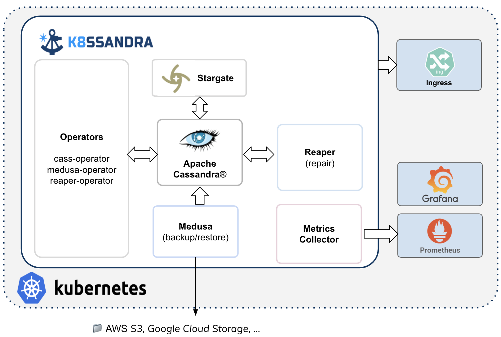
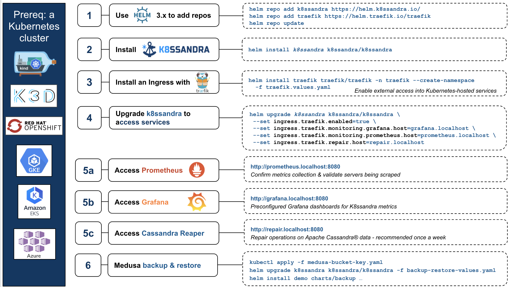

If you're new to K8ssandra, this FAQ is for you! Whether you're viewing this page in [GitHub](https://github.com/k8ssandra/k8ssandra/blob/main/docs/content/en/docs/faqs/_index.md) or on the [Web](https://k8ssandra.io/docs/faqs/), you can also propose new or modified FAQs. For this open-source project, contributions are welcome from the community of K8ssandra users. 

### What is K8ssandra?

K8ssandra is an open-source project that anyone in the community can use, improve, and enjoy. K8ssandra is a cloud native distribution of Apache Cassandra&reg; that runs on Kubernetes. Accompanying Cassandra is a suite of tools to ease and automate operational tasks. This includes metrics, data anti-entropy services, and backup/restore tools. As part of K8ssandra’s installation process, all of these components are installed and wired together, freeing your teams from having to perform the tedious plumbing of components.

### Ok - how should I pronounce "K8ssandra"?

Any way you want! But think of it this way:  "Kate" + "Sandra".

### What does K8ssandra include?

At a pure component level, K8ssandra integrates and packages together:

* Apache Cassandra
* Stargate, the open source data gateway
* Kubernetes Operator for Apache Cassandra (cass-operator)
* Reaper, also known as the Repair Web Interface (reaper-operator)
* Medusa for backup and restore (medusa-operator)
* Metrics Collector, with Prometheus integration, and visualization via preconfigured Grafana dashboards
* Templates for connections into your Kubernetes environment via Ingress solutions

An illustration always helps:



In addition to the set of components, it's important to emphasize that K8ssandra is really a collection of experience from the community of Cassandra + Kubernetes users, packaged and ready for everyone to use freely. 

### How do I get started and install K8ssandra?

It's easy! There are several options, but we recommend using [Helm](https://helm.sh/docs/intro/install/) commands. 

```
helm repo add k8ssandra https://helm.k8ssandra.io/
helm repo add traefik https://helm.traefik.io/traefik
helm repo update
helm install k8ssandra k8ssandra/k8ssandra
```

For more, see [Getting Started]().

### When I install K8ssandra, I see a some warning messages, is that a problem?

When installing K8ssandra on newer versions of Kubernetes (v1.19+), some warnings may be visible on the command line
related to deprecated API usage.  This is currently a known issue and will not impact the provisioning of the cluster.

```
W0128 11:24:54.792095  27657 warnings.go:70] apiextensions.k8s.io/v1beta1 CustomResourceDefinition is deprecated in v1.16+, unavailable in v1.22+; use apiextensions.k8s.io/v1 CustomResourceDefinition
```

For more information, check out issue [#267](https://github.com/k8ssandra/k8ssandra/issues/267).

### What exactly does k8ssandra install?

The chart installs Kubernetes Operator for Apache Cassandra (cass-operator), Prometheus Operator, reaper (repairs), medusa (backup/restores), the Grafana Operator, (optional) Stargate, and launches instances.

After those installs, and all the pods are in a Ready state, from `kubectl get pods` you'll see output similar to:

```
NAME                                                              READY   STATUS      RESTARTS   AGE
cass-operator-65956c4f6d-f25nl                                    1/1     Running     0          10m
grafana-deployment-8467d8bc9d-czsg5                               1/1     Running     0          6m23s
k8ssandra-grafana-operator-k8ssandra-5bcb746b8d-4nlhz             1/1     Running     0          6m20s
k8ssandra-a-reaper-k8ssandra-6cf5b87b8f-vxrwj                     1/1     Running     6          6m20s
k8ssandra-a-reaper-k8ssandra-schema-pjmv8                         0/1     Completed   5          6m20s
k8ssandra-a-reaper-operator-k8ssandra-55dc486998-f4r46            1/1     Running     2          6m20s
k8ssandra-dc1-default-sts-0                                       2/2     Running     0          10m
k8ssandra-tools-kube-prome-operator-6d57f758dd-7zd92              1/1     Running     0          10m
prometheus-k8ssandra-a-prometheus-k8ssandra-0                     2/2     Running     1          10m
```

### Does k8ssandra have to be installed in a particular namespace?

The chart can be installed to any namespace. The following example demonstrates this:

```
# Install k8ssandra-tool in the k8ssandra namespace
$ helm install k8ssandra k8ssandra/k8ssandra -n k8ssandra --create-namespace
```

### Can I install multiple releases of k8ssandra?

Some of the objects installed by the k8ssandra chart are currently configured to be cluster-scoped; consequently, you should only install those components once. This should be
fixed before version 1.0 to allow multiple installations. Other parts can be installed multiple times to allow creating multiple Cassandra clusters in a single k8s cluster.

### What components does k8ssandra install?

K8ssandra deploys the following components, some components are optional, and depending on the configuration, may not be deployed:

* [Apache Cassandra](https://cassandra.apache.org/) (version deployed is dependent upon configuration)
  * 3.11.7
  * 3.11.8
  * 3.11.9
  * 3.11.10 (default)
* [Management API for Apache Cassandra](https://github.com/datastax/management-api-for-apache-cassandra)
  * 0.1.19
* [Metric Collector for Apache Cassandra (MCAC)](https://github.com/datastax/metric-collector-for-apache-cassandra)
  * 0.1.9
* [Prometheus](https://prometheus.io/)
  * 2.22.1
* [Grafana](https://grafana.com/)
  * 7.3.5
* [Medusa](https://github.com/thelastpickle/cassandra-medusa)
  * 0.9.0-dev ([unreleased](https://github.com/thelastpickle/cassandra-medusa/tree/6ab6a55541e98505e502eb698b2cb7805764a9f2))
* [Cassandra Reaper](http://cassandra-reaper.io/)
  * 2.1.3
* [Stargate](https://stargate.io/)
  * 1.0.8

*Note: Throughout these docs, examples are shown to deploy [Traefik](https://traefik.io/) as a means to provide external access to the k8ssandra cluster.  It is deployed separately from k8ssandra, and as such, the version deployed will vary.*

### What is cass-operator?

Kubernetes Operator for Apache Cassandra -- [cass-operator](https://github.com/datastax/cass-operator) -- is the most critical element bridging Kubernetes and Cassandra. The community has been focusing much of its attention on operators over the past two years, as the appropriate starting place. If there is magic happening, it’s all in the operator. The cass-operator serves as the translation layer between the control plane of Kubernetes and actual operation done by the Cassandra cluster. Recently, the Apache Cassandra project agreed on gathering around a single operator: cass-operator. Some great contributions from Orange with CassKop will be merged with the DataStax operator and a final version will be merged into the Apache project. This is the best example of actual production knowledge finding its way into code. Community members contributing to cass-operator are running large amounts of Cassandra in Kubernetes every day. 

### What is Reaper?

Reaper is a tool that helps manage the critical maintenance task of anti-entropy **repair** in a Cassandra cluster. We also refer to Reaper as the [Repair Web Interface](). Originally created by Spotify, later adopted and maintained by The Last Pickle. If you were to sit a group of Cassandra DBAs down to talk about what they do, chances are they would talk a lot about running repairs. It’s an important operation because it keeps data consistent despite inevitable issues that happen like node failures and network partitions. In K8ssandra, Reaper runs it for you automatically! And because this is built for SREs, you can expect a good set of pre-built metrics to verify everything is working great. 

### What is Medusa?

Medusa provides backup/restore functionality for Cassandra data; this project also originated at Spotify. Medusa not only helps coordinate backup &amp; restore tasks, it manages the placement of the data at rest. The initial implementation allows backup sets to be stored and retrieved on cloud object storage (such as AWS S3 buckets) with more options on the way. K8ssandra offers this [backup and restore]() feature to help you recover Cassandra data when inevitable real-world issues occur.

### What is Stargate?

[Stargate](https://stargate.io/) is an open source data gateway that abstracts away many Apache Cassandra specific concepts, providing access to the database through various API options.  It helps to remove barriers of entry for developers new to Apache Cassandra by providing REST, GraphQL, and schemaless JSON document based APIs in addition to traditional CQL access.

### How can I access Kubernetes resources from outside the environment?

K8ssandra provides [preconfigured]() Traefik Ingress integrations. Traefik is a modern reverse proxy and load balancer that makes deploying microservices easy.  Traefik integrates with your existing infrastructure components and configures itself automatically and dynamically. Traefik handles advanced ingress deployments including mTLS of TCP with SNI and UDP. Operators define rules for routing traffic to downstream systems through Kubernetes Ingress objects or more specific Custom Resource Definitions. K8ssandra supports deploying `IngressRoute objects` as part of a deployment to expose metrics, repair, and Cassandra interfaces. For more, start in the [Traefik]() topic.

### How can I monitor the health of my Kubernetes + Cassandra cluster?

Configure Traefik to expose the K8ssandra monitoring interfaces. See [Monitoring]() for the steps to enable the Traefik Ingress. Then see [Monitoring UI]() for details about how to access the preconfigured Grafana dashboards that K8ssandra provides. After completing the prerequisites, for example in your local environment, you can open http://grafana.localhost:8080/ in your browser. 

### What is the login for the Grafana dashboards?

The default configured Grafana username is `admin`, and the password is `secret`. See the topic about managing [Grafana credentials]().

### What kind of provisioning tasks can I perform with K8ssandra?

Among the tasks are dynamically scaling up or down the size of your cluster. See [Provisioning a cluster](). 

### Can you illustrate the steps and sample commands I'll use with K8ssandra?

Yes - here are the steps and commands in a single graphic:



### How can I contribute to the K8ssandra docs?

See the documentation [guidelines]() topic. 

## Next

Read the documentation [topics]() and actively participate in the [community](https://k8ssandra.io/community/) of K8ssandra users.
