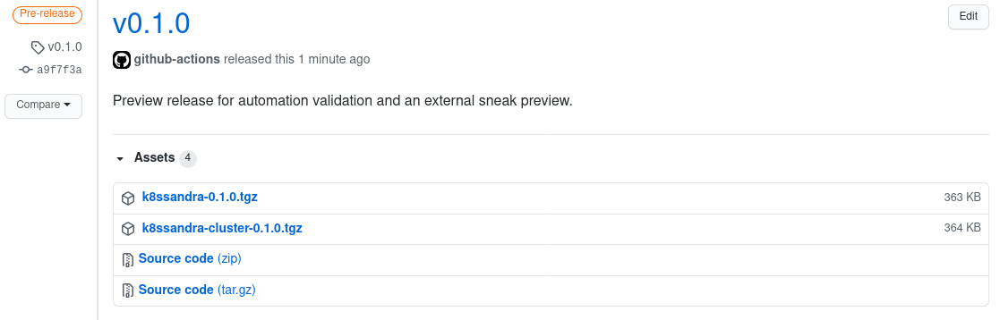

Welcome to K8ssandra! The following guide will get you up and running with a single node Apache Cassandra cluster on Kubernetes. If you are interested in a more detailed component walkthroughs check out the [topics]() section.

## Prerequisites

In your local environment the following tools are required for provisioning a K8ssandra cluster.

* [Helm v3+](https://helm.sh/docs/intro/install/)
* [Kubectl](https://kubernetes.io/docs/tasks/tools/install-kubectl/)

As K8ssandra deploys on a Kubernetes cluster one must be available to target for installation. This may be a local version running on your development machine, on-premises self-hosted environment, or managed cloud offering. To that end the cluster must be up and available to your `kubectl` command.

```console
# Validate cluster connectivity
kubectl cluster-info
```

If you do not have a Kubernetes cluster available consider one of the following local versions that run within Docker or a virtual machine.

* [K3D](https://k3d.io/)
* [Kind](https://kind.sigs.k8s.io/)
* [OpenShift CodeReady Containers](https://developers.redhat.com/products/codeready-containers/overview)

## Configure Helm Repository

K8ssandra is delivered as a collection of Helm Charts. In order to leverage these charts we have provided a Helm Repository for easy installation. Alternatively, users may download the individual charts directly from the project's [releases](https://github.com/k8ssandra/k8ssandra/releases) page.

```console
helm repo add k8ssandra https://helm.k8ssandra.io/
helm repo update
```

or



## Install K8ssandra

From a packaging perspective, K8ssandra is composed of a number of helm charts. One handles installation of operators and custom resources while another is focused on provisioning cluster instances. This loose coupling allows for separate lifecycles of components at the cost additional `helm install` commands.

```console
# Install shared dependencies / tooling
helm install k8ssandra-tools k8ssandra/k8ssandra

# Provision a K8ssandra cluster named "k8ssandra-cluster-a"
helm install k8ssandra-cluster-a k8ssandra/k8ssandra-cluster
```
