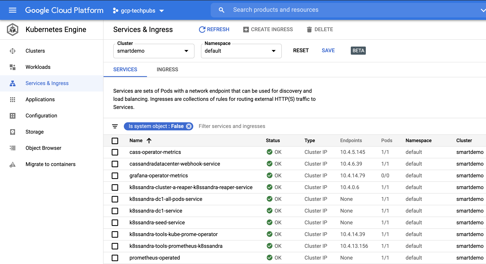

K8ssandra comes with a preconfigured metrics reporter dashboard that was built using [Prometheus operator](https://operatorhub.io/operator/prometheus) and [Grafana operator](https://operatorhub.io/operator/grafana-operator). The dashboard allows you to check the health of open-source Apache Cassandra® resources in your Kubernetes cluster.

## Tools

[Metrics dashboard for Cassandra in Kubernetes](https://github.com/datastax/metric-collector-for-apache-cassandra/tree/master/dashboards/k8s-build)

## Prerequisites

In the [Getting Started](/docs/getting-started) topic, when you used helm to install `k8ssandra-tools`, Prometheus and Grafana services were installed in your Kubernetes environment. All prerequisites were met at that time. 

For example, in the Google Cloud console for GKE, the running services are displayed:

## Steps

The preconfigured dashboard is ready to go!  View the metrics in the Grafana dashboard:

http://localhost:9090/

Example:

<!--- http://127.0.0.1:3000/ (username: admin, password: secret) ? -->

## Next

Access the [Repair Web interface](docs/topics/access-repair-interface/).
