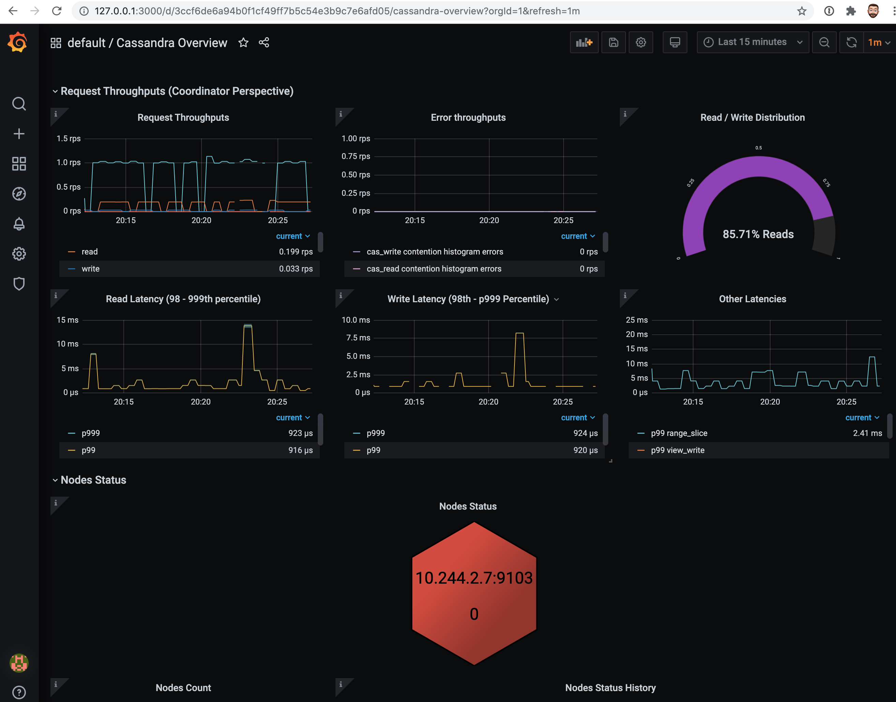

## Tools

* Web Browser

## Prerequisites

1. Kubernetes cluster with the following elements deployed:
   * [K8ssandra Operators]()
   * [K8ssandra Cluster]()
   * [Ingress Controller]()
1. DNS name for the Grafana service, referred to as _GRAFANA DOMAIN_ below.
1. DNS name for the Prometheus service, referred to as _PROMETHEUS DOMAIN_
   below.

## Access Grafana Interface

With the prerequisites satisfied the repair GUI should be available at the
following address:

**http://GRAFANA_DOMAIN/**

### What can I do in Grafana?

* Cluster health
* Traffic metrics

## Access Prometheus Interface

Prometheus is available at the following address:

**http://PROMETHEUS_DOMAIN/**

### What can I do in Prometheus?

* Validate serves being scraped
* Confirm metrics collection

## Next

Access the [Repair Web interface]({{ ref "repair" }}).
