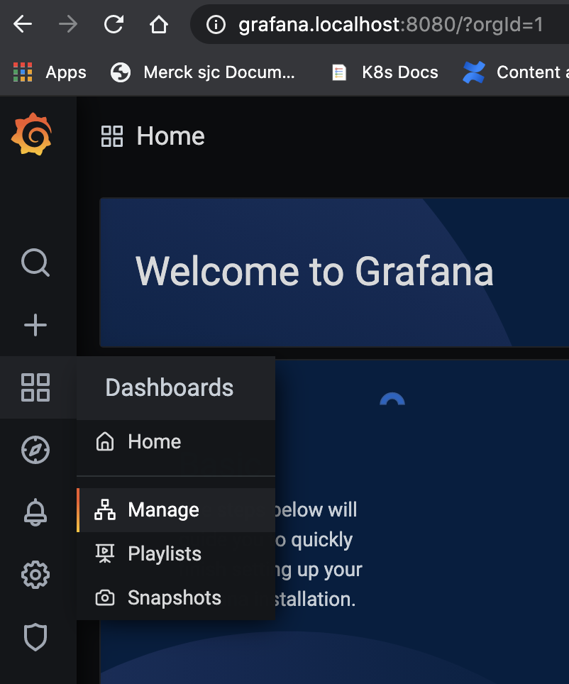
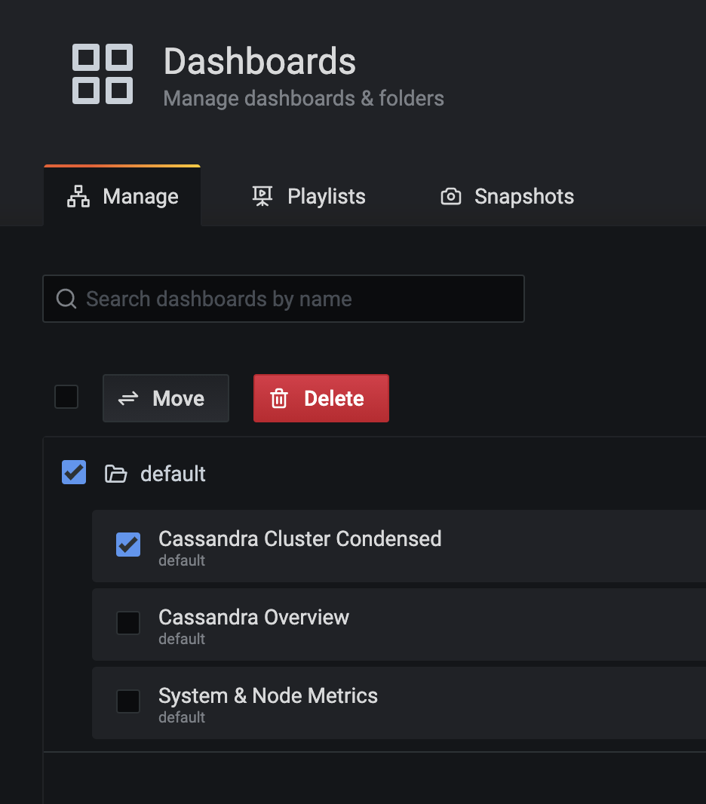
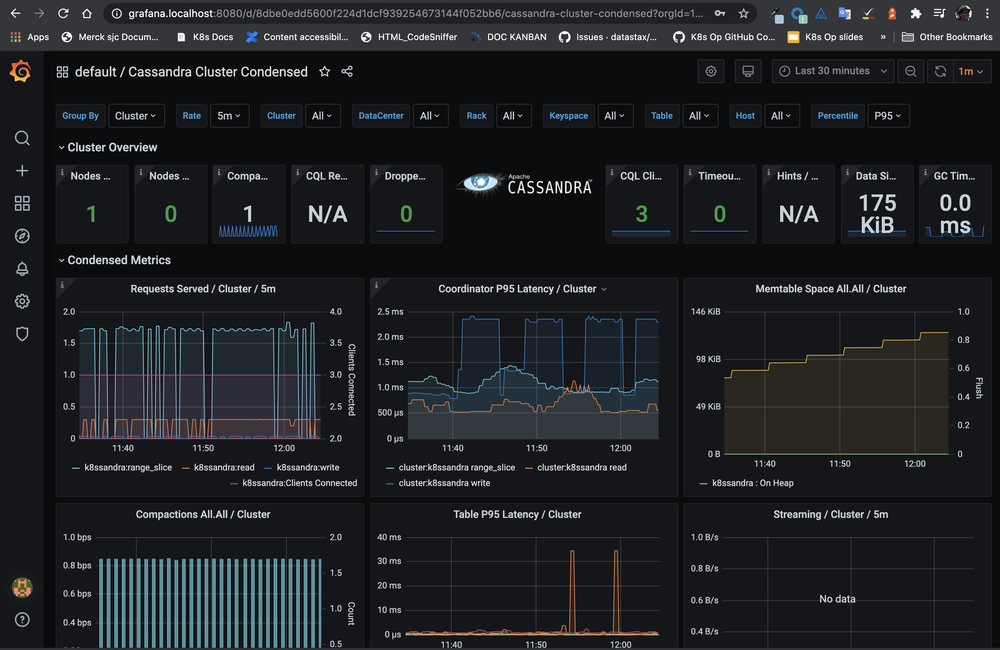

When you used Helm to install a `k8ssandra-cluster` instance in Kubernetes, one of the key features provided was a set of preconfigured Grafana dashboards. They visualize data collected about your environment by the Prometheus Operator, which is also packaged with K8ssandra. Use the Grafana dashboards to monitor your K8ssandra cluster's health and traffic metrics.  

After you've met the prerequisites identified below, access the preconfigured Grafana dashboards. For example:

http://grafana.localhost:8080/

## Tools

* Web browser

## Prerequisites

1. Kubernetes cluster with the following elements deployed:
   * [K8ssandra Operators]()
   * [K8ssandra Cluster]()
   * [Ingress Controller]()
1. DNS name for the Grafana service, referred to as _GRAFANA DOMAIN_ below.
1. DNS name for the Prometheus service, referred to as _PROMETHEUS DOMAIN_
   below.

## Access Grafana Interface

Check that the pods configured by K8ssandra are running:

`kubectl get pods`
```
NAME                                                              READY   STATUS      RESTARTS   AGE
cass-operator-65956c4f6d-f25nl                                    1/1     Running     0          4h26m
grafana-deployment-8467d8bc9d-czsg5                               1/1     Running     0          4h13m
k8ssandra-cluster-a-grafana-operator-k8ssandra-5bcb746b8d-4nlhz   1/1     Running     0          4h22m
k8ssandra-cluster-a-reaper-k8ssandra-6cf5b87b8f-vxrwj             1/1     Running     0          4h5m
k8ssandra-cluster-a-reaper-k8ssandra-schema-pjmv8                 0/1     Completed   5          4h8m
k8ssandra-cluster-a-reaper-operator-k8ssandra-55dc486998-f4r46    1/1     Running     0          4h22m
k8ssandra-dc1-default-sts-0                                       2/2     Running     0          4h22m
k8ssandra-tools-kube-prome-operator-6d57f758dd-7zd92              1/1     Running     0          4h26m
prometheus-k8ssandra-cluster-a-prometheus-k8ssandra-0             2/2     Running     1          4h22m
```

Notice that the Grafana Operator is running, as well as other services such as Prometheus.

If you are running a local Kubernetes environment, you can access the Grafana dashboard with a URL such as:

http://grafana.localhost:8080/

From the Grafana start page, click the Dashboards icon, and select the Manage pane:



Grafana loads its dashboard options:

1. Enable the Default checkbox.
1. Click the checkbox for one of the dashboards that K8ssandra created when you installed the `k8ssandra-cluster` instance
1. To open the selected dashboard, click on its text link. In this example, you'd click on Cassandra Cluster Condensed:



Here's an example of the Cassandra Cluster Condensed dashboard in Grafana:



### What can I do in Grafana?

* Cluster health
* Traffic metrics

## Access Prometheus Interface


Prometheus is available at the following address:

**http://PROMETHEUS_DOMAIN/**

For example:

http://prometheus.localhost:8080/

### What can I do in Prometheus?

* Validate serves being scraped
* Confirm metrics collection

## Next

Access the [Repair Web interface]({{ ref "repair" }}).
