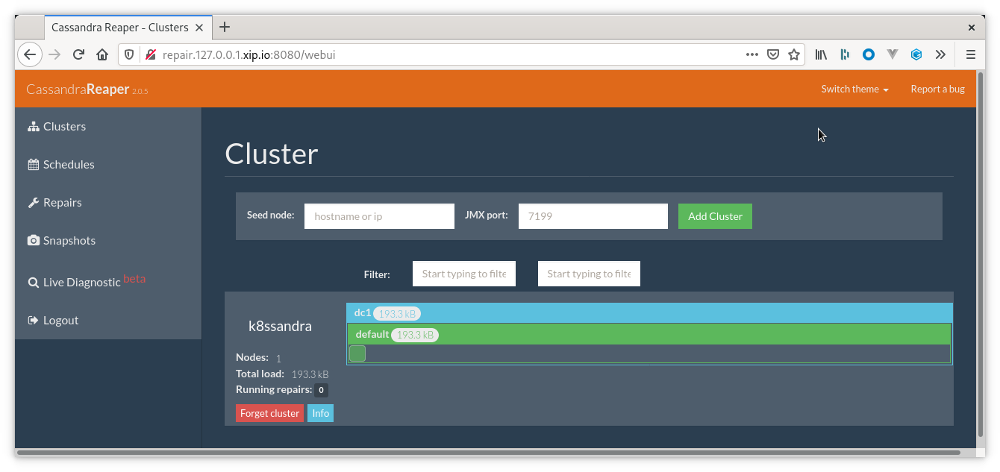

## Tools

* Web Browser

## Prerequisites

1. Kubernetes cluster with the following elements deployed:
   * [K8ssandra Operators]() Helm Chart
   * [K8ssandra Cluster]() Helm Chart
   * [Ingress Controller]()
1. DNS name configured for the repair interface, referred to as _REPAIR DOMAIN_ below.

## Access Repair Interface

With the prerequisites satisfied the repair GUI should be available at the following address:

http://REPAIR_DOMAIN/webui

Upon receiving a request the Ingress Controller detects which application should be routed to by matching on the `Host` header. Upon finding a match it then forwards the request to the downstream system, in this case Reaper.

_Note_ depending on the ingress there _may_ be a rule in place to redirect from a URL with the bare domain and no path to one with `/webui` appended. This is not guaranteed and is heavily dependent on the ingress controller in use.

## What can I do in Reaper?

For details about the tasks you can perform in Reaper, see these topics in the
Cassandra Reaper documentation:

* [Check a cluster's health](http://cassandra-reaper.io/docs/usage/health/)
* [Run a cluster repair](http://cassandra-reaper.io/docs/usage/single/)
* [Schedule a cluster repair](http://cassandra-reaper.io/docs/usage/schedule/)
* [Monitor Cassandra diagnostic events](http://cassandra-reaper.io/docs/usage/cassandra-diagnostics/)
