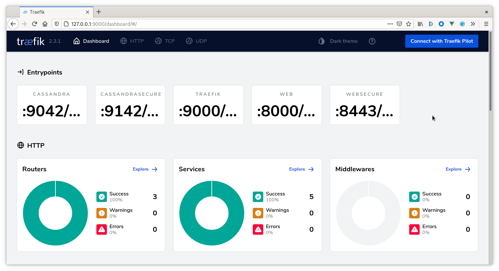
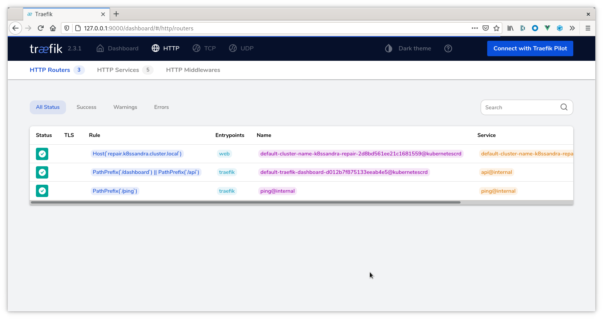

Follow these steps to configure and install a `Traefik Ingress` controller for access into your Kubernetes cluster; then access the k8ssandra Repair Web Interface (Cassandra&reg; Reaper).

## Prerequisites

1. Running Kubernetes cluster
   1. K8ssandra operators deployed
   1. Traefik deployed
   1. K8ssandra cluster deployed
1. DNS name where the repair service should be listening
1. Kubectl
1. Helm

## Helm Parameters

The `k8ssandra-cluster` Helm chart contains templates for Traefik `IngressRoute`
and `IngressRouteTCP` Custom Resources. These may be enabled at any time either
through a `values.yaml` file of command-line flags.

### `values.yaml`
```yaml
ingress:
  traefik:
    # Set to `true` to enable the templating of Traefik ingress custom resources
    enabled: false

    # Repair service
    repair: 
      # Note this will **only** work if `traefik.enabled` is also `true`
      enabled: true

      # Name of the Traefik entrypoints where we want to source traffic.
      entrypoints: 
        - web

      # Hostname Traefik should use for matching requests.
      host: repair.k8ssandra.cluster.local
```

// TODO - describe the importance of the DNS name, mention services like xip.io

## Enabling Traefik Ingress

### Command-line
```bash
# New Install
helm install cluster-name k8ssandra/k8ssandra-cluster \
  --set ingress.traefik.enabled=true \
  --set ingress.traefik.repair.host=repair.cluster-name.k8ssandra.cluster.local

# Existing Cluster
helm upgrade cluster-name k8ssandra/k8ssandra-cluster \
  --set ingress.traefik.enabled=true \
  --set ingress.traefik.repair.host=repair.cluster-name.k8ssandra.cluster.local
```

### `values.yaml`

// TODO - Discuss why using values.yaml is a good idea. Version control, CI/CD, etc

```bash
# New Install
helm install cluster-name k8ssandra/k8ssandra-cluster -f traefik.values.yaml

# Existing Cluster
helm upgrade cluster-name k8ssandra/k8ssandra-cluster -f traefik.values.yaml
```

## Validate Traefik Configuration

_Note this step is optional. The next step will also prove the configuration is working._

With the ingress routes configured and deployed to Kubernetes we can access the Traefik dashboard to validate the configuration has been picked up and is detecting the appropriate services.

1. Open your web browser and point it at the Traefik dashboard. This may require `kubectl port-forward` or the steps in our [Configuring Kind]() guide.

    

2. Navigate to the HTTP Routers page
    
    

    There should be an entry representing the hostname based rule created as part of the Helm command. Note the Kubernetes logo to the right of the table indicating it was provisioned via a Kubernetes custom resource.
3. Navigate to the HTTP Services page
    

    There should be an entry representing the Reaper service. Note the Kubernetes logo to the right of the table indicating it was provisioned via a Kubernetes custom resource.

## Accessing the Repair Web Interface (Cassandra Reaper)

With the configuration complete and validated, now you can point your browser at the DNS name to access the Repair Web Interface (Cassandra Reaper) UI. 

For example, given a DNS name of `repair.cluster-name.k8ssandra.cluster.local`, you would visit:

[http://repair.cluster-name.k8ssandra.cluster.local/webui](http://repair.cluster-name.k8ssandra.cluster.local/webui). 

Example:


Traefik receives the request, matches the `Host` header against the rule specified in our `IngressRoute`, and proxies the request to the upstream service. Should this service go down and the pod gets rescheduled, everything will automatically update and continue functioning.

## What can I do in Reaper?

For details about the tasks you can perform in Reaper, see these topics in the Cassandra Reaper documentation:

* [Check a cluster's health](http://cassandra-reaper.io/docs/usage/health/)
* [Run a cluster repair](http://cassandra-reaper.io/docs/usage/single/)
* [Schedule a cluster repair](http://cassandra-reaper.io/docs/usage/schedule/)
* [Monitor Cassandra diagnostic events](http://cassandra-reaper.io/docs/usage/cassandra-diagnostics/)
