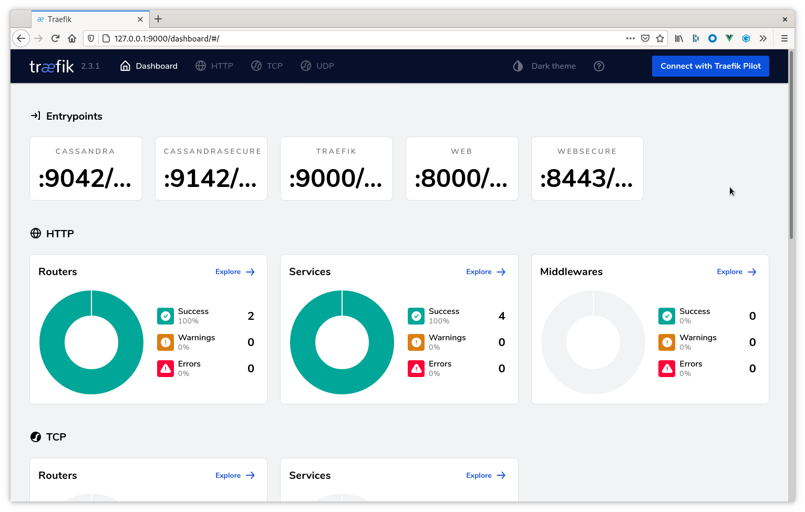

K3d automatically deploys the Traefik ingress controller when the cluster is
started. Unfortunately, it is not configured to accept traffic on ports other
than 80. For our purposes it is best to _skip_ the automatic Traefik
installation and install it ourselves via Helm. The following guide walks
through standing up a K3d cluster with Traefik configured for ingress on ports
other than the standard `80` and `443`.

## 1. Bootstrap K3d _without_ Traefik

Beyond simply disabling Traefik, we must also pre-plan the ports that should be
forwarded into our cluster. K3d spins up a minimum of two containers for a given
cluster. One of which is a load-balancer that handles routing / proxying
requests to all other nodes in the cluster. For our purposes the following ports
will be opened:

* `80` - HTTP traffic - This is used for accessing the metrics and repair user
  interfaces
* `443` - HTTPS traffic - Useful when accessing the metrics and repair
  interfaces in a secure manner
* `9000` - Traefik dashboard - **WARNING** this should only be done in
  development environments. Higher level environments should use `kubectl
  port-forward`.
* `9042` - C* traffic - Insecure Cassandra traffic. _Note:_ Without TLS (more
  specifically SNI) Traefik may **not** be able to distinguish traffic across
  cluster boundaries. If you are in an environment where more than one cluster
  is deployed you **must** add additional ports here.
* `9142` - C* TLS traffic - Secure Cassandra traffic, multiple clusters may run
  behind this single port.
* `8080` - Stargate GraphQL API
* `8081` - Stargate Authorization REST API
* `8082` - Stargate CRUD REST API

```bash
$ k3d cluster create \
  --k3s-server-arg "--no-deploy" \
  --k3s-server-arg "traefik" \
  --port "80:32080@loadbalancer" \
  --port "443:32443@loadbalancer" \
  --port "9000:32090@loadbalancer" \
  --port "9042:32091@loadbalancer" \
  --port "9142:32092@loadbalancer" \
  --port "8080:30080@loadbalancer" \
  --port "8081:30081@loadbalancer" \
  --port "8082:30082@loadbalancer"
INFO[0000] Created network 'k3d-k3s-default'            
INFO[0000] Created volume 'k3d-k3s-default-images'      
INFO[0001] Creating node 'k3d-k3s-default-server-0'     
INFO[0001] Creating LoadBalancer 'k3d-k3s-default-serverlb' 
INFO[0007] Cluster 'k3s-default' created successfully!  
INFO[0007] You can now use it like this:                
kubectl cluster-info
```

## 2. Create Traefik Helm values file

Note the service type of `NodePort`. It is used here as it is the port _on the
Docker container running Kind_ which is forwarded to our local machine.

The `traefik.values.yaml` file referenced here is located in:

https://github.com/k8ssandra/k8ssandra/blob/main/docs/content/en/docs/topics/ingress/traefik/k3d-deployment/traefik.values.yaml

### [`traefik.values.yaml`](traefik.values.yaml)


## 3. Install Traefik via Helm

```bash
$ helm repo add traefik https://helm.traefik.io/traefik
$ helm repo update
$ helm install traefik traefik/traefik -n traefik --create-namespace -f traefik.values.yaml
NAME: traefik
LAST DEPLOYED: Thu Nov 12 16:59:40 2020
NAMESPACE: default
STATUS: deployed
REVISION: 1
TEST SUITE: None
```

## 4. Access Traefik Dashboard

With the deployment complete we need to retrieve the loadbalancer's IP address.
This may be accomplished with:

```bash
$ kubectl get services -n traefik
NAME      TYPE           CLUSTER-IP     EXTERNAL-IP   PORT(S)                                                                   AGE
traefik   LoadBalancer   10.43.75.223   172.22.0.2    9042:32091/TCP,9142:32092/TCP,9000:32090/TCP,80:32080/TCP,443:32443/TCP   4m2s
```

Here we see the external IP address is `172.22.0.2`. For this environment the
Traefik dashboard is at
[http://172.22.0.2:9000/dashboard/](http://172.22.0.2:9000/dashboard/). Example:



Feel free to explore the other [Traefik]() topics now that
you have a local environment configured.
