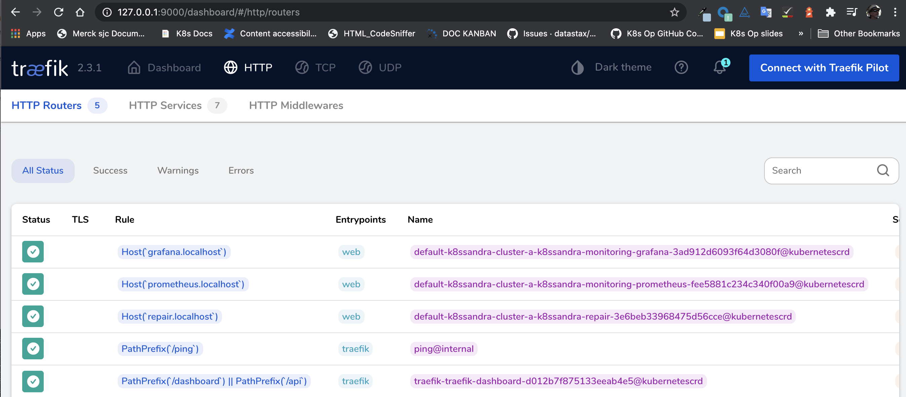
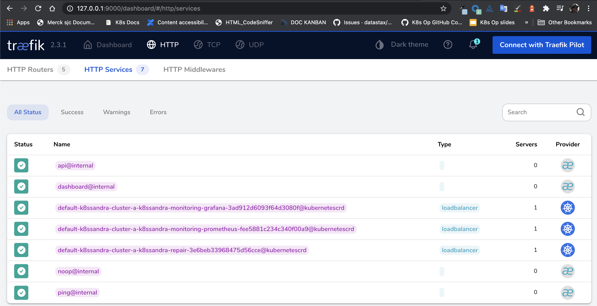

Follow these steps to configure and install `Traefik Ingress` custom resources
for accessing your K8ssandra cluster's monitoring interface (provided by Grafana
& Prometheus).

## Tools

* Helm

## Prerequisites

1. Kubernetes cluster with the following elements deployed:
   * [Traefik]()
   * [K8ssandra]()

   See [Configuring Kind]() for an example of
   how to set up a local installation.
1. DNS name for the Grafana service
1. DNS name for the Prometheus service

_Note_ if you do not have a DNS name available, consider using a service like
[xip.io](http://xip.io) to generate a domain name based on the ingress IP
address. For local Kind clusters this may look like
`monitoring.127.0.0.1.xip.io` which would return the address `127.0.0.1` during
DNS lookup.

## Helm Parameters

The `k8ssandra` Helm chart contains templates for Traefik `IngressRoute`
and `IngressRouteTCP` Custom Resources. These may be enabled at any time either
through a `values.yaml` file of command-line flags.

### `values.yaml`
```yaml
ingress:
  traefik:
    # Set to `true` to enable the templating of Traefik ingress custom resources
    enabled: false

    # Monitoring ingress
    monitoring: 
      grafana:
        # Note this will **only** work if `traefik.enabled` is also `true`
        enabled: true

        # Name of the Traefik entrypoints where we want to source traffic.
        entrypoints: 
          - web

        # Hostname Traefik should use for matching requests.
        host: grafana.k8ssandra.cluster.local
      
      prometheus:
        # Note this will **only** work if `traefik.enabled` is also `true`
        enabled: true

        # Name of the Traefik entrypoints where we want to source traffic.
        entrypoints: 
          - web

        # Hostname Traefik should use for matching requests.
        host: prometheus.k8ssandra.cluster.local
```

Note the `host` parameters, this is where the DNS names must be provided.

## Enabling Traefik Ingress

Traefik ingress may be enabled on the command-line or via a `values.yaml` file.
The K8ssandra team recommends storing this information in a `values.yaml` as
that may be version controlled and managed in a DevOps friendly manner. Examples
of both approaches are provided below as reference.

### `values.yaml`

```bash
# New Install
helm install cluster-name k8ssandra/k8ssandra -f traefik.values.yaml

# Existing Cluster
helm upgrade cluster-name k8ssandra/k8ssandra -f traefik.values.yaml
```

### Command-line
```bash
# New Install
helm install cluster-name k8ssandra/k8ssandra \
  --set ingress.traefik.enabled=true \
  --set ingress.traefik.monitoring.grafana.host=grafana.cluster-name.k8ssandra.cluster.local \
  --set ingress.traefik.monitoring.prometheus.host=prometheus.cluster-name.k8ssandra.cluster.local

# Existing Cluster
helm upgrade cluster-name k8ssandra/k8ssandra \
  --set ingress.traefik.enabled=true \
  --set ingress.traefik.monitoring.grafana.host=grafana.cluster-name.k8ssandra.cluster.local \
  --set ingress.traefik.monitoring.prometheus.host=prometheus.cluster-name.k8ssandra.cluster.local
```

## Validate Traefik Configuration

_Note this step is optional. The next step will also prove the configuration is
working._

With the ingress routes configured and deployed to Kubernetes we can access the
Traefik dashboard to validate the configuration has been picked up and is
detecting the appropriate services.

1. Open your web browser and point it at the Traefik dashboard. This may require
   `kubectl port-forward` or the steps in our [Configuring Kind]() guide.

    

2. Navigate to the HTTP Routers page

    

    There should be entries representing the hostname based rules created as
    part of the Helm command. Note the Kubernetes logo to the right of the table
    indicating it was provisioned via a Kubernetes custom resource.
    
3. Navigate to the HTTP Services page

    

    On this page, you'll find entries representing the Prometheus and Grafana services.
    Note the Kubernetes logo to the right of the table indicating that it was
    provisioned via a Kubernetes custom resource.

## Next

Check out how to [Access the Monitoring Interface]()
