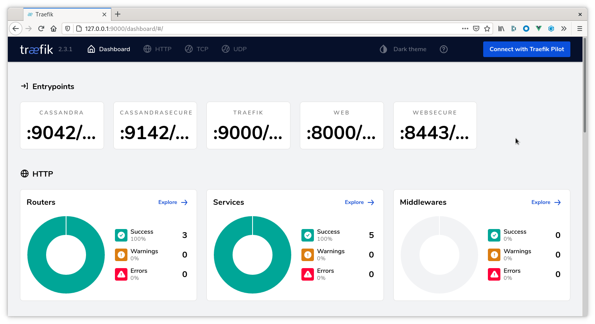
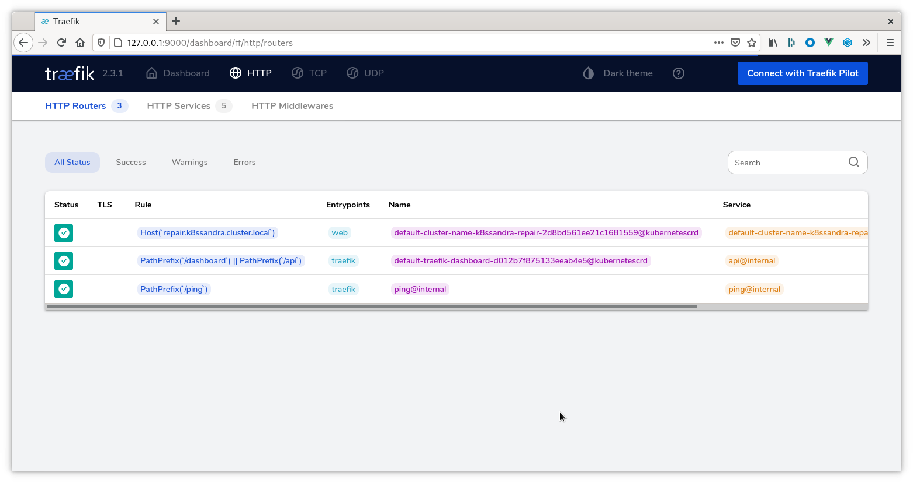

Follow these steps to configure and install `Traefik Ingress` custom resources
for accessing your K8ssandra cluster's repair interface (provided by Cassandra
Reaper).

## Tools

* Helm

## Prerequisites

1. Kubernetes cluster with the following elements deployed:
   * [Traefik]()
   * [K8ssandra Operators]()
   * [K8ssandra Cluster]()

   See the [Configuring Kind]() for an example of
   how to set up a local installation.
1. DNS name where the repair service should be listening.

   _Note_ if you do not have a DNS name available, consider using a service like
   [xip.io](http://xip.io) to generate a domain name based on the ingress IP
   address. For local Kind clusters this may look like `repair.127.0.0.1.xip.io`
   which would return the address `127.0.0.1` during DNS lookup.

## Helm Parameters

The `k8ssandra` Helm chart contains templates for Traefik `IngressRoute`
and `IngressRouteTCP` Custom Resources. These may be enabled at any time either
through a `values.yaml` file or via command-line flags.

### `values.yaml`
```yaml
ingress:
  traefik:
    # Set to `true` to enable the templating of Traefik ingress custom resources
    enabled: false

    # Repair service
    repair: 
      # Note this will **only** work if `traefik.enabled` is also `true`
      enabled: true

      # Name of the Traefik entrypoints where we want to source traffic.
      entrypoints: 
        - web

      # Hostname Traefik should use for matching requests.
      host: repair.k8ssandra.cluster.local
```

Note the `host` parameter, this is where the DNS name must be provided. You will reference this DNS when accessing Reaper in a Web URL. 

If you maintain a values.yaml or traefik.values.yaml file, change the `ingress.traefik.enabled` Boolean from `false` to `true`.  Or, specify `--set ingress.traefik.enabled=true` on the helm install command line. 

## Enabling Traefik Ingress

Traefik ingress may be enabled on the command-line or via a `values.yaml` file.
The K8ssandra team recommends storing this information in a `values.yaml` as
that may be version controlled and managed in a DevOps friendly manner. Examples
of both approaches are provided below as reference.

### `values.yaml`

```bash
# New Install
helm install cluster-name k8ssandra/k8ssandra -f traefik.values.yaml

# Existing Cluster
helm upgrade cluster-name k8ssandra/k8ssandra -f traefik.values.yaml
```

### Command-line
```bash
# New Install
helm install cluster-name k8ssandra/k8ssandra \
  --set ingress.traefik.enabled=true \
  --set ingress.traefik.repair.host=repair.cluster-name.k8ssandra.cluster.local

# Existing Cluster
helm upgrade cluster-name k8ssandra/k8ssandra \
  --set ingress.traefik.enabled=true \
  --set ingress.traefik.repair.host=repair.cluster-name.k8ssandra.cluster.local
```

## Validate Traefik Configuration

_Note this step is optional. The next step will also prove the configuration is
working._

With the ingress routes configured and deployed to Kubernetes we can access the
Traefik dashboard to validate the configuration has been picked up and is
detecting the appropriate services.

1. Open your web browser and point it at the Traefik dashboard. This may require
   `kubectl port-forward` or the steps in our [Configuring Kind]() guide.

    

2. Navigate to the HTTP Routers page

    

    There should be an entry representing the hostname based rule created as
    part of the Helm command. Note the Kubernetes logo to the right of the table
    indicating it was provisioned via a Kubernetes custom resource.
3. Navigate to the HTTP Services page 

    There should be an entry representing the Reaper service. Note the
    Kubernetes logo to the right of the table indicating it was provisioned via
    a Kubernetes custom resource.

## Next

Check out how to [Access the Repair Interface]()
