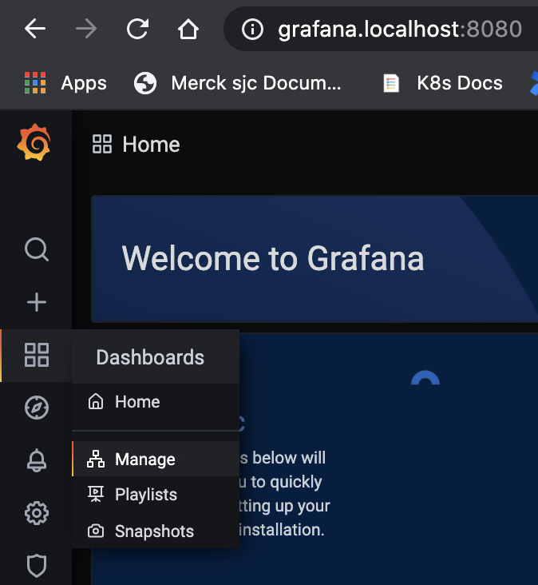
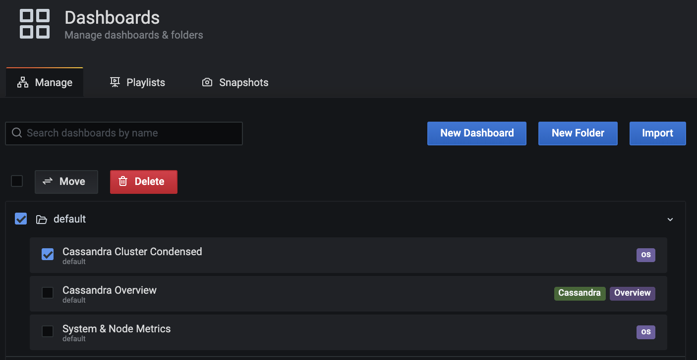
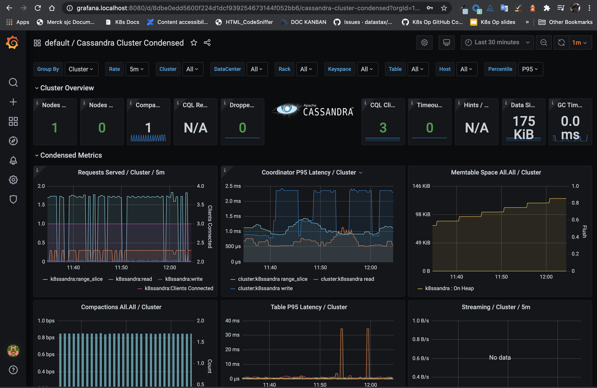
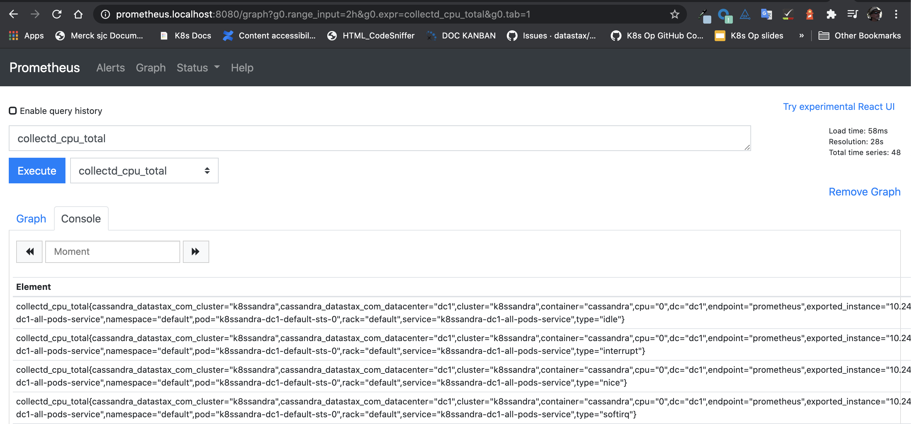

When you used Helm to install a `k8ssandra` instance in Kubernetes, one of the key features provided was a set of preconfigured Grafana dashboards. They visualize data collected about your environment by the Prometheus Operator, which is also packaged with K8ssandra. Use the Grafana dashboards to monitor your K8ssandra cluster's health and traffic metrics.  

After you've met the prerequisites identified below, access the preconfigured Grafana dashboards. For example:

[http://grafana.localhost:8080/](http://grafana.localhost:8080/)

## Tools

* Web browser

## Prerequisites

1. Kubernetes cluster with the following elements deployed:
   * [K8ssandra]()
   * [Ingress Controller]()
1. DNS name for the Grafana service, referred to as _GRAFANA DOMAIN_ below.
1. DNS name for the Prometheus service, referred to as _PROMETHEUS DOMAIN_
   below.

## Access Grafana Interface

If you haven't already, upgrade an existing `k8ssandra` by enabling the Traefik Ingress and passing in Prometheus and Grafana host flags. A command-line example when the host is local:

```bash
helm upgrade k8ssandra k8ssandra/k8ssandra --set ingress.traefik.enabled=true --set ingress.traefik.monitoring.grafana.host=grafana.localhost --set ingress.traefik.monitoring.prometheus.host=prometheus.localhost
```

After a few minutes, check that the pods configured by K8ssandra are running:

```bash
kubectl get pods
```

**Output**:

```bash
NAME                                                              READY   STATUS      RESTARTS   AGE
cass-operator-65956c4f6d-f25nl                                    1/1     Running     0          4h26m
grafana-deployment-8467d8bc9d-czsg5                               1/1     Running     0          4h13m
k8ssandra-grafana-operator-k8ssandra-5bcb746b8d-4nlhz             1/1     Running     0          4h22m
k8ssandra-reaper-k8ssandra-6cf5b87b8f-vxrwj                       1/1     Running     0          4h5m
k8ssandra-reaper-k8ssandra-schema-pjmv8                           0/1     Completed   5          4h8m
k8ssandra-reaper-operator-k8ssandra-55dc486998-f4r46              1/1     Running     0          4h22m
k8ssandra-dc1-default-sts-0                                       2/2     Running     0          4h22m
k8ssandra-tools-kube-prome-operator-6d57f758dd-7zd92              1/1     Running     0          4h26m
prometheus-k8ssandra-prometheus-k8ssandra-0                       2/2     Running     1          4h22m
```

Notice that the Grafana Operator is running, as well as other services such as Prometheus.

If you are running a local Kubernetes environment, you can access the Grafana dashboard with a URL such as:

<http://grafana.localhost:8080>

### Grafana credentials

The default configured credentials for Grafana are:

```yaml
grafana:
  adminUser: admin
  adminPassword: secret
```

Refer to: <https://github.com/k8ssandra/k8ssandra/blob/main/charts/k8ssandra/values.yaml>

You can change the credentials in several ways:

* In the Grafana admin UI. See: <http://grafana.localhost:8080/profile/password>

* Or edit a **copy** of [values.yaml](https://github.com/k8ssandra/k8ssandra/blob/main/charts/k8ssandra/values.yaml); update the credentials; submit a `helm upgrade` command to the cluster. Example: 

    ```bash
    helm upgrade cluster-name k8ssandra/k8ssandra -f my-values.yaml`
    ```

* Or pass in a `--set grafana.adminPassword` flag. Example:

    ```bash
    `helm upgrade cluster-name k8ssandra/k8ssandra --set  grafana.adminPassword=NewpAssw0rd!`
    ```

### Navigating in Grafana

From the Grafana start page, <http://grafana.localhost:8080> in local installs, click the Dashboards icon shown below and select the **Manage** pane:



Grafana loads its dashboard options:

1. Enable the **Default** checkbox.
1. Click the checkbox for one of the dashboards that K8ssandra created when you installed the `k8ssandra` instance
1. To open the selected dashboard, click on its text link. In this example, you'd click on `Cassandra Cluster Condensed`:



Here's an example of the `Cassandra Cluster Condensed` dashboard in Grafana:



### What can I do in Grafana?

* Cluster health
* Traffic metrics

## Access Prometheus Interface



Prometheus is available at the following address: <http://PROMETHEUS_DOMAIN>

For example:

<http://prometheus.localhost:8080>

### What can I do in Prometheus?

* Validate servers being scraped
* Confirm metrics collection

## Next

Access the [Repair Web interface]().
