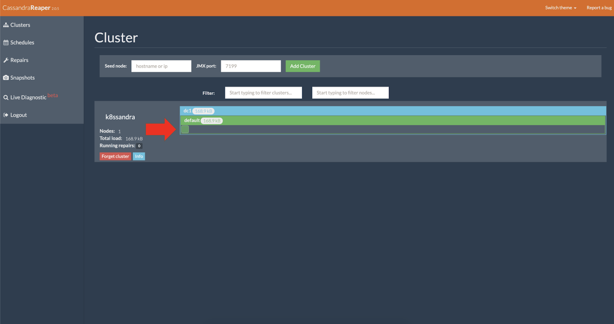
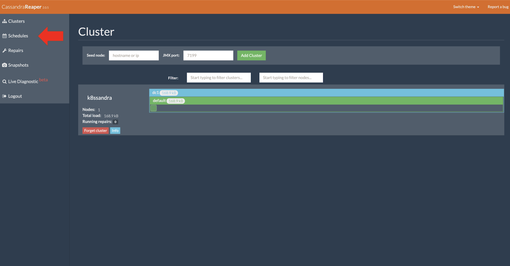
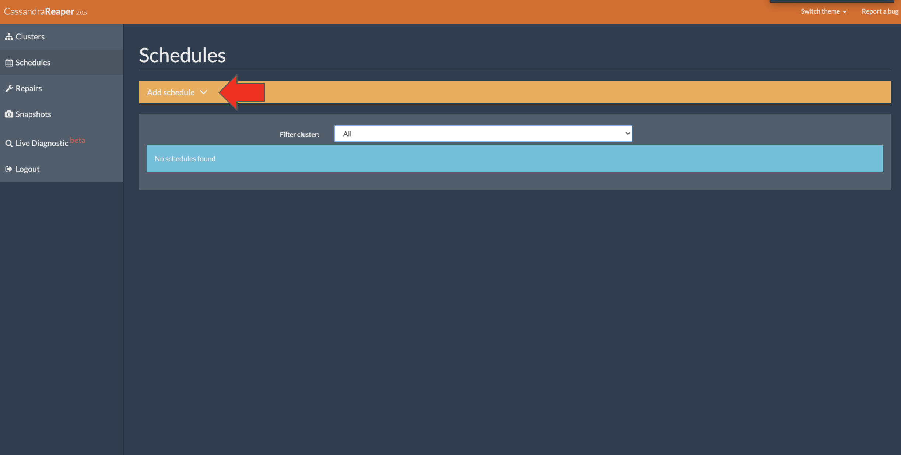
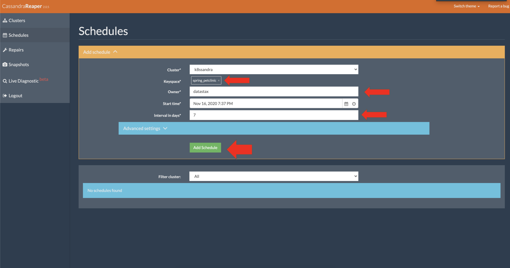
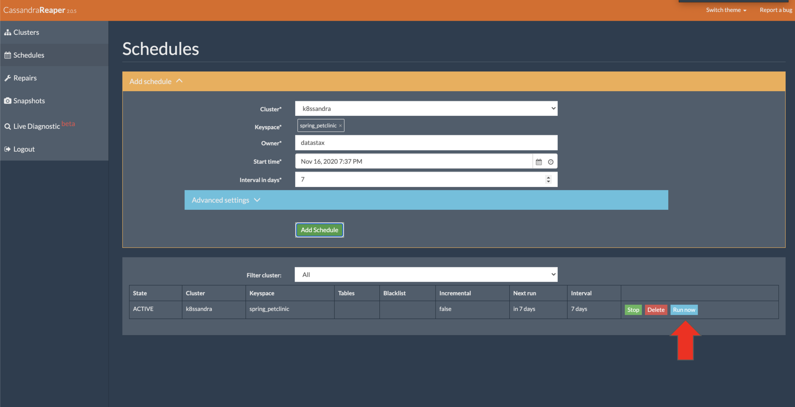

Repairs are a critical anti-entropy operation in Apache Cassandra (Cassandra). In the past, there have been many custom solutions to manage them outside of your main Cassandra installation. K8ssandra provides the Reaper for Apache Cassandra web interface (Reaper) that eliminates the need for a custom solution. Just like K8ssandra makes Cassandra setup easy, Reaper makes configuration of repairs even easier.

{}
The requirement for your environment may vary considerably, however the general recommendation is to run a repair operation on your Cassandra clusters about once a week.
{}

## Tools

* Web Browser
* `values.yaml` configuration, or use `--set` flags on the command line

## Prerequisites

1. Kubernetes cluster with the following elements deployed:
   * [K8ssandra]() Helm chart
   * [Ingress Controller]()
1. DNS name configured for the Reaper for Apache Cassandra interface, referred to as _REPAIR DOMAIN_ below.

## Access the Reaper Web Interface


With the prerequisites satisfied the Reaper web interface should be available at the following address:

http://REPAIR_DOMAIN/webui

For example, to upgrade a previously installed `k8ssandra` that's running locally, where the `releaseName` used on the prior `helm install` command was `k8ssandra`:

`helm upgrade k8ssandra k8ssandra/k8ssandra --set ingress.traefik.enabled=true --set ingress.traefik.repair.host=repair.localhost`

Notice how in this example, the DNS host name is specified on the command line as `repair.localhost`.

After a few minutes, check that the pods are running. Example:

```bash
kubectl get pods
```

**Output:**

```bash
NAME                                                        READY   STATUS      RESTARTS   AGE
k8ssandra-cass-operator-65cc657-fq6bc                       1/1     Running     0          10m
k8ssandra-dc1-default-sts-0                                 3/3     Running     0          10m
k8ssandra-dc1-stargate-bb47877d5-54sdt                      1/1     Running     0          10m
k8ssandra-grafana-7f84d96d47-xd79s                          2/2     Running     0          10m
k8ssandra-kube-prometheus-stack-operator-76b984f9f4-pp745   1/1     Running     0          10m
k8ssandra-medusa-operator-6888946787-qwzsx                  1/1     Running     2          10m
k8ssandra-reaper-k8ssandra-656f5b77cc-nqfzv                 1/1     Running     0          10m
k8ssandra-reaper-k8ssandra-schema-88cpx                     0/1     Completed   0          10m
k8ssandra-reaper-operator-5b8c4c66b8-8cf86                  1/1     Running     2          10m
prometheus-k8ssandra-kube-prometheus-stack-prometheus-0     2/2     Running     1          10m
```

## What can I do in Reaper?

To access Reaper, if you are running locally, navigate to [http://repair.localhost:8080/webui/](http://repair.localhost:8080/webui/).

### Check the cluster’s health

In the Reaper UI, notice how the nodes are displayed inside the datacenter for the cluster.



The color of the nodes indicates the overall load the nodes are experiencing at the current moment.

See [Check a cluster's health](http://cassandra-reaper.io/docs/usage/health/).

### Schedule a cluster repair

On the UI's left sidebar, notice the **Schedule** option.



Click **Schedules**



Click **Add schedule** and fill out the details when you are done click the final _add schedule_ to apply the new repair job.  A Cassandra best practice is to have one repair complete per week to prevent zombie data from coming back after a deletion.



Enter values for the keyspace, tables, owner, and other fields. Then click **Add Schedule**. The details for adding a schedule are similar to the details for the Repair form, except the “Clause” field is replaced with two fields:

* “Start time”
* “Interval in days”

After creating a scheduled repair, the page is updated with a list of Active and Paused repair schedules.

{}
When choosing to add a new repair schedule, we recommended that you limit the repair schedules to specific tables, instead of scheduling repairs for an entire keyspace. Creating different repair schedules will allow for simpler scheduling, fine-grain tuning for more valuable data, and easily grouping tables with smaller data load into different repair cycles. For example, if there are certain tables that contain valuable data or a business requirement for high consistency and high availability, they could be scheduled for repairs during low-traffic periods.
{}

For additional information, see [Schedule a cluster repair](http://cassandra-reaper.io/docs/usage/schedule/) on the Reaper site.

{}
Users with access to the Reaper web interface can pause or delete scheduled repairs. To add authentication security in the UI, see [Reaper authentication](http://cassandra-reaper.io/docs/configuration/authentication/).
{}

### Run a cluster repair

On the repair job you just configured, click **Run now**.



Notice the repair job kicking off.

## Recommended reading

* [Running a cluster repair](http://cassandra-reaper.io/docs/usage/single/)
* [Reaper details](http://cassandra-reaper.io/)
* [Blog articles](https://thelastpickle.com/blog/)
