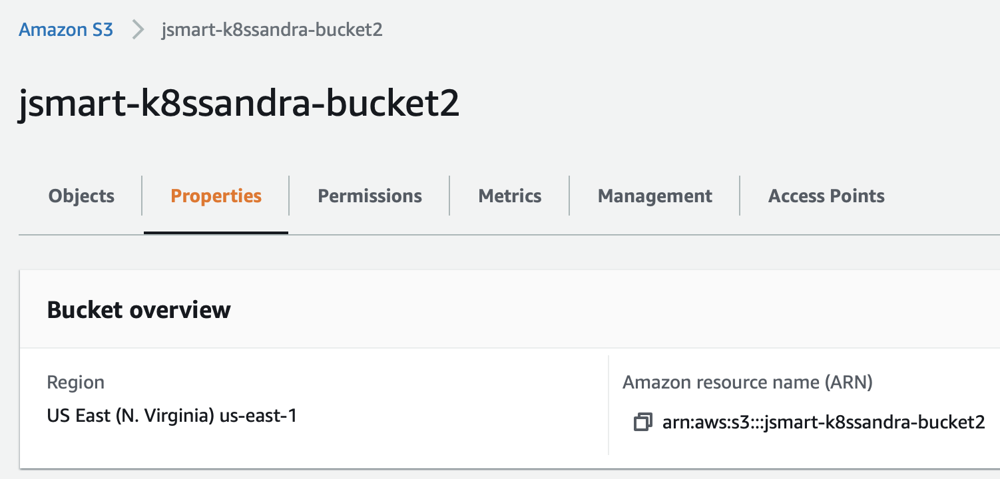

This topic walks you through the steps to backup and restore Cassandra data running in a Kubernetes cluster.

## Tools

* K8ssandra Helm chart, which we'll extend with `backupRestore` Medusa buckets for Amazon S3 integration
* Sample files in GitHub:
  * [medusa-bucket-key.yaml](medusa-bucket-key.yaml) to create a secret with credentials for AWS S3 buckets
  * [backup-restore-values.yaml](backup-restore-values.yaml) to enable Medusa (backup/restore service) and set values
  * [test_data.cql](test_data.cql) to populate a Cassandra keyspace and table with data
 
## Prerequisites

* A Kubernetes environment
* Storage for the backups - see below
* [Helm](https://helm.sh/), a packaging manager for Kubernetes

All other prerequisites are handled by the installed tools listed above. 

## Steps

### Verify you've met the prereqs

You will need storage for the backups. This topic shows the use of AWS S3 buckets.

* If you'll use AWS S3, before proceeding with the configuration described below, verify that you know:
  * The `aws_access_key_id` and `aws_secret_access_key` values
  * The `name` of the S3 bucket
  * The region assigned to the S3 bucket
  
  Or contact your IT team if they manage those assets. You'll provide those details in an edited version of the [medusa-bucket-key.yaml](medusa-bucket-key.yaml) file. For information about the S3 setup steps, see this helpful [readme](https://github.com/thelastpickle/cassandra-medusa/blob/master/docs/aws_s3_setup.md).  

* Add and update the following repo, which has in one chart all the settings for K8ssandra plus the backup/restore settings:

```
helm repo add k8ssandra https://helm.k8ssandra.io/
helm repo update
```

```
Hang tight while we grab the latest from your chart repositories...
...Successfully got an update from the "k8ssandra" chart repository
Update Complete. ⎈Happy Helming!⎈
```

### Create secret for read/write access to an S3 bucket

Before installing the k8ssandra cluster, we need to supply credentials so that Medusa has read/write access to an AWS S3 bucket, which is where the backup will be stored. Medusa supports local, Amazon S3, Google Cloud Storage (GCS), and Azure buckets. At this time, K8ssandra exposes configurations for S3 and GCS. The example in this topic uses an S3 bucket.

{}
See [AWS S3 setup](https://github.com/thelastpickle/cassandra-medusa/blob/master/docs/aws_s3_setup.md) on the Medusa wiki for more details for configuring S3.
{}

Start by creating a secret with the credentials for the S3 bucket.

The [medusa-bucket-key.yaml](medusa-bucket-key.yaml) sample in GitHub contains:

```
apiVersion: v1
kind: Secret
metadata:
 name: medusa-bucket-key
type: Opaque
stringData:
 # Note that this currently has to be set to medusa_s3_credentials!
 medusa_s3_credentials: |-
   [default]
   aws_access_key_id = my_access_key
   aws_secret_access_key = my_secret_key
```
   
**Make a copy** of [medusa-bucket-key.yaml](medusa-bucket-key.yaml), and then replace:

* `my_access_key` and `my_secret_key` with your S3 values
* The `name` of the S3 bucket defined in the AWS console.

In the YAML, notice the `stringData` property value: `medusa_s3_credentials`. The secret gets mounted to this location; this is where Medusa expects to get the AWS credentials.

Apply the YAML to your Kubernetes environment. In this example, assume that you had copied `medusa-bucket-key.yaml` to `my-medusa-bucket-key.yaml`:

`kubectl apply -f my-medusa-bucket-key.yaml`
 
`secret/medusa-bucket-key configured`

**TIP:** If the values noted above in your edited **copy** of medusa-bucket-key.yaml do not match the S3 bucket's values, a subsequent attempt to install K8ssandra will begin and most pods will reach a Ready state; however, the Medusa container in the `k8ssandra-dc1-default-sts-0` pod will fail due to the misconfiguration, and you will not be able to perform backup and restore operations. 

**IMPORTANT:** Also, make sure that the region used by your S3 bucket matches the region expected by Medusa. If there is a mismatch, you'll see an error like the following:

`kubectl logs k8ssandra-dc1-default-sts-0 -c medusa`

```
.
.
.
File "/usr/local/lib/python3.6/dist-packages/libcloud/storage/drivers/s3.py", line 143, in parse_error driver=S3StorageDriver)
libcloud.common.types.LibcloudError: <LibcloudError in <class 'libcloud.storage.drivers.s3.S3StorageDriver'> 'This bucket is located in a different region. Please use the correct driver. Bucket region "us-east-2", used region "us-east-1".'>
```

If your IT group manages the AWS S3 bucket settings, consult with them to get the correct values. 

Here's an example from the AWS S3 dashboard showing a sample bucket name and region:



Notice how in this example, the region defined in the AWS console is `us-east-1`, and the bucket name on S3 is `jsmart-k8ssandra-bucket2`.  The backup-restore-values.yaml file that you use in the next step should match your values.

### Create or update the k8ssandra cluster

Install the `k8ssandra` chart with the following properties. You can reference an edited copy of the provided [backup-restore-values.yaml](backup-restore-values.yaml) file; customize the `name` of the S3 bucket defined for your purposes, and make sure the region value matches the region used by the S3 bucket. Before edits, this sample values file contains:

```
size: 3
backupRestore: 
  medusa:
    enabled: true
    bucketName: k8ssandra-bucket-dev
    bucketSecret: medusa-bucket-key
    storage: s3
    storage_properties:
      region: us-east-1
```

Modify a copy of the file for your purposes. In this example, the `bucketName` setting shown in the prior section would be changed to `jsmart-k8ssandra-bucket2`.

The chart's entries relate to a Kubernetes Secret, which contains the object store credentials. Specifically, the `bucketSecret` property specifies the name of a secret that should contain an AWS access key. As described in the [Medusa documentation](https://github.com/thelastpickle/cassandra-medusa/blob/master/docs/aws_s3_setup.md), the AWS account with which the key is associated should have the permissions that are required for Medusa to access the S3 bucket. For these examples, assume that you had copied `backup-restore-values.yaml` to `my-backup-restore-values.yaml` and edited it with values for your environment. 

Example for a new K8ssandra installation, in which we use `demo` as the cluster name:

`helm install demo k8ssandra/k8ssandra -f my-backup-restore-values.yaml`

Example for an existing K8ssandra installation, in which we used `demo` as the cluster name:

`helm upgrade demo k8ssandra/k8ssandra -f my-backup-restore-values.yaml`

Allow a few minutes for the pods to start and proceed to a Ready state; check the pod status periodically:

`kubectl get pods`                           

```
NAME                                                   READY   STATUS      RESTARTS   AGE
demo-cass-operator-65cc657-fq6bc                       1/1     Running     0          7m20s
demo-dc1-default-sts-0                                 3/3     Running     0          6m53s
demo-dc1-stargate-bb47877d5-54sdt                      1/1     Running     0          7m20s
demo-grafana-7f84d96d47-xd79s                          2/2     Running     0          7m20s
demo-kube-prometheus-stack-operator-76b984f9f4-pp745   1/1     Running     0          7m20s
demo-medusa-operator-6888946787-qwzsx                  1/1     Running     0          7m20s
demo-reaper-k8ssandra-656f5b77cc-nqfzv                 1/1     Running     0          4m21s
demo-reaper-k8ssandra-schema-88cpx                     0/1     Completed   0          4m31s
demo-reaper-operator-5b8c4c66b8-8cf86                  1/1     Running     0          7m20s
prometheus-demo-kube-prometheus-stack-prometheus-0     2/2     Running     1          7m17s
```

Backup and restore operations are enabled by default. In the example YAML, `bucketName` corresponds to the name of the S3 bucket: `K8ssanda-bucket-dev`.  The `bucketSecret` corresponds to the secret credentials.

`kubectl get cassdc dc1 -o yaml`

In the output, see the `podTemplateSpec` property; two containers were added for Medusa.  Here’s the entry for the GRPC backup service:

`    name: medusa`

Here’s the entry for the restore’s init container. K8ssandra looks for an environment variable to be set, which would indicate when to perform a restore operation.

`    name: medusa-restore`

After a few minutes, once the pods have started, check the status:

```
kubectl get cassdc dc1 -o yaml
.
.
.
status:
  cassandraOperatorProgress: Ready
  conditions:
  ...
  - lastTransitionTime: "2021-02-05T20:45:46Z"
    message: ""
    reason: ""
    status: "True"
    type: Ready
  ...
```

### Add test data and get credentials for Cassandra access

Now let’s create some test data.  The [test_data.cql](test_data.cql) sample file in GitHub contains:

```
CREATE KEYSPACE medusa_test WITH replication = {'class': 'SimpleStrategy', 'replication_factor': 1};
USE medusa_test;
CREATE TABLE users (email text primary key, name text, state text);
insert into users (email, name, state) values ('john@gamil.com', 'John Smith', 'NC');
insert into users (email, name, state) values ('joe@gamil.com', 'Joe Jones', 'VA');
insert into users (email, name, state) values ('sue@help.com', 'Sue Sas', 'CA');
insert into users (email, name, state) values ('tom@yes.com', 'Tom and Jerry', 'NV');
```

Copy the cql file to the k8ssandra container (pod):

`kubectl cp test_data.cql demo-dc1-default-sts-0:/tmp -c cassandra`

Before you can launch the CQLSH instance that's deployed by K8ssandra in your Kubernetes cluster, you'll need authentication credentials. The superuser secret defaults to `<cluster-name>-superuser`. In this example: `demo-superuser`. To verify, you can extract and decode the username secret:

`kubectl get secret demo-superuser -o jsonpath="{.data.username}" | base64 --decode`
`demo-superuser`

The command output (second line above) verified that the username to use on a subsequent command is `demo-superuser`.

Next, extract and decode the password secret. For example:

`kubectl get secret demo-superuser -o jsonpath="{.data.password}" | base64 --decode`
```
7kZV7YUFSWUTksJ9nfZoWzuTL0qGSgjp54kEVAlgrbMTW_E3RXcTsg
```

**Note:** This sample value is for _this_ cluster. Your cluster will have a different value.

### Use the credentials and add the data to the Cassandra database:

For example:

`kubectl exec -it demo-dc1-default-sts-0 -c cassandra -- cqlsh -u demo-superuser -p 7kZV7YUFSWUTksJ9nfZoWzuTL0qGSgjp54kEVAlgrbMTW_E3RXcTsg -f /tmp/test_data.cql`

### Exec open CQLSH and enter DML and DDL statements

`kubectl exec -it demo-dc1-default-sts-0 -c cassandra -- cqlsh -u demo-superuser -p 7kZV7YUFSWUTksJ9nfZoWzuTL0qGSgjp54kEVAlgrbMTW_E3RXcTsg`

```
Connected to k8ssandra at 127.0.0.1:9042.
[cqlsh 5.0.1 | Cassandra 3.11.10 | CQL spec 3.4.4 | Native protocol v4]
Use HELP for help.
cqlsh> use medusa_test;
cqlsh:medusa_test> select * from medusa_test.users;

 email          | name          | state
----------------+---------------+-------
 john@gamil.com |    John Smith |    NC
  joe@gamil.com |     Joe Jones |    VA
   sue@help.com |       Sue Sas |    CA
    tom@yes.com | Tom and Jerry |    NV

(4 rows)
```

Exit out of CQLSH:

`cqlsh:medusa_test> exit`

**TIP:** Keep the sample `medusa_test.users` table data in mind -- we will use subsequent backup and restore steps with this data.

### Create the backup

Now create a backup by referencing the backup chart in GitHub:

`helm install test k8ssandra/backup --set name=test,cassandraDatacenter.name=dc1`

```
kubectl get cassandrabackup
NAME       AGE
test       17s
```

Examine the YAML:

`kubectl get cassandrabackup test -o yaml`

The Status section in the YAML shows the backup operation’s start and finish timestamps.

### Amazon S3 buckets

Let's look at the resources in the Amazon S3 dashboard. 

S3 maintains the `backup_index` bucket so it only has to store a single copy of an SSTable across backups.  S3 stores pointers in the index to the SSTables. That implementation avoids a large amount of storage.  For example: 


### Restore data from the backup

Consider the case where an unexpected event occurred, such as an authorized user accidentally entering cqlsh `TRUNCATE` commands that wiped out data in Cassandra. You can restore data from the backup. For example:

`helm install restore-test ./restore --set name=helm-test,backup.name=test,cassandraDatacenter.name=dc1`

Examine the YAML:

`kubectl get cassandrarestore helm-test -o yaml`

The output shows the restore operation’s start time and that the `cassandraDatacenter` is being recreated.

You can also examine the in-progress logs:

`kubectl logs cassandra-dc1-default-sts-0 -c medusa-restore`

### Launch CQLSH again and verify the restore

Exec into CQLSH and select the data again, to verify the restore operation.

```
kubectl exec -it demo-dc1-default-stc-0 -c cassandra -cqlsh

Connected to k8ssandra at 127.0.0.1:9042.
[cqlsh 5.0.1 | Cassandra 3.11.10 | CQL spec 3.4.4 | Native protocol v4]
Use HELP for help.
cqlsh> use medusa_test;
cqlsh:medusa_test> select * from medusa_test.users;

 email          | name          | state
----------------+---------------+-------
 john@gamil.com |    John Smith |    NC
  joe@gamil.com |     Joe Jones |    VA
   sue@help.com |       Sue Sas |    CA
    tom@yes.com | Tom and Jerry |    NV

(4 rows)
```

You can look again at the cassandrarestore helm-test YAML for the start and ending timestamps:

`kubectl get cassadrarestore helm-test -o yaml`

## Next

Learn how to use the [Reaper Web Interface]().
