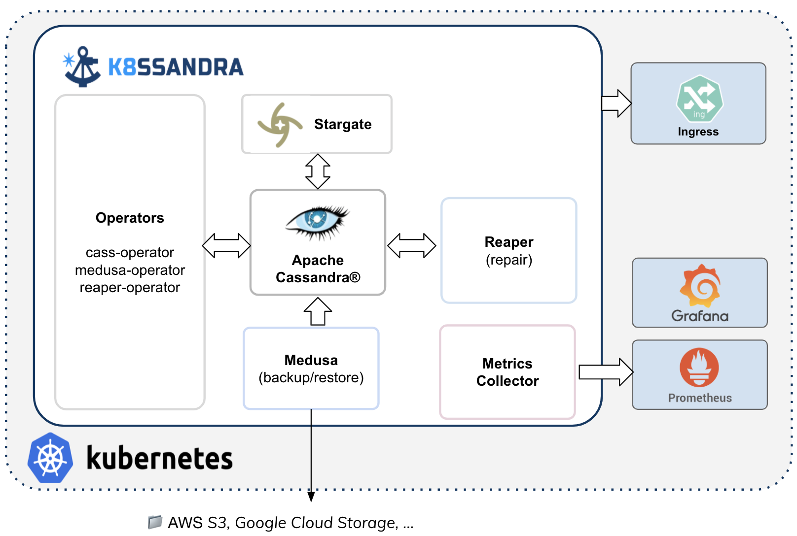
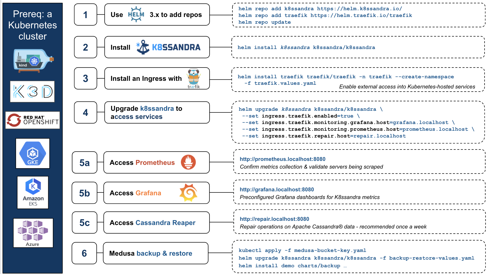

If you're new to K8ssandra, this FAQ is for you! 

### What is K8ssandra?

K8ssandra is an open-source project that anyone in the community can use, improve, and enjoy. K8ssandra is a cloud native distribution of Apache Cassandra® that runs on Kubernetes. Accompanying Cassandra is a suite of tools to ease and automate operational tasks. This includes metrics, data anti-entropy services, and backup/restore tools. As part of K8ssandra’s installation process, all of these components are installed and wired together, freeing your teams from having to perform the tedious plumbing of components.

### Ok - how should I pronounce "K8ssandra"?

Any way you want! But think of it this way:  "Kate" + "Sandra".

### What does K8ssandra include?

At a pure component level, K8ssandra integrates and packages together:

* Apache Cassandra
* Stargate, the open source data gateway
* Kubernetes Operator for Apache Cassandra (cass-operator)
* Reaper for Apache Cassandra, an anti-entropy repair feature (reaper-operator)
* Medusa for Apache Cassandra for backup and restore (medusa-operator)
* Metrics Collector, with Prometheus integration, and visualization via preconfigured Grafana dashboards
* Templates for connections into your Kubernetes environment via Ingress solutions

An illustration always helps:



In addition to the set of components, it's important to emphasize that K8ssandra is really a collection of experience from the community of Cassandra + Kubernetes users, packaged and ready for everyone to use freely. 

### How do I get started and install K8ssandra?

It's easy! Use [Helm](https://helm.sh/docs/intro/install/) v3 commands. 

```
helm repo add k8ssandra https://helm.k8ssandra.io/stable/
helm repo add traefik https://helm.traefik.io/traefik
helm repo update
helm install k8ssandra k8ssandra/k8ssandra
```

For more, start with the [install]() topics. Then proceed to the post-installation quickstart steps for [developers]() or [Site Reliability Engineers]().

### What components and versions does K8ssandra deploy?

For the full list of deployed components and latest versions, see the K8ssandra [Release notes](). 

### When I install K8ssandra, I see some warning messages. Is that a problem?

When installing K8ssandra on newer versions of Kubernetes (v1.19+), some warnings may be visible on the command line
related to deprecated API usage. This is a known issue and will not impact the provisioning of the cluster.

```bash
W0128 11:24:54.792095  27657 warnings.go:70] apiextensions.k8s.io/v1beta1 CustomResourceDefinition is deprecated in v1.16+, unavailable in v1.22+; use apiextensions.k8s.io/v1 CustomResourceDefinition
```

For more information, see issue [#267](https://github.com/k8ssandra/k8ssandra/issues/267) in the K8ssandra GitHub repo.

### Does K8ssandra have to be installed in a particular namespace?

The chart can be installed to any namespace. The following example demonstrates this:

```bash
helm install demo k8ssandra/k8ssandra -n my-k8ssandra --create-namespace
```

### Can I install multiple releases of K8ssandra?

You can install multiple releases of K8ssandra in a Kubernetes environment, provided:

* You install one release per namespace
* The release names are unique across the entire Kubernetes cluster

### How do I install K8ssandra using the K8 included with Docker Desktop for Mac?

When installing K8ssandra in the K8 instance of Docker Desktop for Mac, you may encounter the following error:

```bash
Error: failed pre-install: timed out waiting for the condition
```

To solve the issue, install K8ssandra using the following Helm command:

```bash
helm install <cluster-name> k8ssandra/k8ssandra \
   --set cassandra.cassandraLibDirVolume.storageClass=hostpath
```

### What is Stargate?

[Stargate](https://stargate.io/) is an open source data gateway that abstracts away many Apache Cassandra specific concepts, providing access to the database through various API options.  It helps to remove barriers of entry for developers new to Apache Cassandra by providing REST, GraphQL, and schemaless JSON document based APIs in addition to traditional CQL access.

### What is cass-operator?

Kubernetes Operator for Apache Cassandra, also known as Cass Operator or cass-operator, is the most critical element bridging Kubernetes and Cassandra. The community has been focusing much of its attention on operators over the past two years, as the appropriate starting place. If there is magic happening, it’s all in the operator. The cass-operator serves as the translation layer between the control plane of Kubernetes and actual operation done by the Cassandra cluster. Recently, the Apache Cassandra project agreed on gathering around a single operator: cass-operator. Some great contributions from Orange with CassKop will be merged with the DataStax operator and a final version will be merged into the Apache project. This is the best example of actual production knowledge finding its way into code. Community members contributing to cass-operator are running large amounts of Cassandra in Kubernetes every day. 

### What is Reaper for Apache Cassandra?

Reaper for Apache Cassandra is a tool that helps manage the critical maintenance task of anti-entropy **repairs** in a Cassandra cluster. Originally created by Spotify, later adopted and maintained by The Last Pickle, and one of the features installed by K8ssandra. If you were to sit a group of Cassandra DBAs down to talk about what they do, chances are they would talk a lot about running repairs. It’s an important operation because it keeps data consistent despite inevitable issues that happen like node failures and network partitions. In K8ssandra, Reaper runs it for you automatically! And because this is built for SREs, you can expect a good set of pre-built metrics to verify everything is working great. For more, see the [Reaper]() topic and follow the tasks in [Repair Cassandra with Reaper]().

### What is Medusa for Apache Cassandra?

Medusa for Apache Cassandra provides backup/restore functionality for Cassandra data. This project also originated at Spotify. Medusa not only helps coordinate backup &amp; restore tasks, it manages the placement of the data at rest. The initial implementation allows backup sets to be stored and retrieved on cloud object storage (such as AWS S3 buckets) with more options on the way. K8ssandra offers this [backup and restore]() feature to help you recover Cassandra data when inevitable real-world issues occur.

### How can I access Kubernetes resources from outside the environment?

K8ssandra provides [preconfigured]() Ingress integrations, such as Traefik, which is a modern reverse proxy and load balancer that makes deploying microservices easy. Traefik integrates with your existing infrastructure components and configures itself automatically and dynamically. Traefik handles advanced ingress deployments including mTLS of TCP with SNI and UDP. Operators define rules for routing traffic to downstream systems through Kubernetes Ingress objects or more specific Custom Resource Definitions. K8ssandra supports deploying `IngressRoute objects` as part of a deployment to expose metrics, repair, and Cassandra interfaces. For more, start in the [Traefik ingress]() topic.

### How can I monitor the health of my Kubernetes + Cassandra cluster?

Configure Traefik to expose the K8ssandra monitoring interfaces. See [Monitoring]() for the steps to enable the Traefik Ingress. Then see [Monitor Cassandra]() for details about how to access the preconfigured Grafana dashboards that K8ssandra provides. After completing the prerequisites, for example in your local environment, you can open <http://grafana.localhost:8080>. 

### What is the login for the Grafana dashboards?

The default configured Grafana username is `admin`, and the password is `secret`. See the topic about managing [Grafana credentials]().

### What kind of provisioning tasks can I perform with K8ssandra?

Among the tasks are to dynamically scale up or down the size of your cluster. See the [scaling task]().

### How can I backup and restore my Cassandra data?

Backup and restore Cassandra data to/from a supported storage object, such as an Amazon S3 bucket or Google Cloud Storage. See [Backup and restore Cassandra]().

### How do I schedule and orchestrate repairs of my Cassandra data?

Periodically run anti-entropy operations to repair your Cassandra data. A general recommendation is once every 7-10 days. With the Reaper UI, you can schedule repairs, run repairs, and check the cluster's health. See [Reaper for Apache Cassandra repairs]().

### Can you illustrate the steps and sample commands I'll use with K8ssandra?

Yes - here are the steps and commands in a single graphic:



For command-line and UI details, see K8ssandra [tasks]().

### How can I contribute to the K8ssandra docs?

See the code and documentation [Contributing guidelines]().

## Next steps

* [FAQs](): If you're new to K8ssandra, these FAQs are for you. 
* [Install](): K8ssandra install steps for local development or production-ready cloud platforms.
* [Quickstarts](): Post-install K8ssandra topics for developers or Site Reliability Engineers.
* [Components](): Dig in to each deployed component of the K8ssandra stack and see how it communicates with the others.
* [Tasks](): Need to get something done? Check out the Tasks topics for a helpful collection of outcome-based solutions.
* [Reference](): Explore the K8ssandra configuration interface (Helm charts), the available options, and a Glossary.

We encourage you to actively participate in the [K8ssandra community](https://k8ssandra.io/community/).
