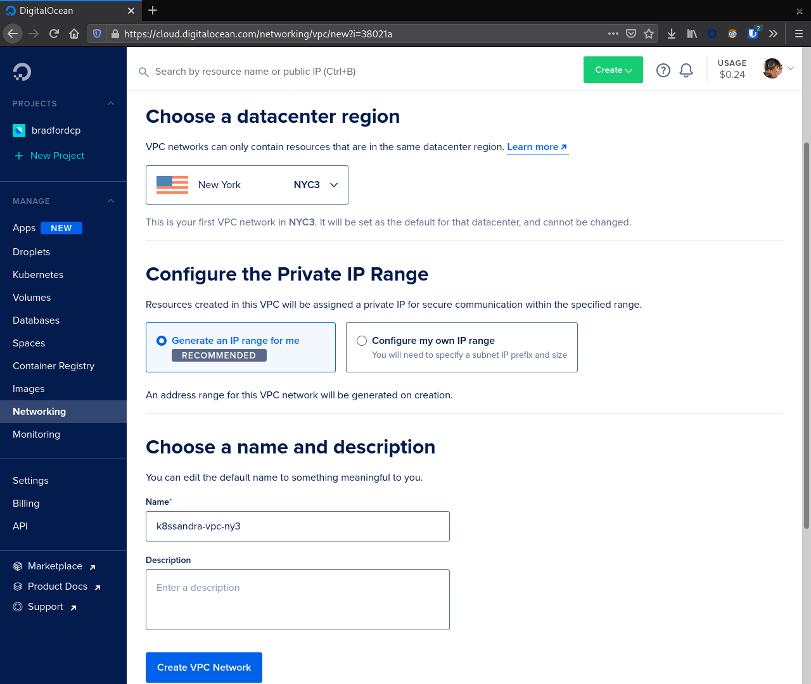
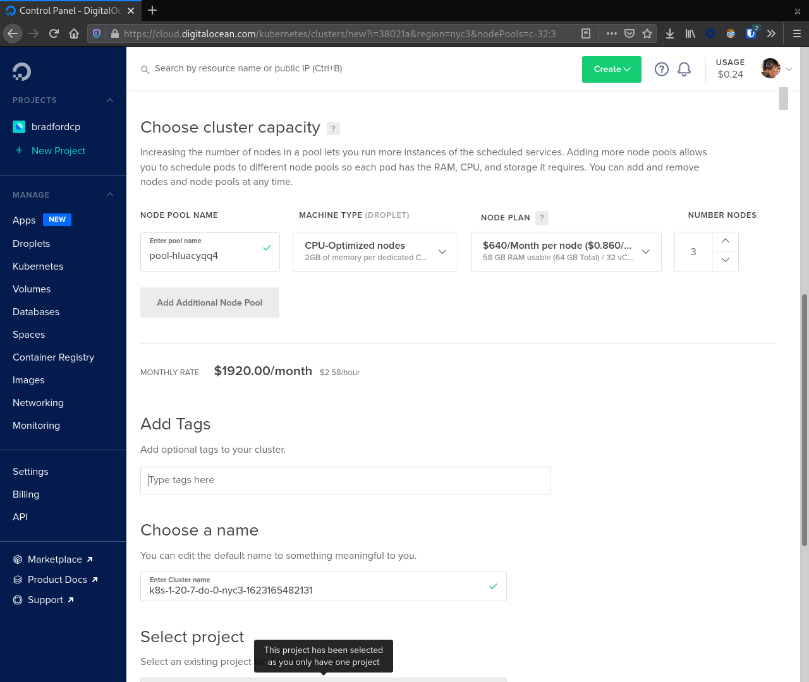
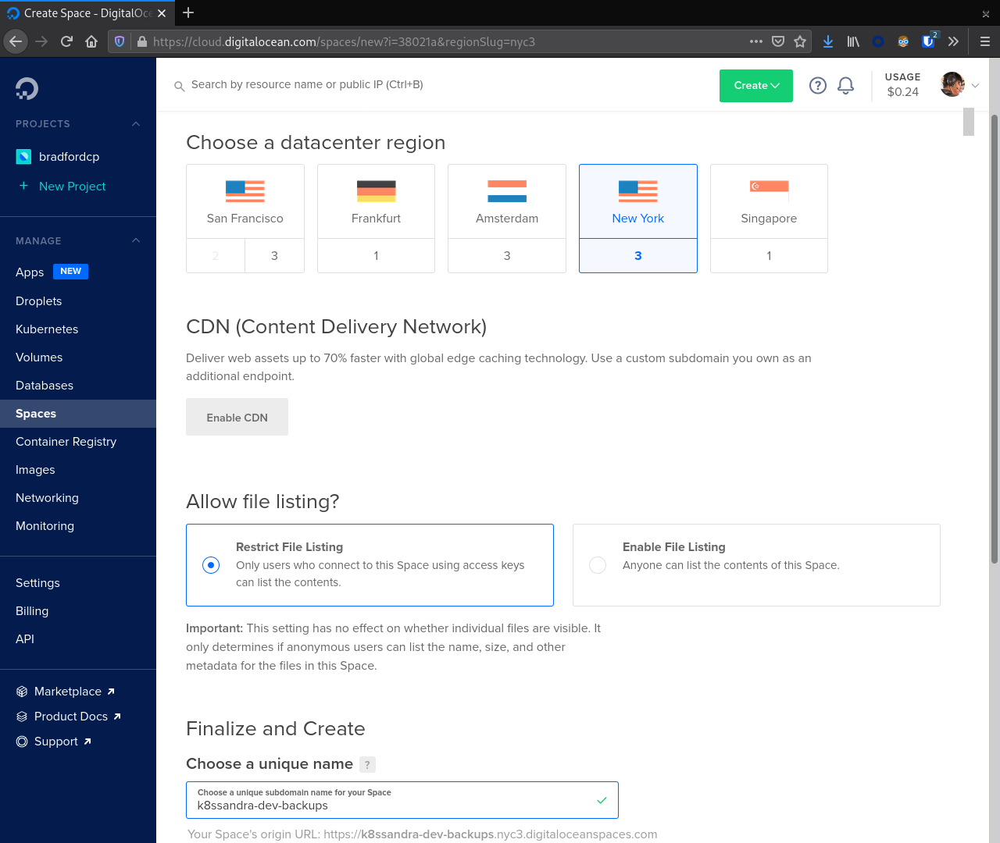
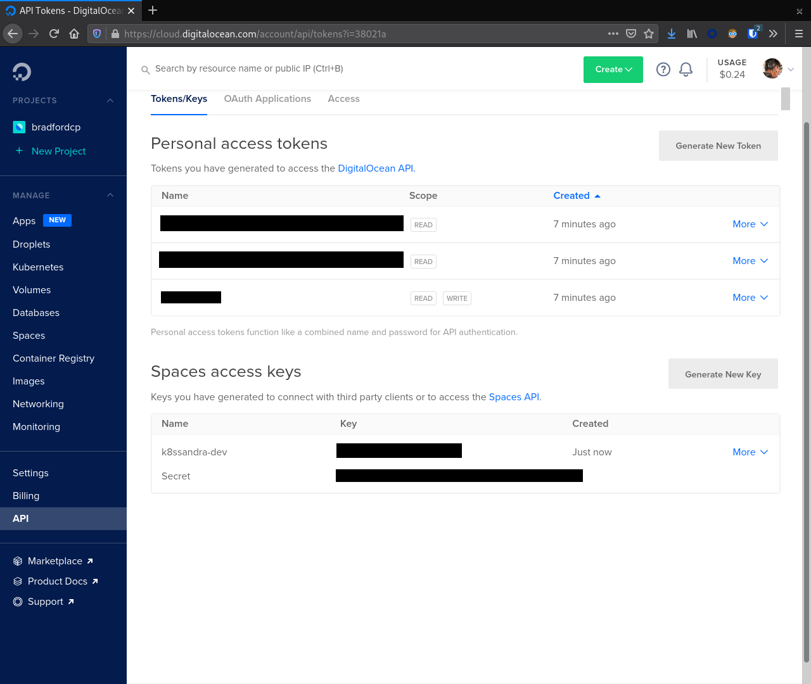

[DigitalOcean Kubernetes](https://www.digitalocean.com/products/kubernetes/) or "DOKS" is a managed Kubernetes environment on [DigitalOcean](https://www.digitalocean.com/) (DO). DOKS is a fully managed experience; it handles the management/upgrading of the Kubernetes cluster master as well as autoscaling of "nodes" through "node pools."

{}
Also available in followup topics are post-install steps and role-based considerations for [developers]() or [Site Reliability Engineers]() (SREs).
{}

## Deployment

This topic covers provisioning the following infrastructure resources.

* 1x VPC Network
* 1x DOKS cluster
* 2x Node Pools
  * 3x Cassandra Kubernetes workers
    * 32 vCPUs
    * 64 GB RAM
  * 3x Support Kubernetes workers
    * 2 vCPUs
    * 4 GB RAM
* 3x 2TB Block Storage Volumes (provisioned automatically during installation of K8ssandra)
* 1x DigitalOcean Spaces bucket for backups

{}
The instance flavors specified here may not be available to all accounts. If these higher capacity instances are unavailable reach out to Digital Ocean support to increase your limits.
{}

On this infrastructure the K8ssandra installation will consist of the following workloads.

* 3x instance Apache Cassandra cluster
* 3x instance Stargate deployment
* 1x instance Prometheus deployment
* 1x instance Grafana deployment
* 1x instance Reaper deployment

Feel free to update the parameters used during this guide to match your target deployment. This should be considered a minimum for production workloads.

## Provisioning Infrastructure

At this time the K8ssandra project does not have Terraform modules available to assist with provisioning infrastructure. With that being said the steps required to manually provision the infrastructure are outlined below. If you have already provisioned a cluster skip to the [Install K8ssandra](#install-k8ssandra) section. 

### Tools

| Tool | Version | 
|------|---------|
| [kubectl](https://kubernetes.io/docs/tasks/tools/) | 1.17.17 |
| [doctl](https://docs.digitalocean.com/reference/doctl/how-to/install/) | 1.61.0 |

Make sure to authenticate `doctl` as we will be using it later.

```console
doctl auth init
```

**Output:**

```console
Please authenticate doctl for use with your DigitalOcean account. You can generate a token in the control panel at https://cloud.digitalocean.com/account/api/tokens

Enter your access token: 
Validating token... OK
```

### VPC Network

Before creating our DOKS cluster we should create VPC network. It is possible to skip this step, but ultimately this network will be created for you anyway. From the DO console navigate to `Networking` in the left sidebar then `VPC`. Click the `Create VPC Network` button to start the process.

From here choose a `datacenter region` and configure the `Private IP range`.



In our example we are using `NYC3` and `Generate an IP range for me`.

### Kubernetes Cluster

Next, we navigate to `Kubernetes` in the sidebar navigation and click `Create`. First, choose a `Kubernetes version` and `VPC Network`.


With that selected we now focus on creating our first node pool. In this case we will create a node pool for the Cassandra nodes. This node pool should match the recommended instance size for production. Here we used `CPU-optimized nodes` with `32 vCPUs` and `64 GB RAM`.



Finally, click `Create Cluster` to start the provisioning process.

### Node Pool(s)

At this point the cluster is provisioning. We need to create a second node pool for running our supporting tools like Reaper, Prometheus, and Grafana.

From the cluster detail screen navigate to the `Nodes` tab. Next, click the `Add Node Pool` button.


Note that these nodes do not need to be as large as the C* nodes. For our example we selected `Basic nodes` with `4 GB RAM` and `2 vCPUs`. We chose `3` nodes for this pool. After selecting the appropriate values here click the `Add Node Pool(s)` button.

### Spaces

While these droplets spin up we can head over to the `Spaces` section of the sidebar and create a bucket for our Medusa backups. Click the `Create` button to start the process. Make sure to select a region where your DOKS cluster is running to minimize traffic ingress/egress costs.



{}
The bucket name must be unique across all of DigitalOcean. Copying the value here will most likely result in a conflict.
{}

With a bucket created click the `Spaces` link in the sidebar again and navigate to the `Manage Keys` button. In the `Spaces Access Keys` section create a key that Medusa will use to access our Space.



After creating the key note the key id and secret. We will use these values later when configuring Medusa. Failure to do so will require regenerating the secret later.

## Retrieve `kubeconfig`

After provisioning the DOKS cluster we must request a copy of the `kubeconfig`. This provides the `kubectl` command with all connection information including TLS certificates and IP addresses for Kube API requests.

```console
# NOTE your kubeconfig command WILL BE DIFFERENT, retrieve the command from the DO console interface.
doctl kubernetes cluster kubeconfig save REDACTED
```

**Output**:

```bash
Notice: Adding cluster credentials to kubeconfig file found in "~/.kube/config"
Notice: Setting current-context to do-nyc3-k8s-1-20-7-do-0-nyc3-1623165482131
```

With `kubectl` configured let's check connectivity to the cluster and verify versions.

```bash
kubectl cluster-info
```

**Output**:

```bash
Kubernetes control plane is running at https://f10bb874-562f-4328-8910-e0e2f6efa78b.k8s.ondigitalocean.com
CoreDNS is running at https://f10bb874-562f-4328-8910-e0e2f6efa78b.k8s.ondigitalocean.com/api/v1/namespaces/kube-system/services/kube-dns:dns/proxy

To further debug and diagnose cluster problems, use 'kubectl cluster-info dump'.
```

```bash
kubectl version
```

**Output**:

```bash
Client Version: version.Info{Major:"1", Minor:"21", GitVersion:"v1.21.1", GitCommit:"5e58841cce77d4bc13713ad2b91fa0d961e69192", GitTreeState:"clean", BuildDate:"2021-05-12T14:18:45Z", GoVersion:"go1.16.4", Compiler:"gc", Platform:"linux/amd64"}
Server Version: version.Info{Major:"1", Minor:"20", GitVersion:"v1.20.7", GitCommit:"132a687512d7fb058d0f5890f07d4121b3f0a2e2", GitTreeState:"clean", BuildDate:"2021-05-12T12:32:49Z", GoVersion:"go1.15.12", Compiler:"gc", Platform:"linux/amd64"}
```

### Taint Nodes

With mixed node types available we should apply taints to each node type in order to facilitate scheduling. The larger instances will be tainted with the value `app=cassandra:NoSchedule` effectively blocking the scheduling of Pods unless they have the taint `app=cassandra`. In our example deployment here Cassandra nodes are part of the pool named `pool-hluacyqq4`.

{}
Your node pool names will most likely not match the values above. Make sure you adjust the commands / values appropriately for your environment.
{}

```console
kubectl taint node -l doks.digitalocean.com/node-pool=pool-hluacyqq4 app=cassandra:NoSchedule
```

**Output:**

```console
node/pool-hluacyqq4-8edt2 tainted
node/pool-hluacyqq4-8edtl tainted
node/pool-hluacyqq4-8edtt tainted
```


## Install K8ssandra

With all of the infrastructure provisioned we can now focus on installing K8ssandra. This will require configuring a service account for the backup and restore service and creating a set of Helm variable overrides.

### Create Backup / Restore Service Account Secrets

In order to allow for backup and restore operations, we must create a service account for the Medusa operator which handles coordinating the movement of data to and from DigitalOcean Spaces. As part of the provisioning section a key was generated for this purpose. Plug in the key and secret from the provisioning section in the following file and save the file as `medusa_s3_credentials`.



Next submit this file to Kubernetes as a secret.
```bash
kubectl create secret generic prod-k8ssandra-medusa-key --from-file=medusa_s3_credentials=./medusa_s3_credentials
```

**Output**:

```bash
secret/prod-k8ssandra-medusa-key created
```

{}
The name of the key file within the secret MUST be `medusa_s3_credentials`. _Any_ other value will result in Medusa not finding the secret and backups failing.
{}

This secret, `prod-k8ssandra-medusa-key`, can now be referenced in our K8ssandra configuration to allow for backing up data to DigitalOcean Spaces with Medusa.

### Create `WaitForFirstConsumer` Storage Class

K8ssandra requires a Kubernetes Storage Class that has `volumeBindingMode: WaitForFirstConsumer`. The default pre-installed `do-block-storage` storage class has `volumeBindingMode: Immediate`. We will create a new storage class with the required mode based on the existing version. 



Submit this file to the Kubernetes cluster with:

```console
kubectl apply -f do-block-storage-wait.yaml 
```

**Output:**

```console
storageclass.storage.k8s.io/do-block-storage-wait created
```

### Generate `doks.values.yaml`

Here is a reference Helm `doks.values.yaml` file with configuration options for running K8ssandra in DigitalOcean on DOKS.



{}
Take note of the comments in this file. If you have changed the name of your secret, are deploying in a different region, or have tweaked any other values it is imperative that you update this file before proceeding.
{}

### Deploy K8ssandra with Helm

With a `values.yaml` file generated which details out specific configuration overrides we can now deploy K8ssandra via Helm.

```bash
helm install prod-k8ssandra k8ssandra/k8ssandra -f doks.values.yaml
```

**Output**:

```bash
NAME: prod-k8ssandra
LAST DEPLOYED: Sat Apr 24 01:15:46 2021
NAMESPACE: default
STATUS: deployed
REVISION: 1
```

### Retrieve K8ssandra superuser credentials {#superuser}

You'll need the K8ssandra superuser name and password in order to access Cassandra utilities and do things like generate a Stargate access token.

{}
In `kubectl get secret` commands, be sure to prepend the environment name. In this topic's examples, we have used `prod-k8ssandra`. Notice how it's prepended in the examples below. Also, save the displayed superuser name and the generated password for your environment. You will need the credentials when following the 
[Quickstart for developers]() or [Quickstart for Site Reliability Engineers]() post-install steps.
{}

To retrieve K8ssandra superuser credentials:

1. Retrieve the K8ssandra superuser name:

    ```bash
    kubectl get secret prod-k8ssandra-superuser -o jsonpath="{.data.username}" | base64 --decode ; echo
    ```

    **Output**:

    ```bash
    prod-k8ssandra-superuser
    ```

1. Retrieve the K8ssandra superuser password:

    ```bash
    kubectl get secret prod-k8ssandra-superuser -o jsonpath="{.data.password}" | base64 --decode ; echo
    ```

    **Output**:

    ```bash
    PGo8kROUgAJOa8vhjQrE49Lgruw7s32HCPyVvcfVmmACW8oUhfoO9A
    ```

## Cleanup Resources

If this cluster is no longer needed you may optionally uninstall K8ssandra or delete all of the infrastructure.

### Uninstall K8ssandra

```console
helm uninstall prod-k8ssandra
```

**Output**:

```bash
release "prod-k8ssandra" uninstalled
```

### Destroy Infrastructure

Similar to our provisioning section visit the following console sections (in order) to destroy the underlying infrastructure used during this guide.

1. Kubernetes cluster
2. Spaces
3. Networking => VPC. _Note_ if this is the only VPC in your account it is considered the default and may not be destroyed. You will not be billed for the VPC, just resources within it.

## Next steps

With a freshly provisioned cluster on DOKS, consider visiting the [developer]() and [Site Reliability Engineer]() quickstarts for a guided experience exploring your cluster. 

Alternatively, if you want to tear down your DOKS cluster and / or infrastructure, refer to the section above that covers [cleaning up resources]().
