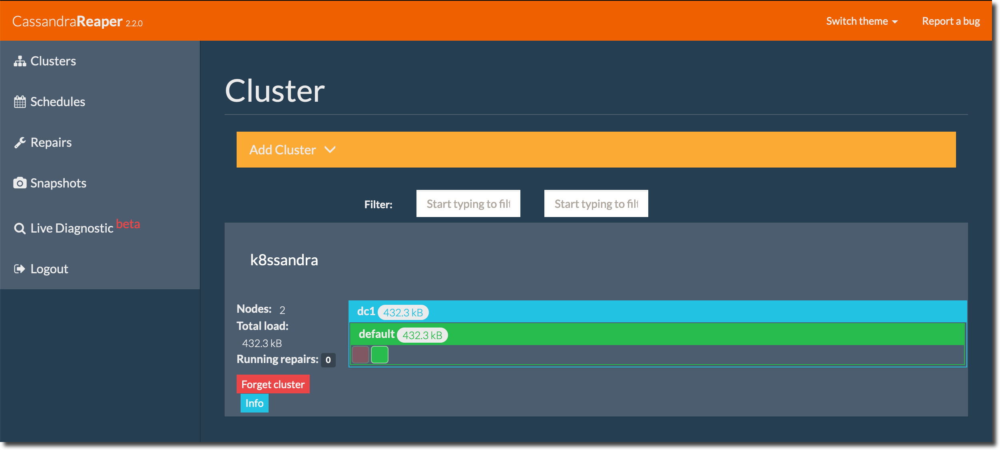

Before performing these post-install steps, complete at least one K8ssandra Operator [cluster deployment]() in Kubernetes. 

In this quickstart for Site Reliability Engineers (SREs), we'll cover:

* [Accessing nodetool commands]() like status, ring, and info.
* [Accessing Reaper](), an easy to use repair interface.

## Access the Cassandra nodetool utility {#nodetool}

Cassandra's nodetool utility is commonly used for a variety of monitoring and management tasks. You'll need to run nodetool on your K8ssandra cluster using the `kubectl exec` command, because there's no external standalone option available.

Follow these steps to run `nodetool` commands.

1. Get a list of the running K8ssandra pods using `kubectl get`:

    ```bash
    kubectl get pods -n k8ssandra-operator
    ```

    **Output:**

    ```
    NAME                                                    READY   STATUS    RESTARTS   AGE
    demo-dc1-default-stargate-deployment-7b6c9d8dcd-k65jx   1/1     Running   0          5m33s
    demo-dc1-default-sts-0                                  2/2     Running   0          10m
    demo-dc1-default-sts-1                                  2/2     Running   0          10m
    demo-dc1-default-sts-2                                  2/2     Running   0          10m
    k8ssandra-operator-7f76579f94-7s2tw                     1/1     Running   0          11m
    k8ssandra-operator-cass-operator-794f65d9f4-j9lm5       1/1     Running   0          11m
    ```

    The K8ssandra pod running Cassandra takes the form `<k8ssandra-cluster-name>-<datacenter-name>-default-sts-<n>` and, in the example above is `demo-dc1-default-sts-0` which we'll use throughout the following sections.

    **Note:** Although not applicable to this quick start, additional K8ssandra Operator Cassandra nodes will increment the final `<n>` but the rest of the name will remain the same.

2. Run [`nodetool status`](https://docs.datastax.com/en/cassandra-oss/3.x/cassandra/tools/toolsStatus.html), using the Cassandra node name `demo-dc1-default-sts-0`. 

    Replace `<k8ssandra-username>` and `<k8ssandra-password>` with the values you retrieved in the local install topic's [Extract credentials]() section:

    **Tip:** in that topic, the first single-cluster example returned this password: `ACK7dO9qpsghIme-wvfI`.

    With known `-u` and `-p` credentials, you can enter a command that invokes nodetool. Here's an example. Your credentials will be different:

    ```bash
    kubectl exec --stdin --tty demo-dc1-default-sts-0 -n k8ssandra-operator -c cassandra -- nodetool -u demo-superuser 
    -pw ACK7dO9qpsghIme-wvfI status
    ```

    **Output:**

    ```bash
    Datacenter: dc1
    ===============
    Status=Up/Down
    |/ State=Normal/Leaving/Joining/Moving
    --  Address     Load       Tokens  Owns (effective)  Host ID                               Rack
    UN  10.244.1.5  96.71 KiB  16      100.0%            4b95036b-1603-464f-bdee-b519fa28a079  default
    UN  10.244.2.4  96.62 KiB  16      100.0%            ade61d9f-90f4-464c-8e18-dd3522c2bf3c  default
    UN  10.244.3.4  96.7 KiB   16      100.0%            0f75a6fe-c91d-4c0e-9253-2235b6c9a206  default
    ```

    **Note:** All nodes should have the status `UN`, which stands for "Up Normal".

3. Other useful nodetool commands include:

    [`nodetool ring`](https://docs.datastax.com/en/cassandra-oss/3.x/cassandra/tools/toolsRing.html) which outputs all the tokens in the node. Example:

    ```bash
    kubectl exec --stdin --tty demo-dc1-default-sts-0 -n k8ssandra-operator -c cassandra -- nodetool -u demo-superuser 
    -pw ACK7dO9qpsghIme-wvfI ring
    ```

    **Output**:

    ```bash
    Datacenter: dc1
    ==========
    Address      Rack        Status State   Load            Owns                Token
                                                                               9126546575375666475
    172.17.0.13  default     Up     Normal  597.42 KiB      ?                   -9138166261715795932
    172.17.0.13  default     Up     Normal  597.42 KiB      ?                   -9120920057340937901
    172.17.0.13  default     Up     Normal  597.42 KiB      ?                   -9117737800555727340
    172.17.0.13  default     Up     Normal  597.42 KiB      ?                   -9058127181143818684
    172.17.0.13  default     Up     Normal  597.42 KiB      ?                   -8998548020695455271
    ...
    ```

    [`nodetool info`](https://docs.datastax.com/en/cassandra-oss/3.x/cassandra/tools/toolsInfo.html) which provides load and uptime information:

    ```bash
    kubectl exec --stdin --tty demo-dc1-default-sts-0 -n k8ssandra-operator -c cassandra -- nodetool -u demo-superuser 
    -pw ACK7dO9qpsghIme-wvfI info
    ```

    **Output**:

    ```bash
    ID                     : dec6a537-f00c-458a-bbc0-26b173675cc7
    Gossip active          : true
    Thrift active          : true
    Native Transport active: true
    Load                   : 597.42 KiB
    Generation No          : 1614265335
    Uptime (seconds)       : 9232
    Heap Memory (MB)       : 567.72 / 1024.00
    Off Heap Memory (MB)   : 0.00
    Data Center            : dc1
    Rack                   : default
    Exceptions             : 0
    Key Cache              : entries 39, size 3.46 KiB, capacity 51 MiB, 199 hits, 240 requests, 0.829 recent hit rate, 
    14400 save period in seconds
    Row Cache              : entries 0, size 0 bytes, capacity 0 bytes, 0 hits, 0 requests, NaN recent hit rate, 
    0 save period in seconds
    Counter Cache          : entries 0, size 0 bytes, capacity 25 MiB, 0 hits, 0 requests, NaN recent hit rate, 7200 save period 
    in seconds
    Chunk Cache            : entries 6, size 384 KiB, capacity 224 MiB, 111 misses, 3472 requests, 0.968 recent hit rate, 
    NaN microseconds miss latency
    Percent Repaired       : 100.0%
    Token                  : (invoke with -T/--tokens to see all 256 tokens)
    ```

For details on all `nodetool` commands, see [The nodetool utility](https://docs.datastax.com/en/cassandra-oss/3.x/cassandra/tools/toolsNodetool.html).

## Configure port forwarding {#port-forwarding}

In order to access Cassandra utilities outside of the K8s cluster, you'll need to configure port forwarding.

If you haven't already, get a list of your K8ssandra K8s services and ports:

```bash
kubectl get services
```

To configure port forwarding:

1. Open a new terminal.

2. Run the following 3 `kubectl port-forward` commands in the background. Example:

    ```bash
    kubectl port-forward svc/k8ssandra-reaper-reaper-service 9393:8080 &
    ```

    **Output**:

    ```bash
    ~/
    Forwarding from 127.0.0.1:9393 -> 8080
    Forwarding from [::1]:9393 -> 8080
    ```

The K8ssandra Operator services are now available at:

* Reaper: <http://127.0.0.1:9393/webui>

### Terminate port forwarding

To terminate a particular forwarded port:

1. Get the process ID:

    ```bash
    jobs -l
    ```

    **Output**:

    ```bash
    [3]  + 29213 running    kubectl port-forward svc/k8ssandra-reaper-k8ssandra-reaper-service 9393:8080
    ```

    2. Kill the process

    ```bash
    kill 80940
    ```

    **Output**:

    ```bash
    [3]  + terminated  kubectl port-forward svc/k8ssandra-reaper-k8ssandra-reaper-service 9393:8080
    ```

    **Note:** Exiting the terminal instance will terminate all port forwarding services.

## Access Reaper {#reaper}

[Reaper](http://cassandra-reaper.io/) is an easy interface for managing K8ssandra cluster repairs.  Reaper is deployed as part of the K8ssandra Operator [install](). 



For details, start in the [Reaper]() topic. Then read about the [repair]() tasks you can perform with Reaper.

## Next steps

* [Components](): Dig in to each deployed component of the K8ssandra stack and see how it communicates with the others.
* [Tasks](): Need to get something done? Check out the Tasks topics for a helpful collection of outcome-based solutions.
* [Reference](): Explore the Custom Resource Definitions (CRDs) used by K8ssandra Operator.

We encourage developers and SREs to actively participate in the [K8ssandra community](https://k8ssandra.io/community/).
