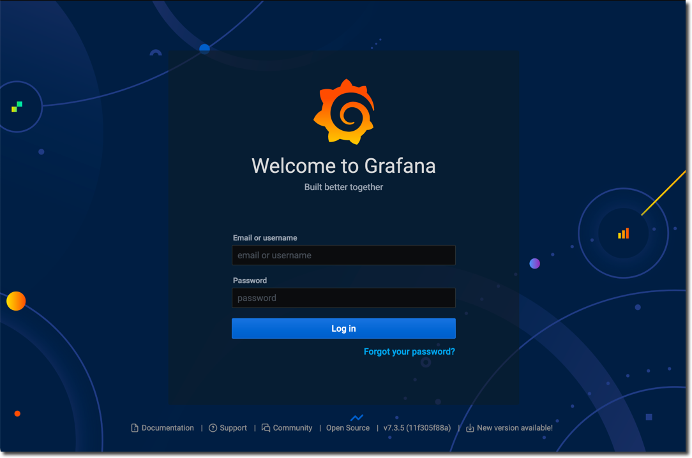
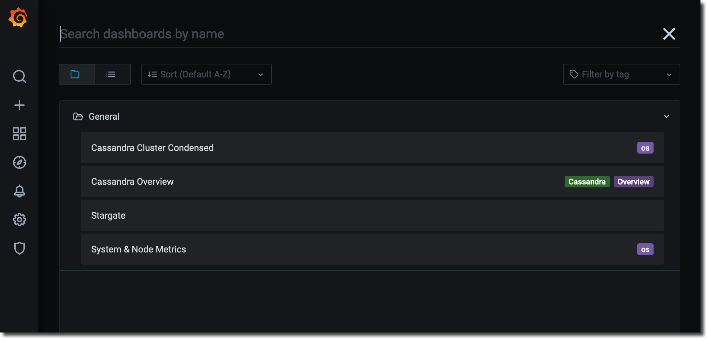

**Completion time**: **10 minutes**.

{}
You **must** complete the steps in [Quick start]() before continuing.
{}

In this quick start we'll cover the following topics:

* [Accessing nodetool commands]() like status, ring, and info.
* [Configure port forwarding]() for the Prometheus and Grafana monitoring utilties as well as Reaper for Apache Cassandra® (Reaper).
* [Accessing the K8ssandra monitoring utilities](), Prometheus and Grafana.
* [Accessing Reaper](), an easy to use repair interface.
* [Upgrading a K8ssandra cluster](): to ensure you're using the latest K8ssandra software, or to apply new settings.

## Access the Apache Cassandra® nodetool utility {#nodetool}

Cassandra's nodetool utility is commonly used for a variety of monitoring and management tasks. You'll need to run nodetool on your K8ssandra cluster using the `kubectl exec` command, because there's no external standalone option available.

To run `nodetool` commands:

1. Get a list of the running K8ssandra pods using `kubectl get`:

    ```bash
    kubectl get pods
    ```

    **Output**:

    ```bash
    NAME                                                READY   STATUS      RESTARTS   AGE
    k8ssandra-cass-operator-766849b497-klgwf            1/1     Running     1          45h
    k8ssandra-dc1-default-sts-0                         2/2     Running     0          115m
    k8ssandra-dc1-stargate-5c46975f66-pxl84             1/1     Running     5          45h
    k8ssandra-grafana-679b4bbd74-wj769                  2/2     Running     2          45h
    k8ssandra-kube-prometheus-operator-85695ffb-ft8f8   1/1     Running     1          45h
    k8ssandra-reaper-655fc7dfc6-n9svw                   1/1     Running     7          45h
    k8ssandra-reaper-operator-79fd5b4655-748rv          1/1     Running     0          45h
    k8ssandra-reaper-schema-dxvmm                       0/1     Completed   1          45h
    prometheus-k8ssandra-kube-prometheus-prometheus-0   2/2     Running     3          45h
    ```

    The K8ssandra pod running Cassandra takes the form `<k8ssandra-cluster-name>-<datacenter-name>-default-sts-<n>` and, in the example above is `k8ssandra-dc1-default-sts-0` which we'll use throughout the following sections.

    {}
Although not applicable to this quick start, additional K8ssandra Cassandra nodes will increment the final `<n>` but the rest of the name will remain the same.
    {}

1. Run [`nodetool status`](https://docs.datastax.com/en/cassandra-oss/3.x/cassandra/tools/toolsStatus.html), using the Cassandra node name `k8ssandra-dc1-default-sts-0`, and replacing `<k8ssandra-username>` and `<k8ssandra-password>` with the values you retrieved in [Retrieve K8ssandra superuser credentials]():

    ```bash
    kubectl exec -it k8ssandra-dc1-default-sts-0 -c cassandra -- nodetool -u <k8ssandra-username> -pw <k8ssandra-password> status
    ```

    **Output**:

    ```bash
    Datacenter: dc1
    ===============
    Status=Up/Down
    |/ State=Normal/Leaving/Joining/Moving
    --  Address      Load       Owns    Host ID                               Token                                    Rack
    UN  10.244.1.12  215.3 KiB  ?       75e52e51-edc9-49f8-84f6-f044999ac130  -1080085985719557225                     default

    Note: Non-system keyspaces don't have the same replication settings, effective ownership information is meaningless
    ```

    {}
All nodes should have the status `UN` or "Up Normal."
    {}

Other useful nodetool commands include:

* [`nodetool ring`](https://docs.datastax.com/en/cassandra-oss/3.x/cassandra/tools/toolsRing.html) which outputs all the tokens in the node:

    ```bash
    kubectl exec -it k8ssandra-dc1-default-sts-0 -c cassandra -- nodetool -u <k8ssandra-username> -pw <k8ssandra-password> ring
    ```

    **Output**:

    ```bash
    Datacenter: dc1
    ==========
    Address      Rack        Status State   Load            Owns                Token
                                                                                9126546575375666475
    172.17.0.13  default     Up     Normal  597.42 KiB      ?                   -9138166261715795932
    172.17.0.13  default     Up     Normal  597.42 KiB      ?                   -9120920057340937901
    172.17.0.13  default     Up     Normal  597.42 KiB      ?                   -9117737800555727340
    172.17.0.13  default     Up     Normal  597.42 KiB      ?                   -9058127181143818684
    172.17.0.13  default     Up     Normal  597.42 KiB      ?                   -8998548020695455271
    ...
    ```

* [`nodetool info`](https://docs.datastax.com/en/cassandra-oss/3.x/cassandra/tools/toolsInfo.html) which provides load and uptime information:

    ```bash
    kubectl exec -it k8ssandra-dc1-default-sts-0 -c cassandra -- nodetool -u <k8ssandra-username> -pw <k8ssandra-password> ring
    ```

    **Output**:

    ```bash
    ID                     : dec6a537-f00c-458a-bbc0-26b173675cc7
    Gossip active          : true
    Thrift active          : true
    Native Transport active: true
    Load                   : 597.42 KiB
    Generation No          : 1614265335
    Uptime (seconds)       : 9232
    Heap Memory (MB)       : 567.72 / 1024.00
    Off Heap Memory (MB)   : 0.00
    Data Center            : dc1
    Rack                   : default
    Exceptions             : 0
    Key Cache              : entries 39, size 3.46 KiB, capacity 51 MiB, 199 hits, 240 requests, 0.829 recent hit rate, 14400 save period in seconds
    Row Cache              : entries 0, size 0 bytes, capacity 0 bytes, 0 hits, 0 requests, NaN recent hit rate, 0 save period in seconds
    Counter Cache          : entries 0, size 0 bytes, capacity 25 MiB, 0 hits, 0 requests, NaN recent hit rate, 7200 save period in seconds
    Chunk Cache            : entries 6, size 384 KiB, capacity 224 MiB, 111 misses, 3472 requests, 0.968 recent hit rate, NaN microseconds miss latency
    Percent Repaired       : 100.0%
    Token                  : (invoke with -T/--tokens to see all 256 tokens)
    ```

For details on all nodetool commands, see [The nodetool utility](https://docs.datastax.com/en/cassandra-oss/3.x/cassandra/tools/toolsNodetool.html).

## Configure port forwarding {#port-forwarding}

In order to access Cassandra utilities outside of the K8s cluster, if you don't have an Ingress setup as described in [Configure Ingress](), you'll need to configure port forwarding.

Begin by getting a list of your K8ssandra K8s services and ports:

```bash
kubectl get services
```

**Output**:

```bash
NAME                                   TYPE        CLUSTER-IP     EXTERNAL-IP   PORT(S)                                                 AGE
cass-operator-metrics                  ClusterIP   10.80.3.92     <none>        8383/TCP,8686/TCP                                       24h
k8ssandra-dc1-all-pods-service         ClusterIP   None           <none>        9042/TCP,8080/TCP,9103/TCP                              24h
k8ssandra-dc1-service                  ClusterIP   None           <none>        9042/TCP,9142/TCP,8080/TCP,9103/TCP,9160/TCP            24h
k8ssandra-dc1-stargate-service         ClusterIP   10.80.13.197   <none>        8080/TCP,8081/TCP,8082/TCP,8084/TCP,8085/TCP,9042/TCP   24h
k8ssandra-grafana                      ClusterIP   10.80.7.168    <none>        80/TCP                                                  24h
k8ssandra-kube-prometheus-operator     ClusterIP   10.80.8.109    <none>        443/TCP                                                 24h
k8ssandra-kube-prometheus-prometheus   ClusterIP   10.80.2.44     <none>        9090/TCP                                                24h
k8ssandra-reaper-reaper-service        ClusterIP   10.80.5.77     <none>        8080/TCP                                                24h
k8ssandra-seed-service                 ClusterIP   None           <none>        <none>                                                  24h
kubernetes                             ClusterIP   10.80.0.1      <none>        443/TCP                                                 27h
prometheus-operated                    ClusterIP   None           <none>        9090/TCP                                                24h
```

In the output above, the services of interest are:

* **k8ssandra-grafana**: The K8ssandra grafana service where the name is a combination of the K8ssandra cluster name you specified during the Helm install, `k8ssandra`, and the postfix, `-grafana`. This service listens on the internal K8s port `80`.
* **prometheus-operated**: The K8ssandra Prometheus daemon. This service listens on the internal K8s port `9090`.
* **k8ssandra-reaper-k8ssandra-reaper-service**: The K8ssandra Reaper service where the name is a combination of the K8ssandra cluster name you specified during the Helm install, `k8ssandra`, `-reaper`, the K8ssandra cluster name again, and the postfix `-reaper-service`. This port listens on the internal K8s port `8080`.

To configure port forwarding:

1. Open a new terminal.

2. Run the following 3 `kubectl port-forward` commands in the background:

    ```bash
    kubectl port-forward svc/k8ssandra-grafana 9191:80 &
    kubectl port-forward svc/prometheus-operated 9292:9090 &
    kubectl port-forward svc/k8ssandra-reaper-reaper-service 9393:8080 &
    ```

    **Output**:

    ```bash
    [1] 29211
    [2] 29212
    [3] 29213

    ~/
    Forwarding from 127.0.0.1:9292 -> 9090
    Forwarding from [::1]:9292 -> 9090
    Forwarding from 127.0.0.1:9393 -> 8080
    Forwarding from [::1]:9393 -> 8080
    Forwarding from 127.0.0.1:9191 -> 3000
    Forwarding from [::1]:9191 -> 3000
    ```

The K8ssandra services are now available at:

* Prometheus: <http://127.0.0.1:9292>
* Grafana: <http://127.0.0.1:9191>
* Reaper: <http://127.0.0.1:9393/webui>

### Terminate port forwarding

To terminate a particular forwarded port:

1. Get the process ID:

    ```bash
    jobs -l
    ```

    **Output**:

    ```bash
    [3]  + 29213 running    kubectl port-forward svc/k8ssandra-reaper-k8ssandra-reaper-service 9393:8080
    ```

1. Kill the process

    ```bash
    kill 80940
    ```

    **Output**:

    ```bash
    [3]  + terminated  kubectl port-forward svc/k8ssandra-reaper-k8ssandra-reaper-service 9393:8080
    ```

{}
Exiting the terminal instance will terminate all port forwarding services.
{}

## Access K8ssandra monitoring utilities {#monitoring}

K8ssandra includes the following customized monitoring utilties:

* [Prometheus](https://prometheus.io/) a standard metrics collection and alerting tool.
* [Grafana](https://grafana.com/) a set of pre-configured dashboards displaying important K8ssandra metrics.

### Prometheus

To check on the health of your K8ssandra cluster using the K8ssandra Prometheus interface:

1. Access the Prometheus home page at <http://127.0.0.1:9292>:

    

1. From the **Status** menu, choose **Targets**.

1. Verify that the `stargate/0` and `k8ssandra/0` are in the state `UP`:

    

For more details on Prometheus, see the [Prometheus](https://prometheus.io/) web site.

### Grafana

To monitor the health and performance of your K8ssandra cluster using the pre-configured K8ssandra dashboards:

1. Retrieve the Grafana login username using the `helm show` command:

    ```bash
    helm show values k8ssandra/k8ssandra | grep "adminUser"
    ```

    **Output**:

    ```bash
    admin
    ```

1. Retrieve the Grafana login password using the `helm show` command:

    ```bash
    helm show values k8ssandra/k8ssandra | grep "adminPassword"
    ```

    **Output**:

    ```bash
    secret
    ```

1. Access the Grafana login screen at <http://127.0.0.1:9191> and login using the username and password:

    

1. Click the home button indicated by the arrow:

    

1. Click the `K8ssandra Overview` dashboard:

    

1. The `K8ssandra Overview` dashboard is displayed:

    

1. Explore the other K8ssandra dashboards.

For more information see the [Grafana](https://grafana.com/) web site.

## Access Reaper (Reaper) {#reaper}

The [Reaper](http://cassandra-reaper.io/) an easy interface for managing K8ssandra cluster repairs.


For more details, see the [Reaper](http://cassandra-reaper.io/) web site.

## Upgrade K8ssandra {#upgrade}

You can easily upgrade your K8ssandra software with the `helm repo update` command, or apply new settings with the `helm upgrade` command. For details, see [Upgrade K8ssandra]().

## Next

For details such as sizing recommendations and quota settings that are specific to cloud providers like Google Kubernetes Engine (GKE) and Amazon Elastic Kubernetes Service (EKS), see the [Install]() topics. 

Also see:

* [Tasks]().
* [FAQs]().
* [K8ssandra components and architecture]().
* [Reference material]().
* If you'd like to contribute to K8ssandra code, docs, or both, refer to our [Contribution guidelines]().
