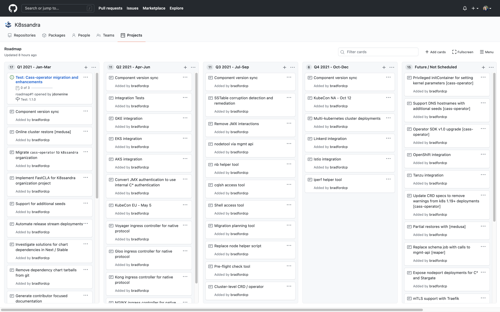

K8ssandra today is deployed as an entire stack. This open-source technology currently assumes your deployment uses the entire stack. Trading out certain components for others is not supported at this time. As part of the roadmap, one goal is to support a la carte composition of components.

The roadmap is currently tracked in GitHub on a [project board](https://github.com/orgs/k8ssandra/projects/6). Here's a quick preview:

