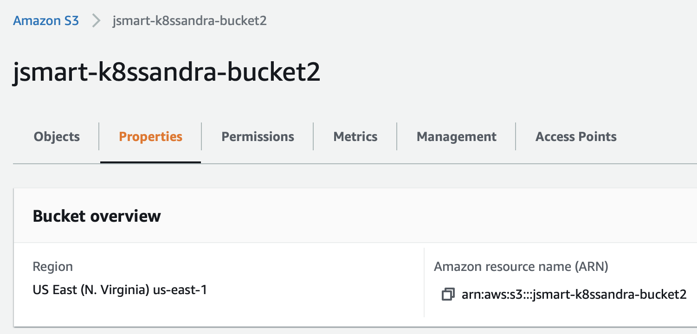
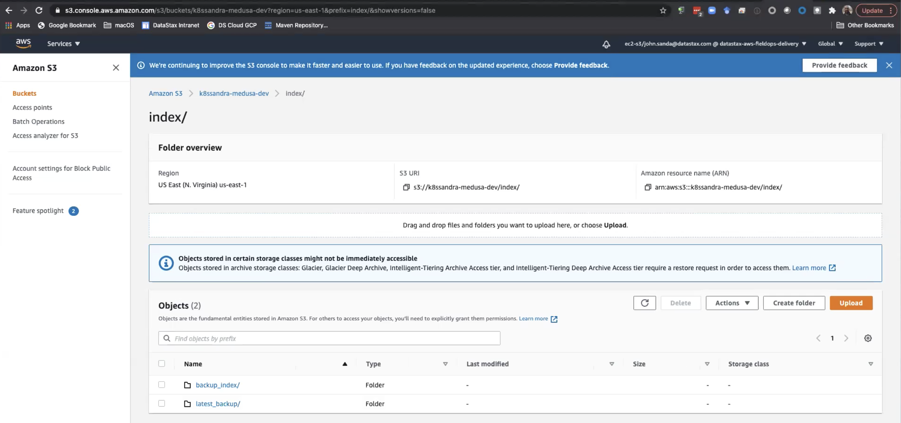

This topic walks you through the steps with Amazon S3 buckets. This feature is included in K8ssandra 1.0.0 and later releases.

For related information, see [Backup and restore Cassandra with MinIO]().

## Tools

* K8ssandra Helm chart, which we'll extend with `backupRestore` Medusa buckets for Amazon S3 integration
* Sample files in GitHub:
  * [medusa-bucket-key.yaml](medusa-bucket-key.yaml) to create a secret with credentials for Amazon S3 buckets
  * [backup-restore-values.yaml](backup-restore-values.yaml) to enable Medusa (backup/restore service) and set values
  * [test_data.cql](../test_data.cql) to populate a Cassandra keyspace and table with data
 
## Prerequisites

* A Kubernetes environment
* Storage for the backups - see below
* [Helm](https://helm.sh/), a packaging manager for Kubernetes

All other prerequisites are handled by the installed tools listed above. 

## Steps

### Verify you've met the prerequisites

You will need storage for the backups. This topic shows the use of Amazon S3 buckets.

* If you'll use Amazon S3, before proceeding with the configuration described below, verify that you know:
  * The `aws_access_key_id` and `aws_secret_access_key` values
  * The `name` of the Amazon S3 bucket
  * The region assigned to the Amazon S3 bucket
  
  Contact your IT team if they manage those assets. You'll provide those details in edited versions of the sample [medusa-bucket-key.yaml](medusa-bucket-key.yaml) and [backup-restore-values.yaml](backup-restore-values.yaml) files. For information about the Amazon S3 setup steps, see this helpful [readme](https://github.com/thelastpickle/cassandra-medusa/blob/master/docs/aws_s3_setup.md).  

* Add and update the following repo, which has in one chart all the settings for K8ssandra plus the backup/restore settings:

```
helm repo add k8ssandra https://helm.k8ssandra.io/stable/
helm repo update
```

**Output:**

```bash
Hang tight while we grab the latest from your chart repositories...
...Successfully got an update from the "k8ssandra" chart repository
Update Complete. ⎈Happy Helming!⎈
```

### Create secret for read/write access to an S3 bucket

Before installing the k8ssandra cluster, we need to supply credentials so that Medusa has read/write access to an Amazon S3 bucket, which is where the backup will be stored. 

{}
Medusa supports local, Google Cloud Storage (GCS), Azure, and all S3-compatible backends including Amazon S3 and MinIO buckets. At this time, K8ssandra exposes configurations for Amazon S3, MinIO, and GCS. The example in this topic uses an Amazon S3 bucket. For related information, see [Backup and restore Cassandra with MinIO](). Also see the [AWS S3 setup](https://github.com/thelastpickle/cassandra-medusa/blob/master/docs/aws_s3_setup.md) article on the Medusa wiki for more details for configuring S3.
{}

Start by creating a secret with the credentials for the Amazon S3 bucket.

The [medusa-bucket-key.yaml](medusa-bucket-key.yaml) sample in GitHub contains:

```yaml
apiVersion: v1
kind: Secret
metadata:
 name: medusa-bucket-key
type: Opaque
stringData:
 # Note that this currently has to be set to medusa_s3_credentials!
 medusa_s3_credentials: |-
   [default]
   aws_access_key_id = my_access_key
   aws_secret_access_key = my_secret_key
```

**Make a copy** of [medusa-bucket-key.yaml](medusa-bucket-key.yaml), and then replace `my_access_key` and `my_secret_key` with your S3 values.

In the YAML, notice the `stringData` property value: `medusa_s3_credentials`. The secret gets mounted to this location; this is where Medusa expects to get the AWS credentials.

Apply the YAML to your Kubernetes environment. In this example, assume that you had copied `medusa-bucket-key.yaml` to `my-medusa-bucket-key.yaml`:

```bash
kubectl apply -f my-medusa-bucket-key.yaml
```

**Output:**

```bash
secret/medusa-bucket-key configured
```

{}
If the values noted above in your edited **copy** of medusa-bucket-key.yaml do not match the Amazon S3 bucket's values, a subsequent attempt to install K8ssandra will begin and most pods will reach a Ready state; however, the Medusa container in the `<releaseName>-dc1-default-sts-0` pod will fail due to the misconfiguration, and you will not be able to perform backup and restore operations. Also, make sure that the region used by your Amazon S3 bucket matches the region expected by Medusa. If there is a mismatch, you'll see an error in the logs.
{}

For example, if there is a configuration mismatch:

```bash
kubectl logs demo-dc1-default-sts-0 -c medusa
```

**Output:**

```bash
.
.
.
File "/usr/local/lib/python3.6/dist-packages/libcloud/storage/drivers/s3.py", line 143, in parse_error driver=S3StorageDriver)
libcloud.common.types.LibcloudError: <LibcloudError in <class 'libcloud.storage.drivers.s3.S3StorageDriver'> 'This bucket is located in a different region. Please use the correct driver. Bucket region "us-east-2", used region "us-east-1".'>
```

The solution is easy - for Amazon S3 buckets, specify the correct region in a values file that you'll reference in the K8ssandra install or upgrade; see the section below. If your IT group manages the AWS S3 bucket settings, consult with them to get the correct values. 

Here's an example from the AWS S3 dashboard showing a sample bucket name and region:



Notice how in this example, the region defined in the AWS console is `us-east-1`, and the bucket name on S3 is `jsmart-k8ssandra-bucket2`.  The backup-restore-values.yaml file that you use in the next step should match your values.

### Create or update the k8ssandra cluster

Install the `k8ssandra` chart with the following properties. You can reference an edited copy of the provided [backup-restore-values.yaml](backup-restore-values.yaml) file; customize the `name` of the Amazon S3 bucket defined for your purposes, and make sure the region value matches the region used by the Amazon S3 bucket. Before edits, this sample values file contains:

```yaml
cassandra:
  datacenters:
  - name: dc1
    size: 3
medusa:
  enabled: true
  bucketName: k8ssandra-bucket-dev
  storageSecret: medusa-bucket-key
  storage: s3
  storage_properties:
    region: us-east-1
```

Modify a copy of the file for your purposes. In this example, the `bucketName` setting would be changed to `jsmart-k8ssandra-bucket2`.

The chart's entries relate to a Kubernetes Secret, which contains the object store credentials. Specifically, the `storageSecret` property specifies the name of a secret that should contain an AWS access key. As described in the [Medusa documentation](https://github.com/thelastpickle/cassandra-medusa/blob/master/docs/aws_s3_setup.md), the AWS account with which the key is associated should have the permissions that are required for Medusa to access the Amazon S3 bucket. For these examples, assume that you had copied `backup-restore-values.yaml` to `my-backup-restore-values.yaml` and edited it with values for your environment. 

Example for a new K8ssandra installation, in which we use `demo` as the cluster name:

```bash
helm install demo k8ssandra/k8ssandra -f my-backup-restore-values.yaml
```

Example for an existing K8ssandra installation, in which we used `demo` as the cluster name:

```bash
helm upgrade demo k8ssandra/k8ssandra -f my-backup-restore-values.yaml
```

Allow a few minutes for the pods to start and proceed to a Ready state; check the pod status periodically:

```bash
kubectl get pods
```

**Output:**

```bash
NAME                                                   READY   STATUS      RESTARTS   AGE
demo-cass-operator-65cc657-fq6bc                       1/1     Running     0          7m20s
demo-dc1-default-sts-0                                 3/3     Running     0          6m53s
demo-dc1-stargate-bb47877d5-54sdt                      1/1     Running     0          7m20s
demo-grafana-7f84d96d47-xd79s                          2/2     Running     0          7m20s
demo-kube-prometheus-stack-operator-76b984f9f4-pp745   1/1     Running     0          7m20s
demo-medusa-operator-6888946787-qwzsx                  1/1     Running     0          7m20s
demo-reaper-k8ssandra-656f5b77cc-nqfzv                 1/1     Running     0          4m21s
demo-reaper-k8ssandra-schema-88cpx                     0/1     Completed   0          4m31s
demo-reaper-operator-5b8c4c66b8-8cf86                  1/1     Running     0          7m20s
prometheus-demo-kube-prometheus-stack-prometheus-0     2/2     Running     1          7m17s
```

Backup and restore operations are enabled by default. The `bucketSecret` corresponds to the secret credentials.

```bash
kubectl get cassdc dc1 -o yaml
```

In the output, see the `podTemplateSpec` property; two containers were added for Medusa.  Here’s the entry for the gRPC backup service:

`    name: medusa`

Here’s the entry for the restore’s init container. K8ssandra looks for an environment variable to be set, which would indicate when to perform a restore operation.

`    name: medusa-restore`

After a few minutes, once the pods have started, check the status:

```bash
kubectl get cassdc dc1 -o yaml
```

**Output:**

```bash
.
.
.
status:
  cassandraOperatorProgress: Ready
  conditions:
  ...
  - lastTransitionTime: "2021-02-05T20:45:46Z"
    message: ""
    reason: ""
    status: "True"
    type: Ready
  ...
```

### Get credentials for Cassandra access

Before you can launch the CQLSH instance that's deployed by K8ssandra to a Kubernetes cluster, you'll need authentication credentials. The superuser secret name defaults to `<cluster-name>-superuser`. In this example: `demo-superuser`. 

Extract the username and password to access Cassandra into variables. (The password is different for each installation unless it is explicitly set at install time.) If you used a non-default namespace, include `-n <your-namespace-name>` in the commands.

```bash
username=$(kubectl get secret demo-superuser -o jsonpath="{.data.username}" | base64 --decode)
password=$(kubectl get secret demo-superuser -o jsonpath="{.data.password}" | base64 --decode)
```

### Use the credentials and add data to the Cassandra database

Connect through CQLSH on one of the nodes:

```bash
kubectl exec -it demo-dc1-default-sts-0 -c cassandra -- cqlsh -u $username -p $password
```

With proper credentials, CQLSH starts:

```cqlsh
Connected to demo at 127.0.0.1:9042.
[cqlsh 5.0.1 | Cassandra 3.11.10 | CQL spec 3.4.4 | Native protocol v4]
Use HELP for help.
demo-superuser@cqlsh>
```

Copy/paste the following statements into CQLSH:

```cqlsh
CREATE KEYSPACE medusa_test  WITH replication = {'class': 'SimpleStrategy', 'replication_factor': 1};
USE medusa_test;
CREATE TABLE users (email TEXT PRIMARY KEY, name TEXT, state TEXT);
INSERT INTO users (email, name, state) VALUES ('alice@example.com', 'Alice Smith', 'TX');
INSERT INTO users (email, name, state) VALUES ('bob@example.com', 'Bob Jones', 'VA');
INSERT INTO users (email, name, state) VALUES ('carol@example.com', 'Carol Jackson', 'CA');
INSERT INTO users (email, name, state) VALUES ('david@example.com', 'David Yang', 'NV');
```

Check that the rows were properly inserted:
 
```cqlsh
demo-superuser@cqlsh:medusa_test> SELECT * from medusa_test.users;
 email             | name          | state
-------------------+---------------+-------
 alice@example.com |   Alice Smith |    TX
   bob@example.com |     Bob Jones |    VA
 david@example.com |    David Yang |    NV
 carol@example.com | Carol Jackson |    CA
(4 rows)
```

Exit out of CQLSH:
```bash
demo-superuser@cqlsh:medusa_test> quit;
```

{}
Keep the sample `medusa_test.users` keyspace.table data in mind -- we will use subsequent backup and restore steps with this data.
{}

### Create the backup

Now create a backup by relreferencing the backup chart:

```bash
helm install test k8ssandra/backup --set name=test,cassandraDatacenter.name=dc1
```

**Output:**

```bash
kubectl get cassandrabackup
NAME       AGE
test       17s
```

Examine the YAML:

```bash
kubectl get cassandrabackup test -o yaml
```

The Status section in the YAML shows the backup operation’s start and finish timestamps.

### Amazon S3 buckets

Let's look at the resources in the Amazon S3 dashboard.

Medusa maintains a `backup_index` as top-level folder in the bucket, to make operations such as listing backups faster. That is, Medusa doesn't need to scan the whole bucket; just the index. SSTables are copied only once as part of a differences backup feature (default mode) that checks the manifest from the previous backup to skip SSTables that were already present. The manifest from the newly created backups then points to both pre-existing sstables and newly uploaded ones. The implementation thus avoids a large amount of storage.  

For example:



### Restore data from the backup

Consider the case where an unexpected event occurred, such as an authorized user accidentally entering cqlsh `TRUNCATE` commands that wiped out data in Cassandra. You can restore data from the backup. Recall that in the prior `helm install test k8ssandra/backup...` command above, we identified the configured backup's name as `test`. So, for example, a subsequent restore can reference the `test` backup this way:

```bash
helm install restore-test k8ssandra/restore --set name=helm-test,backup.name=test,cassandraDatacenter.name=dc1
```

Examine the YAML:

```bash
kubectl get cassandrarestore helm-test -o yaml
```

The output will show the restore operation’s start time and that the `cassandraDatacenter` is being recreated.

You can also examine the in-progress logs:

```bash
kubectl logs cassandra-dc1-default-sts-0 -c medusa-restore
```

### Launch CQLSH again and verify the restore

Exec into CQLSH and select the data again, to verify the restore operation.

```bash
kubectl exec -it demo-dc1-default-sts-0 -c cassandra -- cqlsh -u $username -p $password
```

With proper credentials, CQLSH starts:

```cqlsh
Connected to demo at 127.0.0.1:9042.
[cqlsh 5.0.1 | Cassandra 3.11.10 | CQL spec 3.4.4 | Native protocol v4]
Use HELP for help.
demo-superuser@cqlsh> USE medusa_test;
demo-superuser@cqlsh:medusa_test> SELECT * from medusa_test.users;

 email             | name          | state
-------------------+---------------+-------
 alice@example.com |   Alice Smith |    TX
   bob@example.com |     Bob Jones |    VA
 david@example.com |    David Yang |    NV
 carol@example.com | Carol Jackson |    CA

(4 rows)
```

You can look again at the `cassandrarestore` helm-test YAML for the start and ending timestamps:

```bash
kubectl get cassadrarestore helm-test -o yaml
```

## Next steps

An alternative to an Amazon S3 bucket is MinIO, which is S3 compatible and also supported by Medusa. See [Backup and restore Cassandra with MinIO]().

Also see the following reference topics:

* [Medusa Operator Helm Chart]()
* [Backup Helm Chart]()
* [Restore Helm Chart]()

