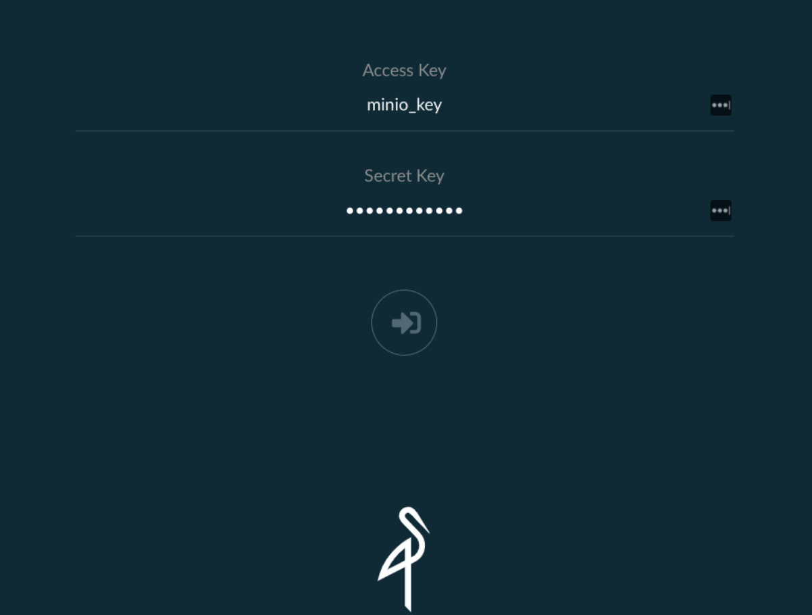
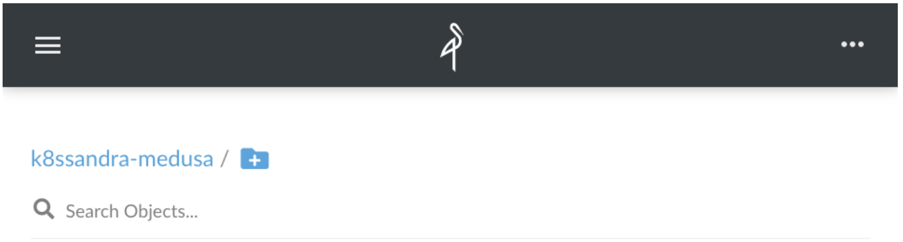
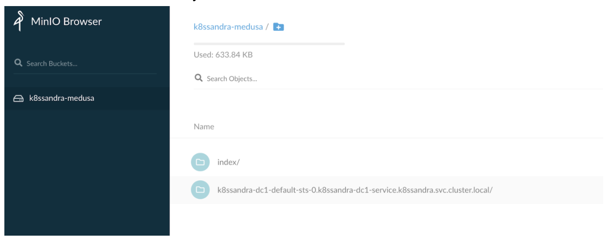

Medusa recently introduced support for all S3-compatible backends, including MinIO. This feature is included in K8ssandra 1.1.0 and later releases.

[MinIO](https://min.io/) is a popular Kubernetes object storage suite. This topic walks you through the backup and restore steps.

For related information, see [Backup and restore Cassandra with Amazon S3]().

## Deploy MinIO

Deploy MinIO through Helm. First, add the MinIO repository to your local list:

```bash
helm repo add minio https://helm.min.io/
```

The MinIO Helm charts allow you to do several things at once at install time:

* Set the credentials to access MinIO
* Create a bucket for your backups that can be set as the default

For example, to create a `k8ssandra-medusa` bucket, use `minio_key/minio_secret` as the credentials, and deploy MinIO in a new namespace called `minio` :

```bash
helm install --set 
accessKey=minio_key,secretKey=minio_secret,defaultBucket.enabled=true,defaultBucket.name=k8ssandra-medusa 
minio minio/minio -n minio --create-namespace
```

{}
Creating the bucket is not mandatory at this stage; alternatively, you can create the bucket via the MinIO UI.
{}

After the `helm install` command has completed, you'll see messages similar to the following in the `minio` namespace: 

```bash
kubectl get all -n minio
```

**Output:**

```
NAME                        READY   STATUS    RESTARTS   AGE
pod/minio-5fd4dd687-gzr8j   1/1     Running   0          109s

NAME            TYPE        CLUSTER-IP     EXTERNAL-IP   PORT(S)    AGE
service/minio   ClusterIP   10.96.144.61   <none>        9000/TCP   109s

NAME                    READY   UP-TO-DATE   AVAILABLE   AGE
deployment.apps/minio   1/1     1            1           109s

NAME                              DESIRED   CURRENT   READY   AGE
replicaset.apps/minio-5fd4dd687   1         1         1       109s
```

Using port forwarding, you can expose access to the MinIO UI in the browser on port 9000:


```bash
kubectl port-forward service/minio 9000:9000 -n minio
```

**Output:**

```bash
Forwarding from 127.0.0.1:9000 -> 9000
Forwarding from [::1]:9000 -> 9000
```

Now you can login to MinIO at <http://localhost:9000> using your install-time defined credentials.



Once logged in, you can see that the `k8ssandra-medusa` bucket was created and is currently empty:




## Deploy K8ssandra

Now that MinIO is up and running, you can create a namespace for your K8ssandra installation and create a secret for Medusa to access the bucket. Create a `medusa_secret.yaml` file with the following content:

```yaml
apiVersion: v1
kind: Secret
metadata:
 name: medusa-bucket-key
type: Opaque
stringData:
 # Note that this currently has to be set to medusa_s3_credentials!
 medusa_s3_credentials: |-
   [default]
   aws_access_key_id = minio_key
   aws_secret_access_key = minio_secret
```

Now create the `k8ssandra` namespace and the Medusa secret with the following commands:

```bash
kubectl create namespace k8ssandra
kubectl apply -f medusa_secret.yaml -n k8ssandra
```

You should now see the `medusa-bucket-key` secret in the `k8ssandra` namespace:

```bash
kubectl get secrets -n k8ssandra
```

**Output:**

```bash
NAME                  TYPE                                  DATA   AGE
default-token-twk5w   kubernetes.io/service-account-token   3      4m49s
medusa-bucket-key     Opaque                                1      45s
```

You can then deploy K8ssandra with the following custom values YAML file; all default values will be used if not customized. Save the following content in a values file named (for example) `k8ssandra_medusa_minio.yaml`:


```yaml
medusa:
  enabled: true
  storage: s3_compatible
  storage_properties:
      host: minio.minio.svc.cluster.local
      port: 9000
      secure: "False"
  bucketName: k8ssandra-medusa
  storageSecret: medusa-bucket-key
```

Then install K8ssandra and specify the values file above with the following command:

```bash
helm install k8ssandra k8ssandra/k8ssandra -f k8ssandra_medusa_minio.yaml -n k8ssandra
```

Now wait for the Cassandra cluster to be ready by using the following `wait` command:

```bash
kubectl wait --for=condition=Ready cassandradatacenter/dc1 --timeout=900s -n k8ssandra
```

When ready, you should now see a list of pods. Example:

```bash
kubectl get pods -n k8ssandra
```

**Output:**

```bash
NAME                                                  READY   STATUS      RESTARTS   AGE
k8ssandra-cass-operator-547845459-dwg68               1/1     Running     0          6m36s
k8ssandra-dc1-default-sts-0                           3/3     Running     0          5m56s
k8ssandra-dc1-stargate-776f88f945-p9twg               0/1     Running     0          6m36s
k8ssandra-grafana-75b9cb64cc-kndtc                    2/2     Running     0          6m36s
k8ssandra-kube-prometheus-operator-5bdd97c666-qz5vv   1/1     Running     0          6m36s
k8ssandra-medusa-operator-d766d5b66-wjt7j             1/1     Running     0          6m36s
k8ssandra-reaper-5f9bbfc989-j59xk                     1/1     Running     0          2m48s
k8ssandra-reaper-operator-858cd89bdd-7gfjj            1/1     Running     0          6m36s
k8ssandra-reaper-schema-4gshj                         0/1     Completed   0          3m3s
prometheus-k8ssandra-kube-prometheus-prometheus-0     2/2     Running     1          6m32s
```

## Create some data and back it up

Next, let's define some sample data in Cassandra by creating a `test_data.cql` file that contains DDL and DML statements:

```cql
CREATE KEYSPACE medusa_test  WITH replication = {'class': 'SimpleStrategy', 'replication_factor': 1};
USE medusa_test;
CREATE TABLE users (email text primary key, name text, state text);
insert into users (email, name, state) values ('alice@example.com', 'Alice Smith', 'TX');
insert into users (email, name, state) values ('bob@example.com', 'Bob Jones', 'VA');
insert into users (email, name, state) values ('carol@example.com', 'Carol Jackson', 'CA');
insert into users (email, name, state) values ('david@example.com', 'David Yang', 'NV');
```

Copy the CQL file into the Cassandra pod; that is, the StatefulSet one, which contains `-sts-` in its name:

```bash
kubectl cp test_data.cql k8ssandra-dc1-default-sts-0:/tmp -n k8ssandra -c cassandra
```

Now extract the password to access Cassandra with the `k8ssandra-superuser`. (The password is different for each installation unless it is explicitly set at install time.)

```bash
kubectl get secret k8ssandra-superuser -n k8ssandra -o jsonpath="{.data.password}" | base64 --decode ; echo
```

**Output:**

```bash
XHsZ943WBg5RPNhVAT8x
```

{}
The password above is an example. The value will be different for your environment. In the subsequent examples, don’t forget to replace the sample password with the one extracted in your environment.
{}

Let’s now run the uploaded cql script and check that you can read the data. 

```bash
kubectl exec -it k8ssandra-dc1-default-sts-0 -n k8ssandra -c cassandra -- cqlsh -u k8ssandra-superuser -p XHsZ943WBg5RPNhVAT8x -f /tmp/test_data.cql
```

```bash
kubectl exec -it k8ssandra-dc1-default-sts-0 -n k8ssandra -c cassandra -- cqlsh -u k8ssandra-superuser -p XHsZ943WBg5RPNhVAT8x -e "SELECT * FROM medusa_test.users"
```

**Output:**

```bash
 email             | name          | state
-------------------+---------------+-------
 alice@example.com |   Alice Smith |    TX
   bob@example.com |     Bob Jones |    VA
 david@example.com |    David Yang |    NV
 carol@example.com | Carol Jackson |    CA

(4 rows)
```

Now backup this data, and check that files get created in your MinIO bucket. 

```bash
helm install my-backup k8ssandra/backup -n k8ssandra --set name=backup1,cassandraDatacenter.name=dc1
```

Because the backup operation is asynchronous, you can monitor its completion by running the following command:

```bash
kubectl get cassandrabackup backup1 -n k8ssandra -o jsonpath={.status.finishTime}
```

As long as this command doesn’t output a date and time, you know that the backup is still running. With the amount of data present and the fact that you’re using a locally accessible backend, this should complete quickly.

Now refresh the MinIO UI and you should see some files in the `k8ssandra-medusa` bucket:



In the MinIO UI, we now see an index folder, which is the Medusa backup index, and another folder that is specific to each Cassandra node in the cluster. In this example, there is only one node.

## Deleting the data and restoring the backup

Now delete the data by truncating the table, and check that the table is empty.

```bash
kubectl exec -it k8ssandra-dc1-default-sts-0 -n k8ssandra -c cassandra -- cqlsh -u k8ssandra-superuser -p XHsZ943WBg5RPNhVAT8x -e "TRUNCATE medusa_test.users"
```

```bash
 kubectl exec -it k8ssandra-dc1-default-sts-0 -n k8ssandra -c cassandra -- cqlsh -u k8ssandra-superuser -p XHsZ943WBg5RPNhVAT8x -e "SELECT * FROM medusa_test.users"
```

**Output:**

```cql
 email | name | state
-------+------+-------

(0 rows)
```

Now restore the backup taken previously:

```bash
helm install restore-test k8ssandra/restore --set name=restore-backup1,backup.name=backup1,cassandraDatacenter.name=dc1 -n k8ssandra
```

The restore operation will take a little longer because it requires K8ssandra to stop the StatefulSet pod and perform the restore as part of the init containers, before the Cassandra container can start. You can monitor progress using this command:

```bash
watch -d kubectl get cassandrarestore restore-backup1 -o jsonpath={.status} -n k8ssandra
```

The restore operation is fully completed once the finishTime value appears in the output. Example:

```bash
{"finishTime":"2021-03-30T13:58:36Z","restoreKey":"83977399-44dd-4752-b4c4-407273f0339e","startTime":"2021-03-30T13:55:35Z"}
```

Verify that you can now read the restored data from the previously truncated table:

```bash
kubectl exec -it k8ssandra-dc1-default-sts-0 -n k8ssandra -c cassandra -- cqlsh -u k8ssandra-superuser -p XHsZ943WBg5RPNhVAT8x -e "SELECT * FROM medusa_test.users"
```

**Output:**

```bash
 email             | name          | state
-------------------+---------------+-------
 alice@example.com |   Alice Smith |    TX
   bob@example.com |     Bob Jones |    VA
 david@example.com |    David Yang |    NV
 carol@example.com | Carol Jackson |    CA

(4 rows)
```

Success! You’ve successfully restored your lost data in just a few commands.

## Next steps

An alternative to MinIO buckets is Amazon S3. See [Backup and restore Cassandra with Amazon S3]().

Also see the following reference topics:

* [Medusa Operator Helm Chart]()
* [Backup Helm Chart]()
* [Restore Helm Chart]()
