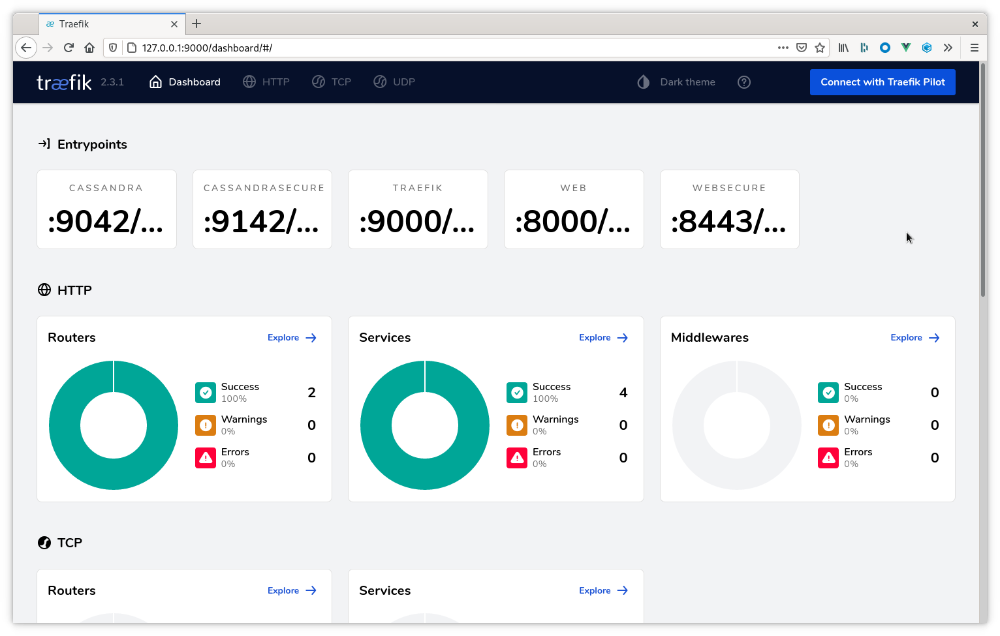



When configuring Kind to use Traefik, additional configuration options are required. The following guide walks through standing up a Kind k8s cluster with Traefik configured for ingress on ports other than the standard `80` and `443`.

## 1. Create a Kind configuration file
Kind supports an optional configuration file for configuring specific behaviors of the Docker container which runs the Kubelet process. Here we are adding port forwarding rules for the following ports:

* `8080` - HTTP traffic - This is used for accessing the metrics and repair user
  interfaces
* `8443` - HTTPS traffic - Useful when accessing the metrics and repair
  interfaces in a secure manner
* `9000` - Traefik dashboard - **WARNING** this should only be done in
  development environments. Higher level environments should use `kubectl
  port-forward`.
* `9042` - C* traffic - Insecure Cassandra traffic. _Note:_ Without TLS (more
  specifically SNI) Traefik may **not** be able to distinguish traffic across
  cluster boundaries. If you are in an environment where more than one cluster
  is deployed you **must** add additional ports here.
* `9142` - C* TLS traffic - Secure Cassandra traffic, multiple clusters may run
  behind this single port.
* `8080` - Stargate GraphQL API
* `8081` - Stargate Authorization REST API
* `8082` - Stargate CRUD REST API
  
### [`kind.config.yaml`](kind.config.yaml)

The `kind.config.yaml` file is [here](kind.config.yaml). 



## 2. Start Kind Cluster

```bash
$ kind create cluster --config ./kind.config.yaml
Creating cluster "kind" ...
 ✓ Ensuring node image (kindest/node:v1.18.2) 🖼
 ✓ Preparing nodes 📦  
 ✓ Writing configuration 📜 
 ✓ Starting control-plane 🕹️ 
 ✓ Installing CNI 🔌 
 ✓ Installing StorageClass 💾 
Set kubectl context to "kind-kind"
You can now use your cluster with:

kubectl cluster-info --context kind-kind

Have a question, bug, or feature request? Let us know! https://kind.sigs.k8s.io/#community 🙂
```

## 3. Create Traefik Helm values file

Note the service type of `NodePort`. It is used here as it is the port _on the
Docker container running Kind_ which is forwarded to our local machine.

### [`traefik.values.yaml`](traefik.values.yaml)

The `traefik.values.yaml` file is [here](traefik.values.yaml).



## 4. Install Traefik via Helm

```bash
$ helm repo add traefik https://helm.traefik.io/traefik
$ helm repo update
$ helm install traefik traefik/traefik -n traefik --create-namespace -f traefik.values.yaml
NAME: traefik
LAST DEPLOYED: Thu Apr 22 16:59:40 2020
NAMESPACE: traefik
STATUS: deployed
REVISION: 1
TEST SUITE: None
```

## 5. Access Traefik Dashboard

With the deployment complete we may now access the Traefik dashboard at [http://127.0.0.1:9000/dashboard/](http://127.0.0.1:9000/dashboard/). Example:



## Next steps

Feel free to explore other the [Traefik ingress]() topics. Also see the additional K8ssandra [tasks]().
