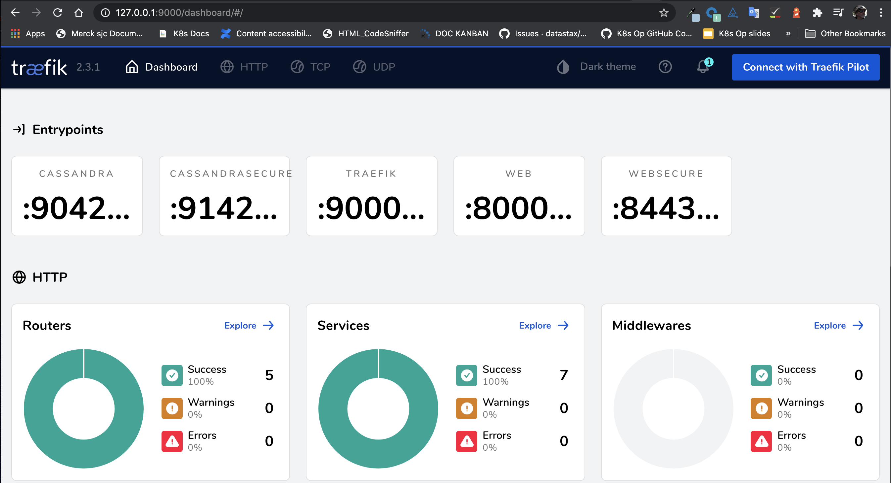
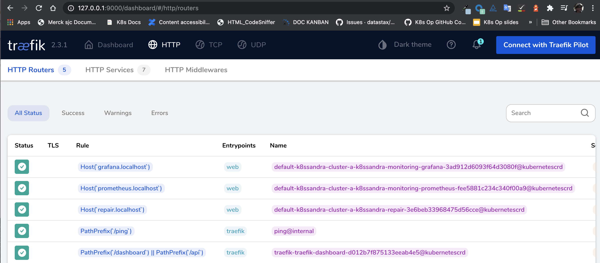
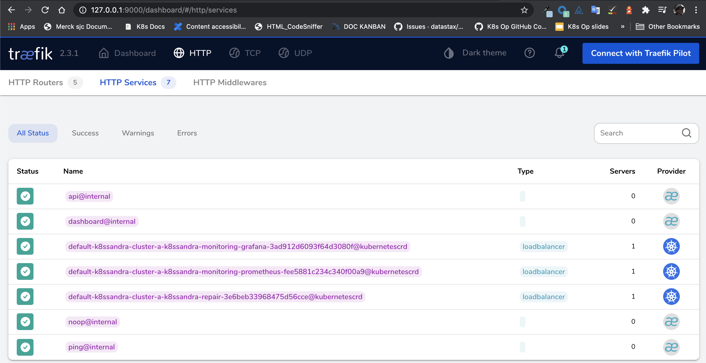



Follow these steps to configure and install `Traefik Ingress` custom resources for accessing your K8ssandra cluster's monitoring interface (provided by Grafana and Prometheus).

## Tools

* Helm

## Prerequisites

1. Kubernetes cluster with the following elements deployed:
   * [Traefik]()
   * [K8ssandra]()

   See [Configuring Kind]() for an example of how to set up a local installation.
1. DNS name for the Grafana service
1. DNS name for the Prometheus service

{}
If you do not have a DNS name available, consider using a service like [xip.io](http://xip.io) to generate a domain name based on the ingress IP address. For local Kind clusters this may look like `monitoring.127.0.0.1.xip.io` which would return the address `127.0.0.1` during DNS lookup.
{}

{}
As an alternative to configuring an Ingress, consider port forwarding. It's another way to provide external access to resources that have been deployed by K8ssandra in your Kubernetes environment. Those resources could include Prometheus metrics, pre-configured Grafana dashboards, and the Reaper web interface for repairs of Cassandra&reg; data. The `kubectl port-forward` command does not require an Ingress/Traefik to work. 
* Developers, see [Set up port forwarding]().  
* Site reliability engineers, see [Configure port forwarding]().
{}

## Helm Parameters

The `k8ssandra` Helm chart contains templates for the Traefik `IngressRoute` custom resource. These may be enabled at any time either through a `values.yaml` file or command-line flags.

For the latest, see the sample [values.yaml](https://github.com/k8ssandra/k8ssandra/blob/main/charts/k8ssandra/values.yaml). 

Note the `host` parameters in the values.yaml is where the DNS names must be provided.

## Enabling Traefik Ingress

Traefik ingress may be enabled on the command-line or via a `values.yaml` file. The K8ssandra team recommends storing this information in a `values.yaml` as that may be version controlled and managed in a DevOps friendly manner. Examples of both approaches are provided below as reference.

### `values.yaml`

**New install:**

```bash
helm install cluster-name k8ssandra/k8ssandra -f traefik.values.yaml
```

**Existing cluster:**

```bash
helm upgrade cluster-name k8ssandra/k8ssandra -f traefik.values.yaml
```

### Command-line

**New install:**

```bash
# New Install
helm install k8ssandra k8ssandra/k8ssandra --set prometheus.ingress.enabled=true,prometheus.ingress.host=localhost
helm install k8ssandra k8ssandra/k8ssandra --set grafana.ingress.enabled=true,grafana.ingress.host=localhost
```

**Existing cluster:**

```bash
helm upgrade k8ssandra k8ssandra/k8ssandra --set prometheus.ingress.enabled=true,prometheus.ingress.host=localhost
helm upgrade k8ssandra k8ssandra/k8ssandra --set grafana.ingress.enabled=true,grafana.ingress.host=localhost
```

## Validate Traefik Configuration

{}
This step is optional. The next step will also prove that the configuration is working.
{}

With the ingress routes configured and deployed to Kubernetes, we can access the Traefik dashboard to validate the configuration has been picked up and is detecting the appropriate services.

1. Open your web browser and point it at the Traefik dashboard. This may require
   `kubectl port-forward` or the steps in our [Configuring Kind]() guide.

    

1. Navigate to the HTTP Routers page

    

    There should be entries representing the hostname based rules created as
    part of the Helm command. Note the Kubernetes logo to the right of the table
    indicating it was provisioned via a Kubernetes custom resource.

1. Navigate to the HTTP Services page

    

    On this page, you'll find entries representing the Prometheus and Grafana services.
    Note the Kubernetes logo to the right of the table indicating that it was
    provisioned via a Kubernetes custom resource.

## Next steps

Feel free to explore the other [Traefik ingress]() topics. 

Also, learn how the steps to use the [monitoring]() features in Grafana, which is preconfigured to visualize the Cassandra and related metrics.
