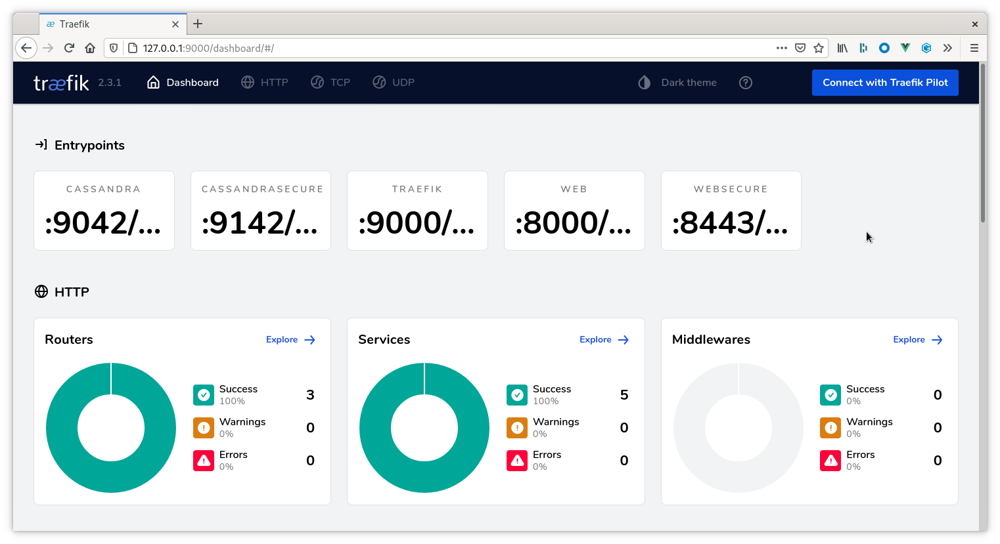
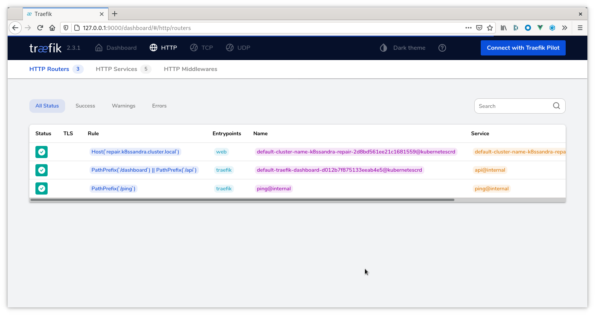

Follow these steps to configure and install `Traefik Ingress` custom resources for accessing your K8ssandra cluster's repair interface (provided by Reaper for Apache Cassandra®).

## Tools

* Helm

## Prerequisites

1. Kubernetes cluster with the following elements deployed:
   * [Traefik]()
   * [K8ssandra]()

   See the [Configuring Kind]() for an example of how to set up a local installation.

1. DNS name where the repair service should be listening.

    {}
If you do not have a DNS name available, consider using a service like [xip.io](http://xip.io) to generate a domain name based on the ingress IP address. For local Kind clusters this may look like `repair.127.0.0.1.xip.io` which would return the address `127.0.0.1` during DNS lookup.
    {}

{}
As an alternative to configuring an Ingress, consider port forwarding. It's another way to provide external access to resources that have been deployed by K8ssandra in your Kubernetes environment. Those resources could include Prometheus metrics, pre-configured Grafana dashboards, and the Reaper web interface for repairs of Cassandra&reg; data. The `kubectl port-forward` command does not require an Ingress/Traefik to work. 

* Developers, see [Set up port forwarding]().  
* Site reliability engineers, see [Configure port forwarding]().
{}


## Helm Parameters

The `k8ssandra` Helm chart contains templates for the Traefik `IngressRoute` and custom resource. This may be enabled at any time either through a `values.yaml` file or via command-line flags.

For the latest, see the sample [values.yaml](https://github.com/k8ssandra/k8ssandra/blob/main/charts/k8ssandra/values.yaml). 

Note the `host` parameter: this is where the DNS name must be provided. You will reference this DNS when accessing Reaper in a Web URL.

If you maintain a values.yaml or traefik.values.yaml file, change the `reaper.ingress.enabled` Boolean from `false` to `true`.  Or, specify `--set reaper.ingress.enabled=true` on the helm install command line. 

## Enabling Traefik Ingress

Traefik ingress may be enabled on the command-line or via a `values.yaml` file. The K8ssandra team recommends storing this information in a `values.yaml` as that may be version controlled and managed in a DevOps friendly manner. Examples of both approaches are provided below as reference.

### `values.yaml`

**New install:**

```bash
helm install cluster-name k8ssandra/k8ssandra -f traefik.values.yaml
```

**Existing Cluster:**

```bash
helm upgrade cluster-name k8ssandra/k8ssandra -f traefik.values.yaml
```

### Command-line

**New install:**

```bash
helm install cluster-name k8ssandra/k8ssandra --set reaper.ingress.enabled=true,reaper.ingress.host=localhost
```

**Existing cluster:**

```bash
helm install cluster-name k8ssandra/k8ssandra --set reaper.ingress.enabled=true,reaper.ingress.host=localhost
```

## Validate Traefik Configuration

{}
This step is optional. The next step will also prove the configuration is working.
{}

With the ingress routes configured and deployed to Kubernetes we can access the Traefik dashboard to validate the configuration has been picked up and is detecting the appropriate services:

1. Open your web browser and point it at the Traefik dashboard. This may require
   `kubectl port-forward` or the steps in our [Configuring Kind]() guide.

    

1. Navigate to the HTTP Routers page

    

    There should be an entry representing the hostname based rule created as
    part of the Helm command. Note the Kubernetes logo to the right of the table
    indicating it was provisioned via a Kubernetes custom resource.

1. Navigate to the HTTP Services page 

    There should be an entry representing the Reaper service. Note the
    Kubernetes logo to the right of the table indicating it was provisioned via
    a Kubernetes custom resource.

## Next steps

Feel free to explore the other [Traefik ingress]() topics. Also see [Monitor Cassandra]().
