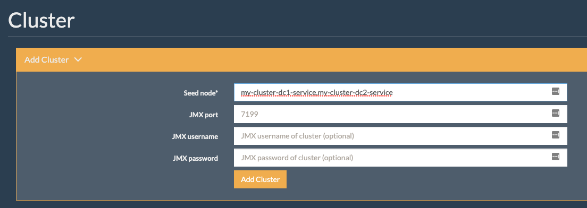

## Migrating an existing Apache Cassandra&copy; or K8ssandra v1 cluster to K8ssandra-operator

There’s a lot of overlap between both Cassandra, K8ssandra v1.x and K8ssandra-operator, but there are also some incompatibilities which currently prevent you from performing an in-place upgrade.

We’ll use a datacenter (DC) switch, instead, creating a new DC with K8ssandra-operator that will expand the cluster, then we’ll decommission the old DC. The whole procedure can be achieved without any downtime.

For the rest of this document, we'll refer to the pre-existing datacenter as `dc1` and the newly created one running on K8ssandra-operator as `dc2`. 

## Pre-requisites

Pod IP addresses must be routable between all Kubernetes clusters involved in the migration, as well as Cassandra nodes when migrating from a non Kubernetes setup.

## Install K8ssandra-operator

First, install cert-manager, which will be used by cass-operator:

```bash
kubectl apply -f https://github.com/jetstack/cert-manager/releases/download/v1.7.1/cert-manager.yaml
```

Using [kustomize.io](https://kustomize.io) or [helm](https://github.com/helm/helm), install k8ssandra-operator and cass-operator in a dedicated namespace (we’ll use k8ssandra-operator here):

### Using Helm

```
helm repo add k8ssandra https://helm.k8ssandra.io/stable
helm repo update
helm install k8ssandra-operator k8ssandra/k8ssandra-operator -n k8ssandra-operator --create-namespace
```

### Using Kustomize

```
kustomize build github.com/k8ssandra/k8ssandra-operator/config/deployments/control-plane\?ref\=v1.1.1 | kubectl apply --server-side --force-conflicts -f -
```

**Note: Modify the version in the URL above to match your target version.**

## Copy secrets from K8ssandra 1.x

Secrets can only be referenced in pods if they exist in the same namespace. Therefore when migrating from K8ssandra 1.x, the secrets that were created in the original k8ssandra namespace need to be copied over to the k8ssandra-operator namespace.

That includes the following secrets:

- Superuser
- Reaper (CQL)
- Reaper JMX
- Medusa
- Medusa bucket key
- Stargate

There is no automation to copy secrets in kubernetes, so they need to be fully recreated either manually or through CD automation.

When migrating from Cassandra, check the [security]() section of our documentation to read about the expected secrets and create them accordingly.

## Alter your keyspaces replication strategy

Before spinning up the new datacenter, make sure all user created keyspaces are using `NetworkTopologyStrategy` (NTS). If not, alter them to use NTS and set the same number of replicas as currently on the existing DC:

```
ALTER KEYSPACE <my-keyspace> WITH replication = {'class': 'NetworkTopologyStrategy', 'dc1':3};
```

Alter the following keyspaces in the same way:

- `system_auth`
- `system_distributed`
- `system_traces`
- `data_endpoint_auth` (Stargate)
- `reaper_db` (Reaper)


## Restrict traffic to dc1

Client traffic should be restricted to `dc1` by selecting it as local datacenter and using only `LOCAL_` consistency levels. This will ensure consistency during the expansion to a new datacenter.

## Create a K8ssandraCluster resource
The cluster is now ready for the expansion to a new datacenter created by k8ssandra-operator.

We’ll need to create a `K8ssandraCluster` (k8c) object with the right settings and secret references. Here’s an example `k8c` object with Reaper, Medusa and Stargate enabled:

```
apiVersion: k8ssandra.io/v1alpha1
kind: K8ssandraCluster
metadata:
  name: my-cluster
spec:
  cassandra:
    serverVersion: "4.0.1"
    resources:
      requests:
        memory: 16Gi
    additionalSeeds:
      - "10.x.x.1"
      - "10.x.x.2"
    datacenters:
      - metadata:
          name: dc2
        size: 3
        storageConfig:
          cassandraDataVolumeClaimSpec:
            storageClassName: standard
            accessModes:
              - ReadWriteOnce
            resources:
              requests:
                storage: 4096Gi
        config:
          jvmOptions:
            heapSize: 8Gi
            heapNewGenSize: 3Gi
    mgmtAPIHeap: 64Mi
    superuserSecretRef:
      name: superuser-secret
  externalDatacenters:
    - "dc1"
  reaper:
    autoScheduling:
      enabled: true
    cassandraUserSecretRef:
      name: reaper-secret
    jmxUserSecretRef:
      name: reaper-jmx-secret
    uiUserSecretRef:
      name: reaper-ui-secret
  medusa:
    storageProperties:
      storageProvider: google_storage
      bucketName: cluster-backups
      storageSecretRef: medusa-bucket-key
      prefix: my-cluster
      maxBackupCount: 10
    cassandraUserSecretRef:
      name: medusa-secret
  stargate:
    size: 1
    heapSize: 4Gi
```

`metadata.name` needs to match the existing Cassandra cluster name so that the datacenters can connect together.

The `additionalSeeds` section requires the IPs of a couple Cassandra nodes (or pods) from the existing datacenter. Those IPs must be reachable on port 7001, which is Cassandra’s storage port used by nodes to communicate with each other.

K8ssandra-operator automatically manages the replication strategy for several keyspaces, such as `system_auth`, `data_endpoint_auth` or `reaper_db`, based on the list of datacenters in a k8c object. It allows safe automation for operations such as expansions to new datacenters. A migration involves one or more datacenters which are not referenced in the k8c object, requiring the addition of extra datacenters in the replication settings. This is what the `externalDatacenters` entry stands for, allowing us to keep replicas on the datacenters we are migrating from.

Create the object in the same namespace as the operator:

```
kubectl apply -f k8ssandra-cluster.yaml -n k8ssandra-operator
```

The K8ssandraCluster objects can be listed using the long CRD name, K8ssandraCluster, but also their short name, k8c:

```
$ kubectl get k8c -n k8ssandra-operator
NAME         AGE
my-cluster   1m
```

Wait for the operator to proceed and create the requested resources.

Check the `server-system-logger` containers logs of the -sts pods to follow the bootstrapping process and see if they successfully join the cluster.

Connect to a pod’s Cassandra container and run the following command to check the topology, which at the end should show two distinct datacenters (`dc1` and `dc2` in our case):

```
$ nodetool -u <superuser name> -pw <superuser password> status
Datacenter: dc1
===============
Status=Up/Down
|/ State=Normal/Leaving/Joining/Moving
--  Address     Load      Tokens  Owns (effective)  Host ID                               Rack   
UN  10.xx.xx.57  7.58 MiB  16      100.0%            9299e226-d2fa-4c2e-9fba-3b344d5d47b7  default
UN  10.xx.xx.7   7.54 MiB  16      100.0%            51c2fb0e-7fad-4b6e-8e4d-2108dc204cd5  default
UN  10.xx.xx.4   7.89 MiB  16      100.0%            6a92531f-a086-4c40-9067-50899b8974a0  default

Datacenter: dc2
===============
Status=Up/Down
|/ State=Normal/Leaving/Joining/Moving
--  Address     Load      Tokens  Owns (effective)  Host ID                               Rack   
UN  10.xx.xx.36  6.97 MiB  16      100.0%            eba0964a-835f-4c76-978e-f25eda0b49ad  default
UN  10.xx.xx.20  6.81 MiB  16      100.0%            d15f93f4-248d-478f-8832-b87b4e3981d2  default
UN  10.xx.xx.80  6.71 MiB  16      100.0%            db09fd06-e011-11ec-9d64-0242ac120002  default
```

## Alter the keyspaces and rebuild the nodes

k8ssandra-operator will fail fully going through with the expansion because `dc2` won’t have any replica for the `system_auth` keyspace. Cassandra will start but Reaper and Stargate won’t as long as replication wasn’t altered and rebuild was done.

Once all nodes in the new DC have joined the cluster, alter the user created keyspaces to NTS with the same number of replicas on both DCs:

```
ALTER KEYSPACE <keyspace-name> WITH replication = {'class': 'NetworkTopologyStrategy', 'dc1':3, 'dc2': 3};
```

Run the above statement for the following keyspaces as well:

- system_auth
- system_distributed
- system_traces
- data_endpoint_auth (Stargate)
- reaper_db (Reaper)

Run the rebuild command in all the Cassandra pods (from the Cassandra container) in the new datacenter:

```
nodetool -u <superuser-name> -pw <superuser-password> rebuild dc1
```

Replace the `<...>` placeholders with the appropriate values in the above command.

## Add dc2’s cassandra service to Reaper
Reaper already has the cluster registered with `dc1`’s Cassandra pods service as seed host.

The operator will not, in its current form, add `dc2`’s service to the seed hosts. This makes it impossible for Reaper in `dc2` to discover the cluster (see this [ticket](https://github.com/k8ssandra/k8ssandra-operator/issues/403) for more information).

Connect to Reaper’s UI in `dc1`, and re-register the cluster, specifying both datacenters Cassandra services as seed nodes:



Change the values to match your deployment settings, knowing that the Cassandra service is named as follows by K8ssandra: `<cluster name>-<dc name>-service`.

## Restrict traffic to dc2
Client traffic should be restricted to dc2 by selecting it as local datacenter and using only `LOCAL_` consistency levels (or `QUORUM`). This will prevent nodes from connecting to `dc1` as we decommission it.

## Decommission dc1
Update the K8ssandraCluster object definition by removing the externalDatacenters and additionalSeeds sections. Only after that, alter all keyspaces to remove replicas from dc1 (if you do it before, the operator will re-alter some keyspaces replication):

```
ALTER KEYSPACE <my-keyspace> WITH replication = {'class': 'NetworkTopologyStrategy', 'dc2': 3};
```

Stop all nodes from `dc1` by deleting its helm release (in the case of a K8ssandra 1.x cluster) or stopping all Cassandra processes (in the case of a non-k8s Cassandra cluster).

Connect to one of the Cassandra pods from `dc2`, in the Cassandra container, and remove nodes from `dc1` one by one using their host id which shows up in the `nodetool status` output.

In our example, we will run the following commands:

```
$ nodetool -u <superuser-name> -pw <superuser-password> removenode 9299e226-d2fa-4c2e-9fba-3b344d5d47b7

$ nodetool -u <superuser-name> -pw <superuser-password> removenode 51c2fb0e-7fad-4b6e-8e4d-2108dc204cd5

$ nodetool -u <superuser-name> -pw <superuser-password> removenode 6a92531f-a086-4c40-9067-50899b8974a0
```

The `nodetool status` output should then be:

```
$ nodetool -u <superuser name> -pw <superuser password> status
Datacenter: dc2
===============
Status=Up/Down
|/ State=Normal/Leaving/Joining/Moving
--  Address     Load      Tokens  Owns (effective)  Host ID                               Rack   
UN  10.xx.xx.36  6.97 MiB  16      100.0%            eba0964a-835f-4c76-978e-f25eda0b49ad  default
UN  10.xx.xx.20  6.81 MiB  16      100.0%            d15f93f4-248d-478f-8832-b87b4e3981d2  default
UN  10.xx.xx.80  6.71 MiB  16      100.0%            6bca9cdf-03f8-4658-84b9-28c5395235ba  default
```

## Remove dc1’s cassandra service from Reaper
Connect to Reaper’s UI in `dc2`, and re-register the cluster, specifying only dc2's Cassandra service as seed node.

## Next steps

* Explore other K8ssandra Operator [tasks]().
* See the [Reference]() topics for information about K8ssandra Operator Custom Resource Definitions (CRDs) and the single K8ssandra Operator Helm chart. 
