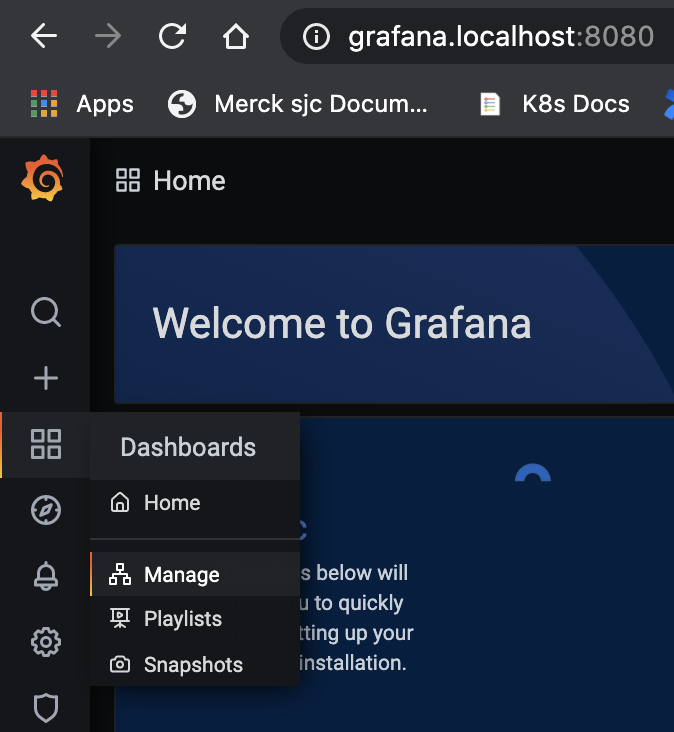
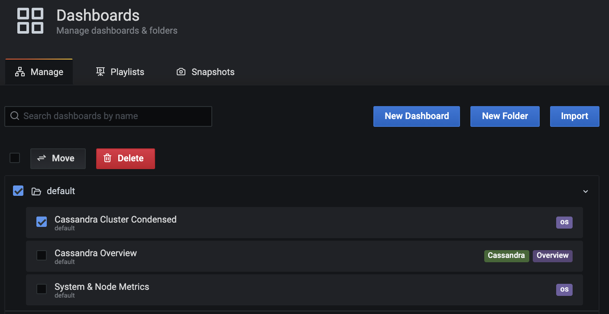
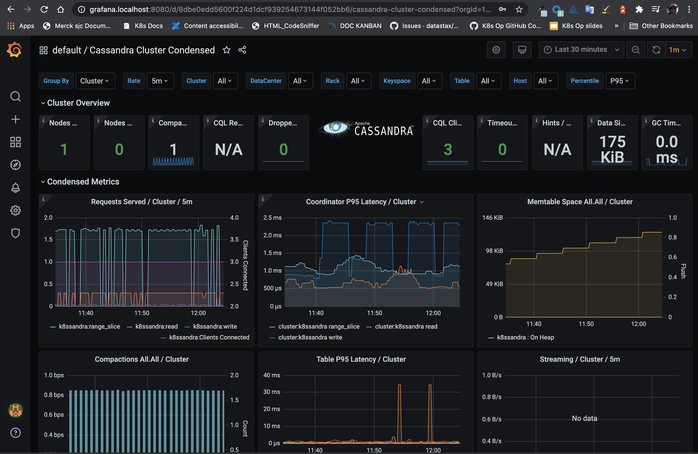
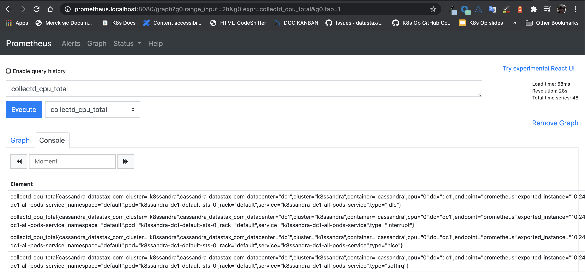

When you used Helm to install a `k8ssandra` instance in Kubernetes, one of the key features provided was a set of preconfigured Grafana dashboards. They visualize data collected about your environment by the Prometheus Operator, which is also packaged with K8ssandra. Use the Grafana dashboards to monitor your K8ssandra cluster's health and traffic metrics.  

After you've met the prerequisites identified below, access the preconfigured Grafana dashboards. For example:

[http://grafana.localhost:8080/](http://grafana.localhost:8080/)

## Tools

* Web browser

## Prerequisites

1. Kubernetes cluster with the following elements deployed:
   * [K8ssandra]()
   * [Ingress Controller]()
1. DNS name for the Grafana service 
1. DNS name for the Prometheus service

{}
As an alternative to configuring an Ingress, consider port forwarding. It's another way to provide external access to resources that have been deployed by K8ssandra in your Kubernetes environment. Those resources could include Prometheus metrics, pre-configured Grafana dashboards, and the Reaper web interface for repairs of Cassandra&reg; data. The `kubectl port-forward` command does not require an Ingress/Traefik to work. 

* Developers, see [Set up port forwarding]().  
* Site reliability engineers, see [Configure port forwarding](). 
{}

## Access Grafana Interface

If you haven't already, upgrade an existing `k8ssandra` by enabling the Traefik Ingress and passing in Prometheus and Grafana host flags. 
Command-line examples when the host is local, and `k8ssandra` is the cluster-name:

```bash
helm upgrade k8ssandra k8ssandra/k8ssandra --set prometheus.ingress.enabled=true,prometheus.ingress.host=localhost
helm upgrade k8ssandra k8ssandra/k8ssandra --set grafana.ingress.enabled=true,grafana.ingress.host=localhost
```

To check the installed or upgraded pods' ready status, without having to submit multiple `kubectl get pods` commands, use `kubectl rollout status`. The command waits up to ten minutes (timeout is configurable) and gives a line of output as one or more pods in the set become ready. The format to check a statefulset (sts) is: 

`kubectl rollout status statefulset ${CLUSTERNAME}-${DATACENTER}-default-sts`

An example where the `CLUSTERNAME` from the prior `helm install` or `helm upgrade` was `k8ssandra`:

```bash
kubectl rollout status statefulset k8ssandra-dc1-default-sts
```

**Output:**

```bash
Waiting for 1 pods to be ready...
Waiting for 1 pods to be ready...
partitioned roll out complete: 1 new pods have been updated...
```

If you submit the command above too quickly after the `helm install` or `helm upgrade` you may get an error that no statefulset with that name exists; in which case, you can run the `kubectl rollout status` command again.  

You should also check the `stargate` pod status before proceeding. Example:

```bash
kubectl rollout status deployment k8ssandra-dc1-stargate
```

**Output:**

```bash
Waiting for 1 pods to be ready...
Waiting for 1 pods to be ready...
Waiting for 1 pods to be ready...
partitioned roll out complete: 1 new pods have been updated...
```

Then check the overall status of the deployed pods.

```bash
kubectl get pods
```

**Output**:

```bash
NAME                                                READY   STATUS      RESTARTS   AGE
k8ssandra-cass-operator-766849b497-klgwf            1/1     Running     0          7m33s
k8ssandra-dc1-default-sts-0                         2/2     Running     0          7m5s
k8ssandra-dc1-stargate-5c46975f66-pxl84             1/1     Running     0          7m32s
k8ssandra-grafana-679b4bbd74-wj769                  2/2     Running     0          7m32s
k8ssandra-kube-prometheus-operator-85695ffb-ft8f8   1/1     Running     0          7m32s
k8ssandra-reaper-655fc7dfc6-n9svw                   1/1     Running     0          4m52s
k8ssandra-reaper-operator-79fd5b4655-748rv          1/1     Running     0          7m33s
k8ssandra-reaper-schema-dxvmm                       0/1     Completed   0          5m3s
prometheus-k8ssandra-kube-prometheus-prometheus-0   2/2     Running     1          7m27s
```

Notice that Grafana is running, as well as other services such as Prometheus.

If you are in a local Kubernetes environment, you can now access the Grafana dashboard with a URL such as:

<http://grafana.localhost:8080>

### Grafana credentials

The default configured credentials for Grafana are:

```yaml
grafana:
  adminUser: admin
  adminPassword: secret
```

Refer to: <https://github.com/k8ssandra/k8ssandra/blob/main/charts/k8ssandra/values.yaml>

You can change the credentials in several ways:

* In the Grafana admin UI. See: <http://grafana.localhost:8080/profile/password>

* Or edit a **copy** of [values.yaml](https://github.com/k8ssandra/k8ssandra/blob/main/charts/k8ssandra/values.yaml); update the credentials; submit a `helm upgrade` command to the cluster. Example: 

    ```bash
    helm upgrade cluster-name k8ssandra/k8ssandra -f my-values.yaml`
    ```

* Or pass in a `--set grafana.adminPassword` flag. Example:

    ```bash
    `helm upgrade cluster-name k8ssandra/k8ssandra --set  grafana.adminPassword=NewpAssw0rd!`
    ```

### Navigating in Grafana

From the Grafana start page, <http://grafana.localhost:8080> in local installs, click the Dashboards icon shown below and select the **Manage** pane:



Grafana loads its dashboard options:

1. Enable the **Default** checkbox.
1. Click the checkbox for one of the dashboards that K8ssandra created when you installed the `k8ssandra` instance
1. To open the selected dashboard, click on its text link. In this example, you'd click on `Cassandra Cluster Condensed`:



Here's an example of the `Cassandra Cluster Condensed` dashboard in Grafana:



### What can I do in Grafana?

* Cluster health
* Traffic metrics

## Access Prometheus Interface



Prometheus is available at the following address if running locally:

<http://prometheus.localhost:8080>

### What can I do in Prometheus?

* Validate servers being scraped
* Confirm metrics collection

## Next steps

Explore other K8ssandra [tasks]().

See the [Reference]() topics for information about K8ssandra Helm charts, and a glossary.

