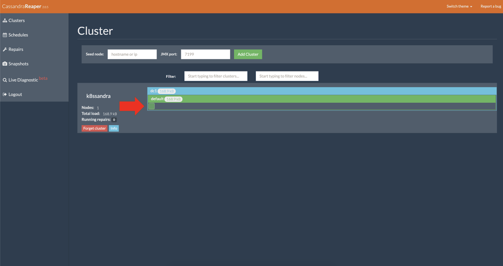
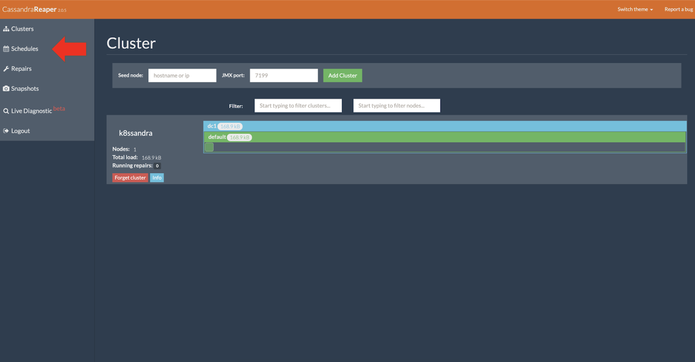
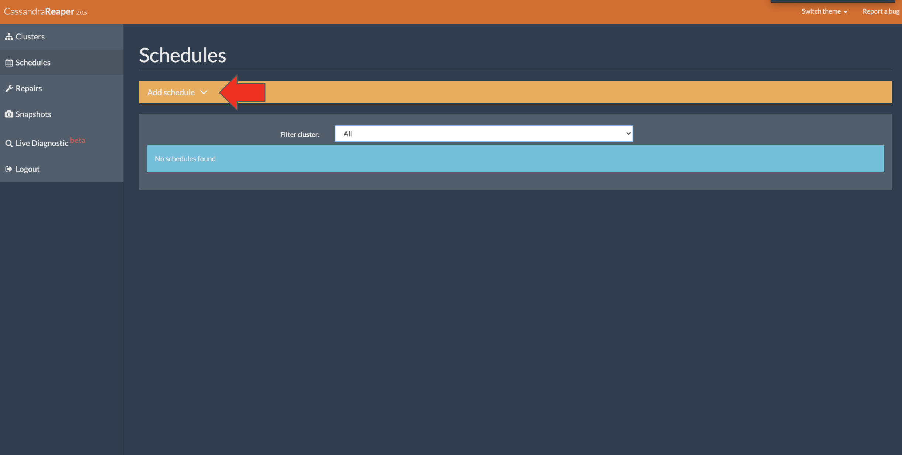
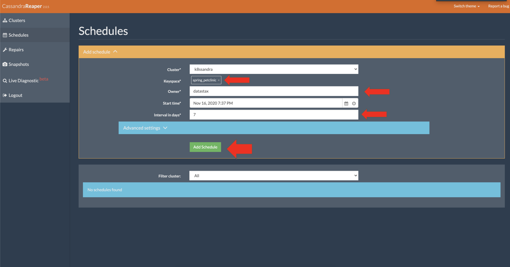

Repairs are a critical anti-entropy operation in Cassandra. In the past, there have been many custom solutions to manage them outside of your main Cassandra installation. K8ssandra provides the Reaper web interface that eliminates the need for a custom solution. Just like K8ssandra makes Cassandra setup easy, Reaper makes configuration of repairs even easier.

{}
The requirement for your environment may vary considerably, however the general recommendation is to run a repair operation on your Cassandra clusters about once a week.
{}

## Tools

* Web Browser
* `values.yaml` configuration, or use `--set` flags on the command line

## Prerequisites

1. Kubernetes cluster with the following elements deployed:
   * [K8ssandra]() Helm chart
   * [Ingress Controller]()
2. DNS name configured for the Reaper web interface

{}
As an alternative to configuring an Ingress, consider port forwarding. It's another way to provide external access to resources that have been deployed by K8ssandra in your Kubernetes environment. Those resources could include Prometheus metrics, pre-configured Grafana dashboards, and the Reaper web interface for repairs of Cassandra data. The `kubectl port-forward` command does not require an Ingress/Traefik to work. 

* Developers, see [Set up port forwarding]().  
* Site reliability engineers, see [Configure port forwarding]().
{}

## Access the Reaper web interface


With the prerequisites satisfied the Reaper web interface should be available at the following address:

http://REAPER_DOMAIN/webui

For example, to upgrade a previously installed `k8ssandra` that's running locally, where the `releaseName` used on the prior `helm install` command was `k8ssandra`:

```bash
helm upgrade k8ssandra k8ssandra/k8ssandra --set reaper.ingress.enabled=true,reaper.ingress.host=localhost
```

{}
Notice how in the `helm upgrade` example above, with Ingress/Traefik access, the DNS hostname is specified on the command line as `localhost`. If you are not running locally, specify a hostname other than `localhost`. 
{}

After about five or more minutes, check that the pods are running. Example:

```bash
kubectl get pods
```

**Output:**

```bash
NAME                                                READY   STATUS      RESTARTS   AGE
k8ssandra-cass-operator-766849b497-klgwf            1/1     Running     0          7m33s
k8ssandra-dc1-default-sts-0                         2/2     Running     0          7m5s
k8ssandra-dc1-stargate-5c46975f66-pxl84             1/1     Running     0          7m32s
k8ssandra-grafana-679b4bbd74-wj769                  2/2     Running     0          7m32s
k8ssandra-kube-prometheus-operator-85695ffb-ft8f8   1/1     Running     0          7m32s
k8ssandra-reaper-655fc7dfc6-n9svw                   1/1     Running     0          4m52s
k8ssandra-reaper-operator-79fd5b4655-748rv          1/1     Running     0          7m33s
prometheus-k8ssandra-kube-prometheus-prometheus-0   2/2     Running     1          7m27s
```

## What can I do in Reaper?

To access Reaper, navigate to [http://localhost:8080/webui/](http://localhost:8080/webui/). 

{}
Again, if you are not running locally, use the hostname value in the URL that you specified on the `--set reaper.ingress.host` flag above.
{}

### Check the cluster’s health

In the Reaper UI, notice how the nodes are displayed inside the datacenter for the cluster.



The color of the nodes indicates the overall load the nodes are experiencing at the current moment.

See [Check a cluster's health](http://cassandra-reaper.io/docs/usage/health/).

### Schedule a cluster repair

On the UI's left sidebar, notice the **Schedule** option.



Click **Schedules**



Click **Add schedule** and fill out the details when you are done click the final _add schedule_ to apply the new repair job.  A Cassandra best practice is to have one repair complete per week to prevent zombie data from coming back after a deletion.



Enter values for the keyspace, tables, owner, and other fields. Then click **Add Schedule**. The details for adding a schedule are similar to the details for the Repair form, except the “Clause” field is replaced with two fields:

* “Start time”
* “Interval in days”

After creating a scheduled repair, the page is updated with a list of Active and Paused repair schedules.

{}
When choosing to add a new repair schedule, we recommended that you limit the repair schedules to specific tables, instead of scheduling repairs for an entire keyspace. Creating different repair schedules will allow for simpler scheduling, fine-grain tuning for more valuable data, and easily grouping tables with smaller data load into different repair cycles. For example, if there are certain tables that contain valuable data or a business requirement for high consistency and high availability, they could be scheduled for repairs during low-traffic periods.
{}

For additional information, see [Schedule a cluster repair](http://cassandra-reaper.io/docs/usage/schedule/) on the Reaper site.

{}
Users with access to the Reaper web interface can pause or delete scheduled repairs. To add authentication security in the UI, see [Reaper authentication](http://cassandra-reaper.io/docs/configuration/authentication/).
{}

### Autoschedule repairs

When you enable the autoschedule feature, Reaper dynamically schedules repairs for all non-system keyspaces in a cluster. A cluster's keyspaces are monitored and any modifications (additions or removals) are detected. When a new keyspace is created, a new repair schedule is created automatically for that keyspace. Conversely, when a keyspace is removed, the corresponding repair schedule is deleted.

To enable autoschedule in Reaper, set the property `repair.reaper.autoschedule` to `true`. 

### Run a cluster repair

On the repair job you just configured, click **Run now**.


Notice the repair job kicking off.

## Recommended reading

* [Running a cluster repair](http://cassandra-reaper.io/docs/usage/single/)
* [Reaper details](http://cassandra-reaper.io/)
* [Blog articles](https://thelastpickle.com/blog/)

## Next steps

Explore other K8ssandra [tasks]().

See the [Reaper Operator Helm Chart]() reference.
