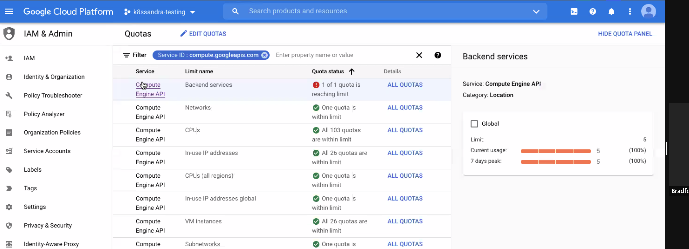
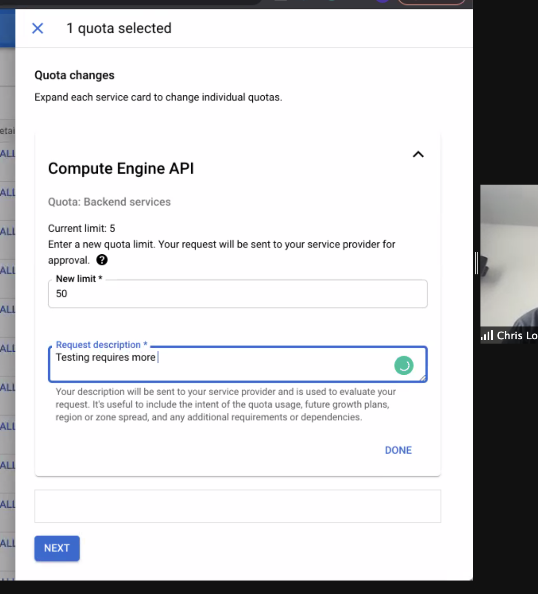
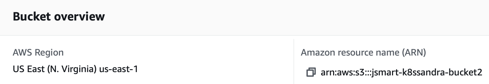
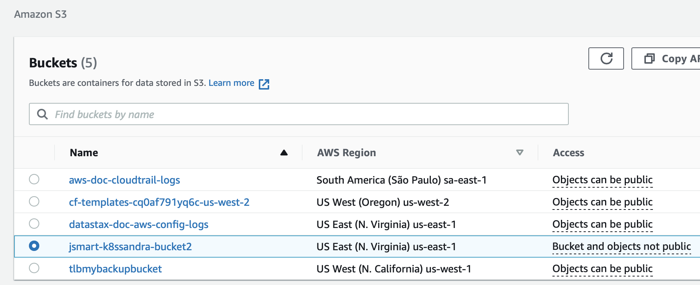

The best place to start when troubleshooting a K8ssandra cluster deployment is its status. The status of a K8ssandra
cluster reports useful information about each of its components (CassandraDatacenter, Stargate, Reaper, etc.)

## Inspecting the cluster status

The cluster status can be obtained with the following command (executed in the appropriate namespace):

    kubectl describe k8c <cluster_name>

### Overall status

A `K8ssandraCluster` status has the following overall structure:

```
Status:
  Conditions: ...         # conditions applying to the whole cluster – see below
  Decommission Progress:  # decommission progress, if a datacenter is being decommissioned – see below 
  Datacenters:            # status of each managed datacenter in this cluster, keyed by name
    <datacenter_name>:
      Cassandra: ...      # status of the datacenter itself (always present)
      Reaper: ...         # status of Reaper, if deployed in this datacenter, absent otherwise
      Stargate: ...       # status of Stargate, if deployed in this datacenter, absent otherwise
```

The `Datacenters` entry is a map keyed by datacenter name. Each datacenter reports its own status per component:
currently Cassandra, Reaper and Stargate statuses are included.

### CassandraDatacenter status

The `Cassandra` entry of a datacenter status section is provided by cass-operator. The contents of this entry correspond
to the status of the `CassandraDatacenter` resource, and provide useful information about the Cassandra cluster and its
nodes.

When the datacenter is ready, the status of this entry looks like below:

```
# Status.Datacenters.<datacenter_name>:
  Cassandra:
    Cassandra Operator Progress:  Ready
    Conditions: ...
    Node Statuses:
      <pod_name>:
      <pod_name>:
      ...
    Observed Generation:  1
    Quiet Period:         2022-02-28T17:14:16Z
    Super User Upserted:  2022-02-28T17:14:11Z
    Users Upserted:       2022-02-28T17:14:11Z
```

Check cass-operator documentation for more information about the `CassandraDatacenter` resource status, and 
especially about all the conditions available, and their meanings.

### Reaper status

The `Reaper` entry of a datacenter status is provided by k8ssandra-operator. The contents of this entry correspond to
the status of the `Reaper` resource.

When Reaper is being deployed, this entry usually looks like below:

```
# Status.Datacenters.<datacenter_name>:
  Reaper:
    Conditions:
      Last Transition Time:  2022-02-28T17:20:04Z
      Status:                False
      Type:                  Ready
    Progress:                Configuring
```

Currently, Reaper only supports the `Ready` condition; it is set to true when Reaper is ready.

The `Progress` field can have the following values: 

* `Pending`: when the controller is waiting for the `CassandraDatacenter` to become ready.
* `Deploying`: when controller is waiting for the Reaper deployment and its associated service to become ready.
* `Configuring`: when the Reaper instance is ready for work and is being connected to its target datacenter.
* `Running`: when Reaper is up and running.

When Reaper is ready, the status of this entry looks like below:

```
# Status.Datacenters.<datacenter_name>:
  Reaper:
    Conditions:
      Last Transition Time:  2022-02-28T17:22:35Z
      Status:                True
      Type:                  Ready
    Progress:                Running    
```

When Reaper is fully deployed, the `Ready` condition must be true, and the `Progress` field must be set to `Running`.

### Stargate status

The `Stargate` entry of a datacenter status is provided by k8ssandra-operator. The contents of this entry correspond to
the status of the `Stargate` resource.

When Stargate is being deployed, this entry usually looks like below:

```
# Status.Datacenters.<datacenter_name>:
  Stargate:
    Available Replicas:  0
    Conditions:
      Last Transition Time:  2022-02-28T17:22:42Z
      Status:                False
      Type:                  Ready
    Deployment Refs:
      <stargate_deployment_ref>
      <stargate_deployment_ref>
      ...
    Progress:              Deploying
    Ready Replicas:        0
    Ready Replicas Ratio:  0/3
    Replicas:              3
    Updated Replicas:      3
```

Currently, Stargate only supports the `Ready` condition; it is set to true when Stargate is ready.

The `Progress` field can have the following values:

* `Pending`: when the controller is waiting for the datacenter to become ready.
* `Deploying`: when the controller is waiting for the Stargate deployment and its associated service to become ready.
* `Running`: when Stargate is up and running.

When Stargate is ready, the status of this entry looks like below:

```
# Status.Datacenters.<datacenter_name>:
  Stargate:
    Available Replicas:  3
    Conditions:
      Last Transition Time:  2022-02-28T17:20:01Z
      Status:                True
      Type:                  Ready
    Deployment Refs:
      <stargate_deployment_ref>
      <stargate_deployment_ref>
      ...
    Progress:              Running
    Ready Replicas:        3
    Ready Replicas Ratio:  3/3
    Replicas:              3
    Service Ref:           <service_ref>
    Updated Replicas:      3
```

When Stargate is fully deployed, the `Ready` condition must be true, and the `Progress` field must be set to `Running`.

### Available `K8ssandraCluster` conditions

Currently, the only condition supported at K8ssandraCluster level is `CassandraInitialized`: it is set to true when the
Cassandra cluster (that is, the Cassandra nodes without taking into account other components, such as Stargate or
Reaper) becomes ready for the first time. During the lifetime of that Cassandra cluster, datacenters may have their
readiness condition change back and forth. Once set, this condition however does not change. This condition is mainly
intended for internal use.

### Decommission Progress

The field `Decommission Progress` is only set when there is an ongoing datacenter decommission. When non-empty, it can
have the following values:

* `UpdatingReplication`: in this phase, keyspace replications are being updated to reflect the datacenter decommission.
* `Decommissioning`: this phase is carried out by cass-operator and corresponds to the actual datacenter decommission.

## Check quotas

In some cases, pods can become "unhealthy" and the root cause may be an insufficient quota. You can check quotas in the cloud provider's UI. For example, in the Google Cloud Platform (GCP) console, check for any unhealthy pods in your GKE project. Then in the IAM &amp; Admin section of the GCP console, navigate to Quotas. Look for any reported issues with backend services:



From the GCP &gt; IAM &amp; Admin &gt; Quotas display:

1. Select the row for the service name that is reporting a quota issue
2. Click **All Quotas** from the Details column
3. Check the box for the affected quota, and click **Edit Quota**. 
4. The dialog indicates: "Enter a new quota limit. Your request will be sent to your service provider for approval." Examine the displayed current value and set a new value. 
5. Enter a brief request description and click **Next**.
6. Verify your contact information, and click **Submit Request**.

Notice how in the following example the Backend services quota is set to '5', and we're changing it to '50'. For the K8ssandra deployments (Stargate, cass-operator, Reaper, Medusa, and so on), actually `10` might be a sufficient quota.




## Bucket region or name for backups is misconfigured

Among the operators installed by K8ssandra is Medusa, which provides backup and restore for Cassandra data.

If the storage object's name or region used by an Amazon S3 bucket does not match the values expected by Medusa, an error is written to the Medusa section of the logs.  Example:

```bash
kubectl logs demo-dc1-default-sts-0 -c medusa
.
.
.
File "/usr/local/lib/python3.6/dist-packages/libcloud/storage/drivers/s3.py", line 143, in parse_error driver=S3StorageDriver)
libcloud.common.types.LibcloudError: <LibcloudError in <class 'libcloud.storage.drivers.s3.S3StorageDriver'> 
'This bucket is located in a different region. Please use the correct driver. Bucket region "us-east-2", used region "us-east-1".'>
As a result of the region mismatch, the Medusa container within the <cluster-name>-dc1-default-sts-0 pod fails to start. While other pods launched by the K8ssandra install may start successfully, the <cluster-name>-dc1-default-sts-0 pod will not due to the Medusa error.
```

Separately in Amazon AWS, confirm that you know the correct region and name to use for your bucket. Example:



Declare the appropriate name and region in a values YAML. For example, create a file named `my-backup-restore-values.yaml`. Notice below the `storage_properties` setting for the region `us-east-1`, which matches the region configured and shown in the Amazon S3 user interface:

```yaml
size: 3
backupRestore: 
  medusa:
    enabled: true
    bucketName: jsmart-k8ssandra-bucket2
    bucketSecret: medusa-bucket-key
    storage: s3
    storage_properties:
      region: us-east-1
```

Also make sure the bucketName matches: `jsmart-k8ssandra-bucket2`, in this example.

For example, relreferring again to the S3 UI, confirm the bucket name:



Then for a new or existing K8ssandra installation, reference the values file. 

New install:

```bash
helm install demo k8ssandra/k8ssandra -f my-backup-restore-values.yaml
```

Upgrade:

```bash
helm upgrade demo k8ssandra/k8ssandra -f my-backup-restore-values.yaml
```

{}
If you're using Google Cloud Storage for your backups, you do not need to include the region setting in a values YAML. 
{}


## Incorrect credentials are configured for backups

If the Medusa log reports an authentication error, check that you provided the correct credentials. For example, with Amazon S3 buckets, check the credentials in the configured `aws_access_key_id` and `aws_secret_access_key` settings. 

For example, `my-medusa-bucket-key.yaml` contains:

```yaml
apiVersion: v1
kind: Secret
metadata:
 name: medusa-bucket-key
type: Opaque
stringData:
# Note that this currently has to be set to medusa_s3_credentials!
medusa_s3_credentials: |-
  [default]
  aws_access_key_id = FakeValues99ESPW3ALMEZ6U
  aws_secret_access_key = FakeValues99cl9bqJFVA3iFUm+yqVe08HxhXFE/ilK
``` 

If your IT group manages S3 credentials, contact IT to get the correct values.

Before installing or upgrading K8ssandra, and before starting a backup, apply the Medusa bucket values to your Kubernetes environment. Example:

```bash
kubectl apply -f my-medusa-bucket-key.yaml
```

**Output:**

```bash
 secret/medusa-bucket-key configured
```

## Collect useful information

Suppose you have an error after editing a K8ssandra configuration, or you want to inspect some things as you learn.  There are some useful commands that come in handy when needing to dig a bit deeper. The following examples assume you are using a `k8ssandra` namespace, but this can be adjusted as needed.

Issue the following `kubectl` command to view the `Management-api` logs.  Replace *cassandra-pod* with an actual pod instance name:

```bash
kubectl logs *cassandra-pod* -c cassandra -n k8ssandra
```

Issue the following `kubectl` command to view the `Cassandra` logs.  Replace *cassandra-pod* with an actual pod instance name:

```bash
kubectl logs *cassandra-pod* -c server-system-logger -n k8ssandra
```

Issue the following `kubectl` command to view `Medusa` logs.  Replace *cassandra-pod* with an actual pod instance name:

```bash
kubectl logs *cassandra-pod* -c medusa -n k8ssandra
```

Issue the following `kubectl` command to describe the `CassandraDatacenter` resource.  This provides a wealth of information about the resource, which includes `aged events` that assist when trying to troubleshoot an issue:

```bash
kubectl describe cassandradatacenter/dc1 -n k8ssandra
```

Gather container specific information for a pod.

 First, list out the pods scoped to the K8ssandra namespace and instance with a target release:

```bash
kubectl get pods -l app.kubernetes.io/instance=*release-name* -n k8ssandra
```

{}
If you don't know the release name, look it up with:
```bash
helm list -n k8ssandra
```
{}

Next, targeting a specific pod, filter out `container` specific information. Replace the name of the pod with the pod of interest:

```bash
kubectl describe pod/*pod-name* -n k8ssandra | grep container -C 3
```

A slight variation: list out pods having the label for a `cassandra` cluster:

```bash
kubectl get pods -l cassandra.datastax.com/cluster=*release-name* -n k8ssandra
```

Now, using a pod-name returned, describe all the details:

```bash
kubectl describe pod/*pod-name* -n k8ssandra
```

## Next steps

* Explore other K8ssandra Operator [tasks]().
* See the [Reference]() topics for information about K8ssandra Operator Custom Resource Definitions (CRDs) and the single K8ssandra Operator Helm chart.  
