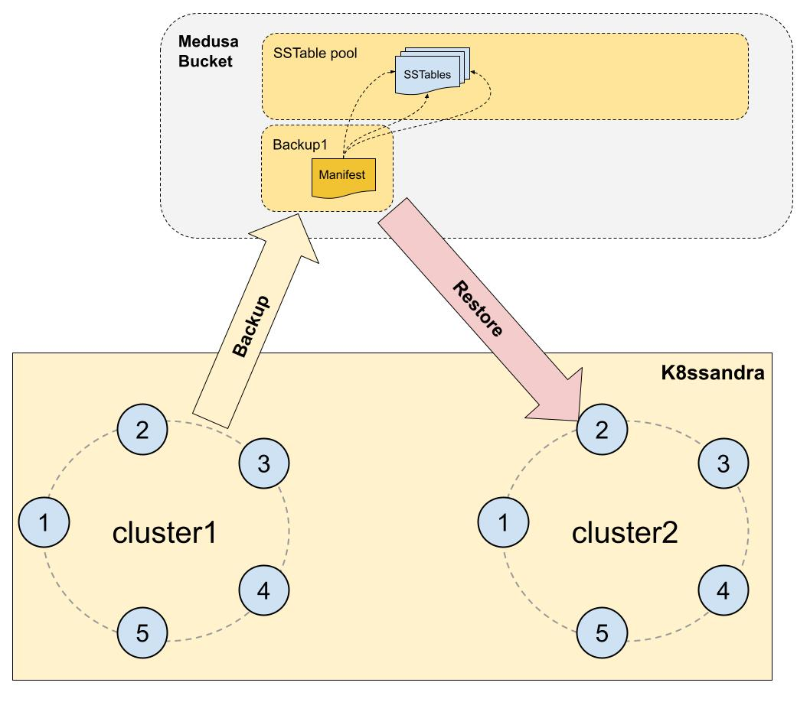
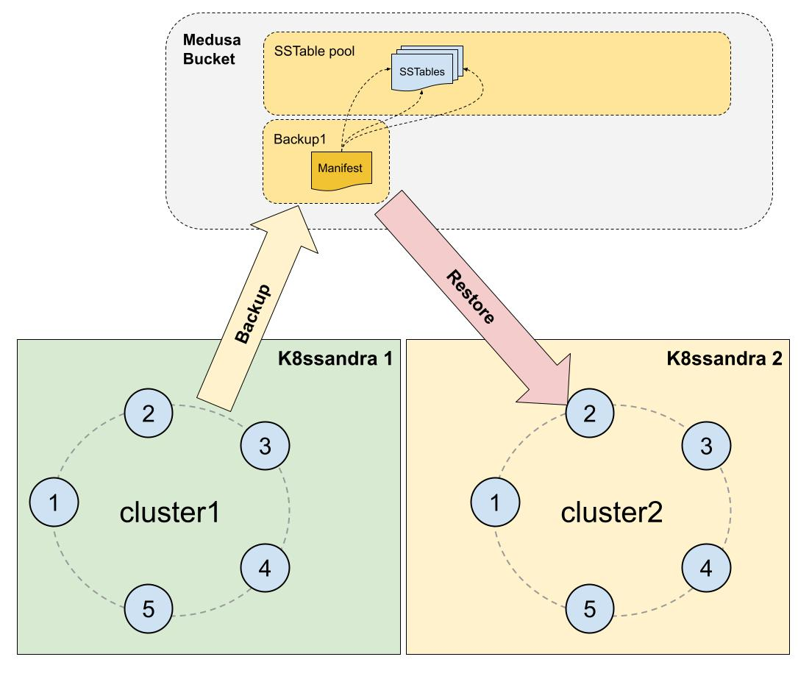
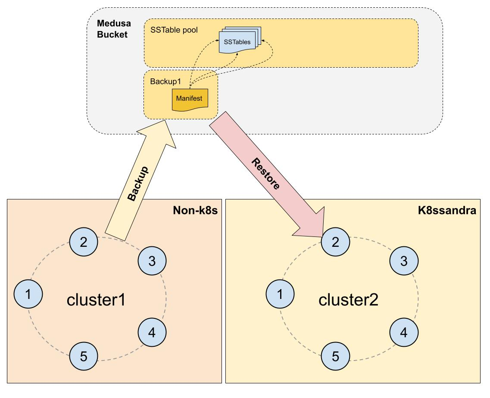
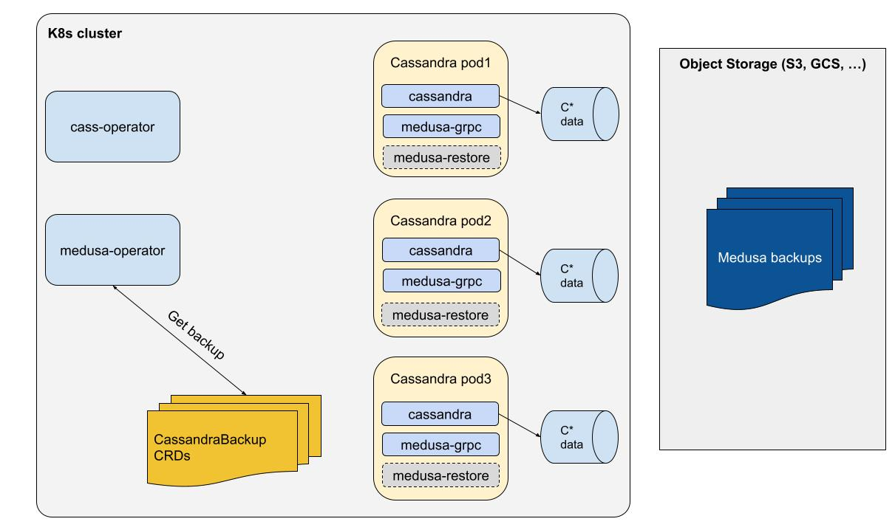
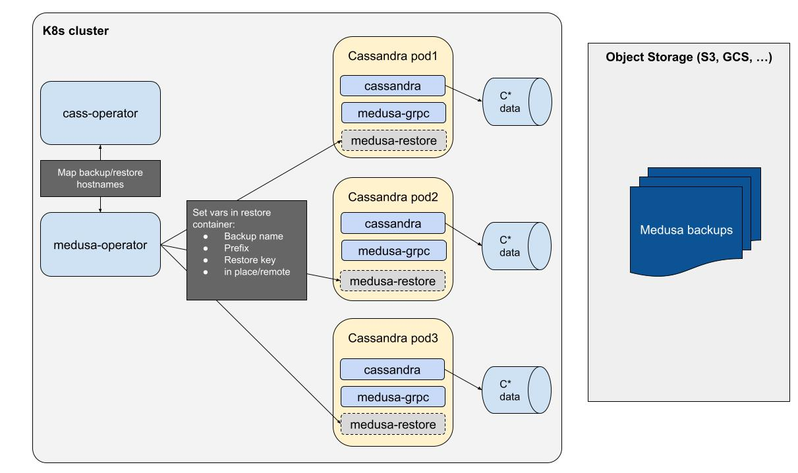
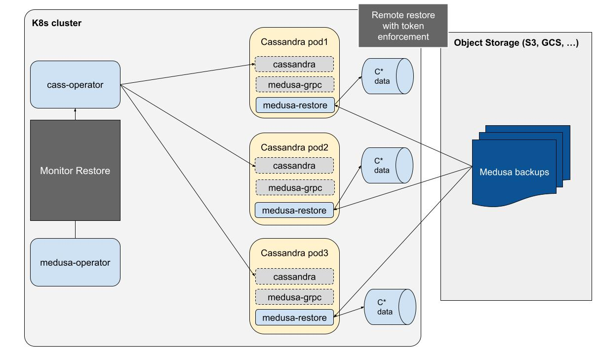
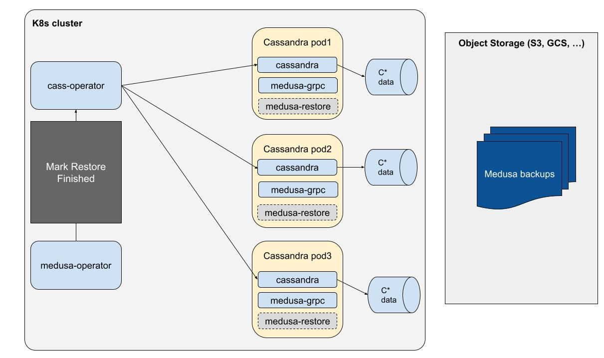

# Medusa Operator - Restore redesign document

## Background

Medusa operator doesn’t yet support remote restores: restoring a backup to another cluster.
As we implement this feature, we would like to have it support multiple use cases that operators could expect to have working:

- Restoring a medusa-operator based backup to another Cassandra install in the same k8s cluster


- Restoring a medusa-operator based backup to another Cassandra install in a different k8s cluster


- Restoring a Medusa backup (non k8s) to a k8s Cassandra install



## Sync CassandraBackup resources with storage
The target solution will need to be able to sync the local CassandraBackup resources with the configured storage backend.
The sync should allow:

- Creating local missing resources from existing backups
- Deleting local resources for missing backups
- Deleting remote backups if a local resource was marked as deleted

A single control loop should be able to handle all 3 operations.
The sync should be required explicitly, meaning that a new CRD should be created to request synchronization to the medusa-operator, and that CRD should contain a prefix so that a cluster can list backups stored for another cluster in a multi-tenant storage bucket.

CassandraBackup objects should receive a finalizer from the backup controller. This will allow deletions of CassandraBackup objects to place a deletion timestamp, and upon reconciliation the backup controller will perform a cleanup of the corresponding backup in the storage bucket. Only after that cleanup task is completed can the CassandraBackup object see its finalizer removed and be garbage collected.

The sync operation would:

- List the backups in the storage bucket, through a gRPC call
- Compare that list to the existing CassandraBackup resources
- Create a CassandraBackup object for each missing backup
- Delete local resources that don’t exist in the list of backups
- Delete remote backups through gRPC for CassandraBackup objects marked for deletion, and upon success delete the resource.

## CassandraBackup CRD changes
CassandraBackup resources shouldn’t store the CassandraDatacenter spec anymore but rather the topology object generated by Medusa.  
This object will contain the list of live nodes at the time of the backup along with their token assignments.
Sample topology object:
```
{"ip-179-31-16-38.us-west-2.compute.internal": {"tokens": [-1051417974279770378, -112095142485141927, 9217379683620055011, 939597040143840721], "is_up": true}, 
 "ip-179-31-23-54.us-west-2.compute.internal": {"tokens": [-1080182033668782299, -1156652990105327691, 9134535641516355167, 9216775765860996507], "is_up": true}, 
 "ip-179-31-30-139.us-west-2.compute.internal": {"tokens": [-1018393144648419592, -1342532530495729638, 8846603596658721956, 8849342512812637165], "is_up": true}}
```

The CRD should also contain information that should be overridable such as the prefix, which is controlled by the namespace name. 

## Medusa changes
The tokenmap generated by Medusa will need to be augmented to provide the placement of nodes in the cluster: datacenter and rack.
Currently Medusa is not dc/rack aware and it can probably be fairly surprising to users. It was built to backup a single DC per cluster and didn’t account for racks either.  
Restoring from a DC/rack aware cluster to another one imposes some constraints on the source/target nodes mapping, which are currently impossible to deal with safely in a remote restore: 

When using NetworkTopologyStrategy, the placement of replicas is dependent on the DC and rack layout.
In this context, the replica for a token range will be placed on the node that owns the next token range in the next rack.
We can't restore any node to any other node as we may end up putting several replicas in the same rack, and the nodes we'd restore to would possibly end up not containing data they're supposed be replica for.
We can be rigid about the mapping and expect the same dc and rack names exclusively, or do a 1:1 mapping between DCs/Racks despite having different names (but expect the same number of both).


## Restore Orchestration

1. Get backup definition from storage backend
  
The restore operation will assume the CRDs have been synced with the remote storage backend. Backup topology (hostnames and tokens) will be retrieved from the new CRD format.

2. Verify the mapping between backup and restore nodes

	The backup definition will be used to map the backup hosts with the restore hosts and perform checks on whether or not the restore is possible:

  - Same number of DCs
  - Same number of nodes per DC
  - Same rack distribution per DC
  
  Nodes will be mapped 1:1 between the source and destination topologies (sorted alphabetically). If the mapping fails to associate nodes 1:1, the restore operation must fail.

3. Alter the `system_auth` keyspace and repair it for remote restores

	Remote restores will require to keep the existing `system_auth` keyspace so that existing credentials can be retained. As token ownership will change, auth data could become unavailable after the restore. To avoid this and as preliminary step to a remote restore, the `system_auth` keyspace should be altered to be replicated on all nodes in the cluster and it should be repaired.

4. Set the env variables on the restore containers
  

  The init containers will get the following env variables set:

  - Backup name
  - Restore key
  - Bucket prefix (new)
  - In Place/Remote (new)

  These values will then be used to invoke medusa.restore_node in the medusa-restore init container.
The init-container needs to deal with mapping between source and dest topologies to self determine which backup it needs to restore. Pre-checks in the operator will guarantee that a 1:1 mapping is possible and topologies are compatible.

5. Shutdown Cassandra to trigger the restore
  

  medusa-operator will patch the cassandradatacenter spec to provoke a shutdown of the Cassandra nodes through cass-operator. The pods will be restarted and the medusa-restore init container will trigger the restore.

6. Restore the backups

  

  The medusa-restore container will perform a remote restore which involves the following:
system.local and system.peers will not be restored
auto_bootstrap will be set to false and seed nodes will start first
tokens will be enforced by modifying cassandra.yaml

  medusa-operator will monitor the restore by checking the cassandradatacenter object state.

  

  Once the cassandradatacenter is in Ready state, the restore will be marked as finished and the cluster will be fully restored and available.

## Other required changes

**The cassandradatacenter object will not be recreated during restore.**
Currently the remote restore procedure assumes that the Cassandra cluster is not running and that the cassandradatacenter object hasn’t been created.
This is a problem because creating the cassandradatacenter shouldn’t predate the helm install which includes other components (Reaper, monitoring, …) that will not be restored by Medusa.
The new procedure will assume that a cassandradatacenter has been created already using the same number of nodes (token assignments can be different and will be enforced, datacenter name can differ). 


**The Restore chart should allow overriding the prefix of the storage backend.**
The remote cluster needs to be able to read from the backup storage bucket and point to the right folder in case multi-tenancy is enabled, despite using a different namespace name.


